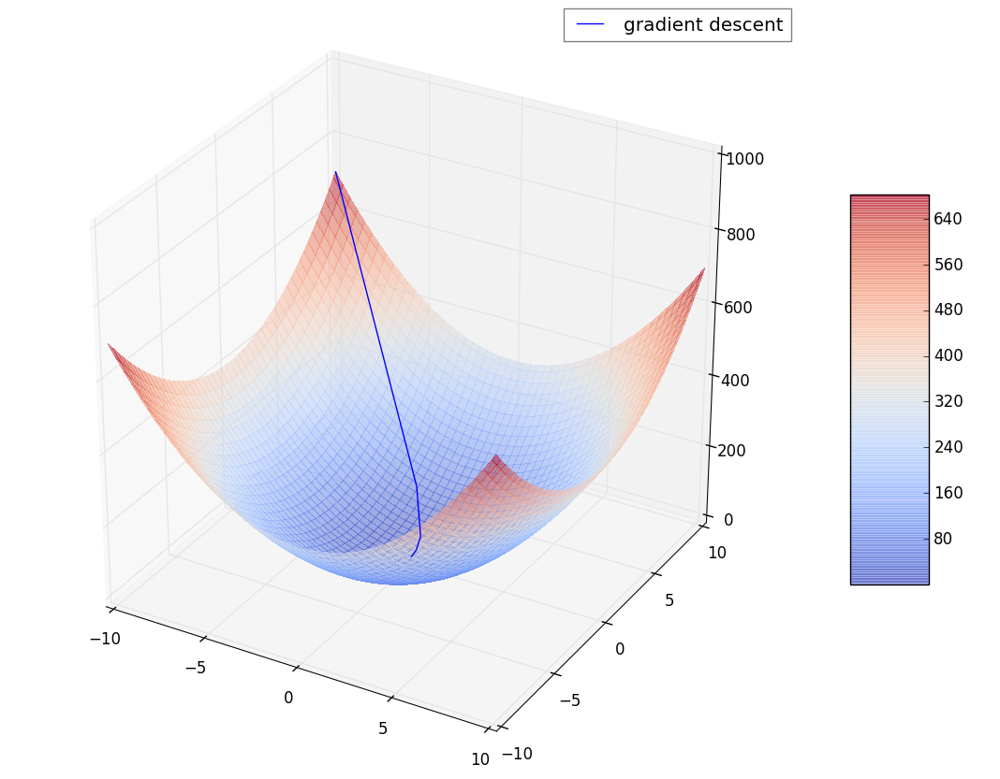
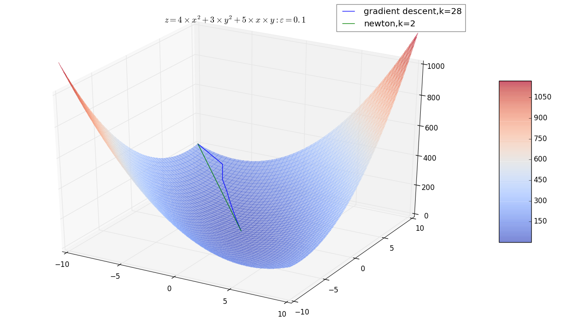
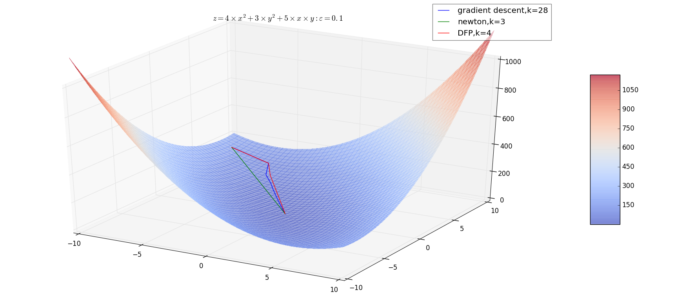
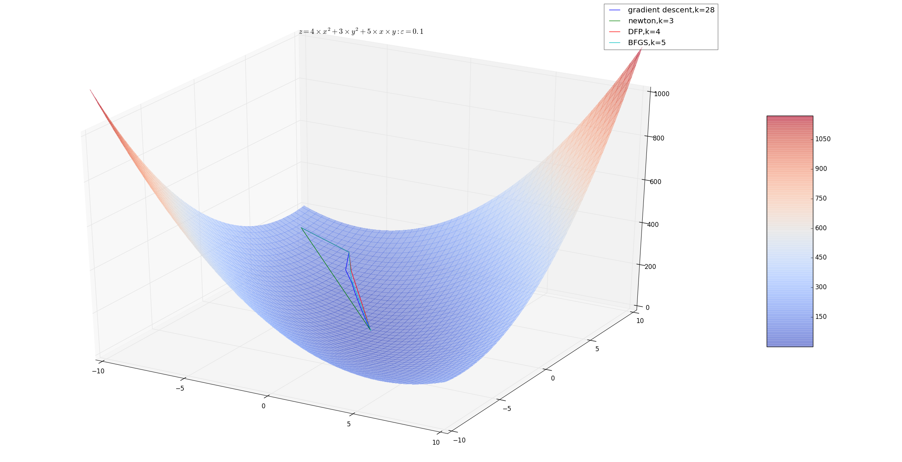
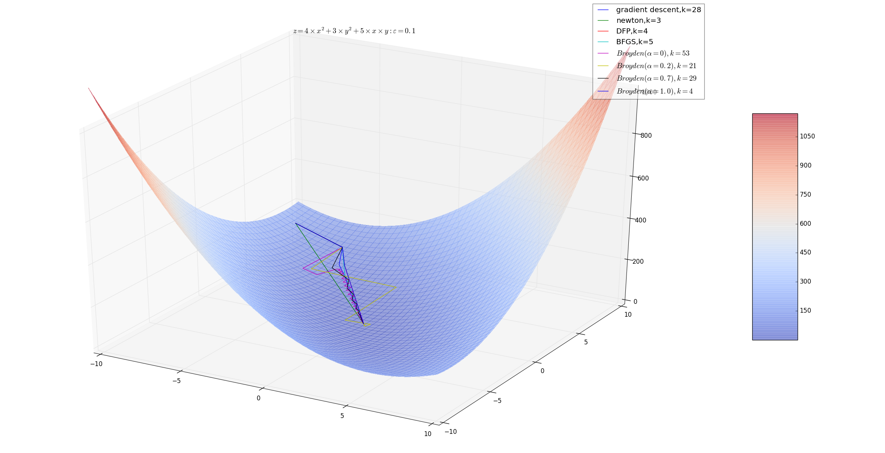

# 最优化问题

## 拉格朗日对偶性

1.在约束最优化问题中，常常利用拉格朗日对偶性将原始问题转换为对偶问题，通过求解对偶问题而得到原始问题的解。

2.约束最优化问题的原始问题：

假设 \\(f(\mathbf x),c_i(\mathbf x),h_j(\mathbf x)\\)  是定义在 \\(\mathbb R^{n}\\) 上的连续可微函数。考虑约束最优化问题：
$$
\min_{\mathbf x \in \mathbb R^{n}}f(\mathbf x)\\\
s.t. \quad c_i(\mathbf x) \le 0,i=1,2,\cdots,k \;;\quad h_j(\mathbf x)=0,j=1,2,\cdots,l
$$

- 引入拉格朗日函数：$$L(\mathbf x,\alpha,\beta)=f(\mathbf x)+\sum\_{i=1}^{k}\alpha_ic_i(\mathbf x)+\sum_{j=1}^{l}\beta_jh_j(\mathbf  x)$$
	这里 \\(\mathbf  x=(\mathbf x^{(1)},\mathbf x^{(2)},\cdots,\mathbf x^{(n)}) \in \mathbb R^{n}, \alpha_i,\beta_j\\) 是拉格朗日乘子， \\(\alpha_i \ge 0\\).
	> \\(L(\mathbf x,\alpha,\beta)\\) 是 \\(\mathbf x, \alpha,\beta\\) 的多元非线性函数
- 定义函数：$$\theta_P(\mathbf x)=\max_{\alpha,\beta\;:\;\alpha_i \ge 0}L(\mathbf  x,\alpha, \beta)$$
	其中下标 P 表示原始问题，则有：
	$$
	\theta_P(\mathbf x)= \begin{cases}
f(\mathbf x), & \text{if $\mathbf x$ statisfy original  problem's constraint} \\\
+\infty, & \text{or else.}
\end{cases}
	$$
	>- 若 \\(\mathbf x\\) 满足原问题的约束，则很容易证明 \\(L(\mathbf x,\alpha,\beta)=f(\mathbf x)+\sum\_{i=1}^{k}\alpha_ic_i(\mathbf x) \le f(\mathbf x)\\) ，等号在 \\(\alpha_i=0\\) 时取到
	>- 若 \\(\mathbf x\\) 不满足原问题的约束：
	> 	- 若不满足 \\( c_i(\mathbf x) \le 0\\)，则设违反的为 \\(c\_{i0}(\mathbf x) \gt 0\\)，则令 \\(\alpha\_{i0} \rightarrow \infty\\)，有\\(L(\mathbf x,\alpha,\beta)=f(\mathbf x)+\sum\_{i=1}^{k}\alpha_ic_i(\mathbf x)  \rightarrow \infty\\) 
	> 	- 若不满足  \\( h_j(\mathbf x) = 0\\)，则设违反的为 \\(h\_{j0}(\mathbf x) \ne 0\\)，则令 \\(\beta\_{j0}h\_{j0}(\mathbf x) \rightarrow \infty\\)，有\\(L(\mathbf x,\alpha,\beta)=f(\mathbf x)+\sum\_{i=1}^{k}\alpha_ic_i(\mathbf x)+\beta\_{j0}h\_{j0}(\mathbf  x)  \rightarrow \infty\\) 

- 考虑极小化问题：$$\min\_{\mathbf x} \theta_P(\mathbf x)=\min\_{\mathbf x}\max_{\alpha,\beta\;:\;\alpha_i \ge 0}L(\mathbf  x,\alpha, \beta)$$
	则该问题是与原始最优化问题是等价的，即他们有相同的问题。 \\(\min\_{\mathbf x}\max\_{\alpha,\beta\;:\;\alpha_i \ge 0}L(\mathbf  x,\alpha, \beta)\\)称为广义拉格朗日函数的极大极小问题。
- 为了方便，定义原始问题的最优值为：\\(p^{*}=\min_{\mathbf x}\theta_P(\mathbf x)\\)

3.对偶问题：定义 \\(\theta_D(\alpha,\beta)=\min_\mathbf x L(\mathbf x,\alpha,\beta)\\)。考虑极大化 \\(\theta\_D(\alpha,\beta)\\)，即：
$$\max\_{\alpha,\beta\;:\;\alpha_i \ge 0}\theta_D(\alpha,\beta)=\max\_{\alpha,\beta\;:\;\alpha_i \ge 0} \min\_{\mathbf x}L(\mathbf  x,\alpha, \beta)$$
问题 \\(\max\_{\alpha,\beta\;:\;\alpha_i \ge 0} \min\_{\mathbf x}L(\mathbf  x,\alpha, \beta)\\) 称为广义拉格朗日函数的极大极小问题。

可以将广义拉格朗日函数的极大极小问题表示为约束最优化问题：
$$
\max\_{\alpha,\beta\;:\;\alpha_i \ge 0}\theta_D(\alpha,\beta)=\max\_{\alpha,\beta\;:\;\alpha_i \ge 0} \min\_{\mathbf x}L(\mathbf  x,\alpha, \beta)\\\
s.t. \alpha_i \ge 0, i=1,2,\cdots,k
$$
称为原始问题的对偶问题。定义对偶问题的最优值 \\(d^*=\max\_{\alpha,\beta\;:\;\alpha_i \ge 0}\theta_D(\alpha,\beta)\\)

4.原问题与对偶问题的关系：

- 定理一：若原问题和对偶问题具有最优值，则：$$d^{\*}=\max\_{\alpha,\beta\;:\;\alpha\_i \ge 0}\min\_{\mathbf x}L(\mathbf  x,\alpha, \beta) \le \min\_{\mathbf x}\max\_{\alpha,\beta\;:\;\alpha\_i \ge 0}L(\mathbf  x,\alpha, \beta)=p^{*}$$
	- 推论一：设 \\(\mathbf x^{\*}\\) 为原始问题的可行解，且 \\(\theta_P(\mathbf x^{\*})\\) 的值为 \\(p^{\*}\\)； \\(\alpha^{\*},\beta^{\*}\\) 为对偶问题的可行解， \\(\theta_D(\alpha^{\*},\beta^{\*})\\) 值为 \\(d^{\*}\\)。如果有 \\(p^{\*}=d^{\*}\\)，则 \\(\mathbf x^{\*},\alpha^{\*},\beta^{\*}\\) ，分别为原始问题和对偶问题的最优解。

- 定理二：假设函数 \\(f(\mathbf x)\\) 和 \\(c_i(\mathbf x)\\) 为凸函数， \\(h_j(\mathbf x)\\) 是仿射函数；并且假设不等式约束 \\(c_i(\mathbf x)\\) 是严格可行的，即存在\\(\mathbf x\\) ，对于所有  i  有 \\(c_i(x) \lt 0\\)。则存在 \\(\mathbf x^{\*},\alpha^{\*},\beta^{\*}\\) ，使得 \\(\mathbf x^{\*}\\) 是原始问题 \\(\min_{\mathbf x}\theta_P(\mathbf x)\\) 的解，\\(\alpha^{\*},\beta^{\*}\\) 是对偶问题 \\(\max\_{\alpha,\beta\;:\;\alpha_i \ge 0}\theta_D(\alpha,\beta)\\) 的解，并且 \\(p^{\*}=d^{\*}=L(\mathbf x^{\*},\alpha^{\*},\beta^{\*})\\)

- 定理三：假设函数 \\(f(\mathbf x)\\) 和 \\(c_i(\mathbf x)\\) 为凸函数， \\(h_j(\mathbf x)\\) 是仿射函数；并且假设不等式约束 \\(c_i(\mathbf x)\\) 是严格可行的，即存在\\(\mathbf x\\) ，对于所有  i  有 \\(c_i(x) \lt 0\\)。则存在 \\(\mathbf x^{\*},\alpha^{\*},\beta^{\*}\\) ，使得 \\(\mathbf x^{\*}\\) 是原始问题 \\(\min_{\mathbf x}\theta_P(\mathbf x)\\) 的解，\\(\alpha^{\*},\beta^{\*}\\) 是对偶问题 \\(\max\_{\alpha,\beta\;:\;\alpha_i \ge 0}\theta_D(\alpha,\beta)\\) 的解的充要条件是：\\(\mathbf x^{\*},\alpha^{\*},\beta^{\*}\\) 满足下面的 `Karush-kuhn-Tucker(KKT)` 条件：

$$
\nabla\_\mathbf xL(\mathbf x^{\*},\alpha^{\*},\beta^{\*})=0\\\
\nabla\_\alpha L(\mathbf x^{\*},\alpha^{\*},\beta^{\*})=0\\\
\nabla\_\beta L(\mathbf x^{\*},\alpha^{\*},\beta^{\*})=0\\\
\alpha^{\*}_ic_i(\mathbf x^{\*})=0,i=1,2,\cdots,k\\\
c_i(\mathbf x^{\*})\le 0,i=1,2,\cdots,k\\\
\alpha^{\*}\_i \ge 0,i=1,2,\cdots,k\\\
h\_j(\mathbf x^{\*})= 0,j=1,2,\cdots,l
$$

5.仿射函数：仿射函数即由1阶多项式构成的函数。一般形式为 \\(f(\mathbf x) = A \mathbf x + b\\)，这里，A 是一个 m×k 矩阵，\\(\mathbf x\\) 是一个 k 向量,b是一个m向量，实际上反映了一种从 k 维到 m 维的空间映射关系。

6.凸函数：设 f 为定义在区间 I 上的函数，若对 I 上的任意两点 \\(\mathbf x_1,\mathbf x_2\\) 和任意的实数 \\(\lambda \in (0,1)\\)，总有 \\(f(\lambda \mathbf x_1+(1-\lambda)\mathbf x_2) \ge \lambda f(\mathbf x_1)+(1-\lambda)f(\mathbf x_2)\\) 则 f 称为 I 上的凸函数

## 梯度下降法

1.梯度下降法是求解无约束最优化问题的一种常见方法

- 梯度下降法实现简单
- 梯度下降法是迭代算法，每一步需要求解目标函数的梯度向量

2.原理：假设 \\(f(\mathbf x)\\) 是 \\(\mathbb R^{n}\\)  上具有一阶连续偏导数的函数 \\(g(\mathbf x)\\)。求解无约束的最优化问题：
$$\min_{\mathbf x \in \mathbb R^{n}}f(\mathbf x)$$

梯度下降法是一种迭代算法。

- 选取适当的初始值 \\(\mathbf x^{<0\>}\\)
- 由于 \\(f(\mathbf x)\\) 具有一阶连续偏导数 \\(g(\mathbf x)\\)，若第 k 次迭代值为  \\(\mathbf x^{<k\>}\\)，则可以将 \\(f(\mathbf x)\\) 在 \\(\mathbf x^{<k\>}\\) 附近进行一阶泰勒展开：
$$f(\mathbf x)=f(\mathbf x^{<k\>})+\mathbf g_k \cdot (\mathbf x-\mathbf x^{<k\>})$$

	其中 \\(\mathbf g_k=g(\mathbf x^{<k\>})=\nabla f(\mathbf x^{<k\>})\\) 为 \\(f(\mathbf x)\\) 在 \\(\mathbf x^{<k\>}\\) 的梯度
- 第 k+1 次迭代值 \\(\mathbf x^{<k+1\>} \leftarrow \mathbf x^{<k\>}+\lambda_k \mathbf p_k\\)，其中 \\(\mathbf p_k\\) 为搜索方向，取负梯度方向：\\(\mathbf p_k=- \nabla f(\mathbf x^{<k\>})\\)；\\(\lambda_k\\) 为步长，由一维搜索确定。即搜索 \\(\lambda_k\\)  使得： 
$$f(\mathbf x^{<k\>}+\lambda_k \mathbf p_k)=\min_{\lambda \ge 0}f(\mathbf x^{<k\>}+\lambda_k \mathbf p_k)$$
	> 不能固定 \\(\lambda_k\\)，以免出现步长过大，跨过了极值点从而引发算法在极值点附近反复震荡

3.梯度下降算法：

- 输入：目标函数 \\(f(\mathbf x)\\), 梯度函数  \\(g(\mathbf x)=\nabla f(\mathbf x) \\)，计算精度 \\(\varepsilon\\)
- 输出：  \\(f(\mathbf x)\\) 的极小点 \\(\mathbf x^*\\)
- 算法步骤：
	- 选取初始值  \\(\mathbf x^{<0\>}\in \mathbb R^{n}\\), 置 k=0
	- 计算 \\(f(\mathbf x^{<k\>})\\)
	- 计算梯度 \\(\mathbf g_k=g(\mathbf x^{<k\>})\\)
		- 若梯度 \\(|\mathbf g_k| \lt \varepsilon\\)，则停止迭代, \\(\mathbf x^*=\mathbf x\\)
			> 即此时导数为 0
		- 若梯度 \\(|\mathbf g_k| \ge \varepsilon\\)，则令 \\(\mathbf p_k=-\mathbf g_k\\)，求 \\(\lambda_k\\) ，使得 \\(f(\mathbf x^{<k\>}+\lambda_k \mathbf p_k)=\min_{\lambda \ge 0}f(\mathbf x^{<k\>}+\lambda_k \mathbf p_k)\\)
			> 通常这也是个最小化问题。但是我们可以给定一系列的\\(\lambda_k\\)的值：如`[10,1,0.1,0.01,0.001,0.0001]`然后从中挑选

		- 令 \\(\mathbf x^{<k+1\>} = \mathbf x^{<k\>}+\lambda_k \mathbf p_k\\)，计算 \\(f(\mathbf x^{<k+1\>})\\)
			- 若 \\(|f(\mathbf x^{<k+1\>})-f(\mathbf x^{<k\>})| \lt \varepsilon\\)或者 \\(|\mathbf x^{<k+1\>}-\mathbf x^{<k\>}| \lt \varepsilon\\) 时，停止迭代，\\(\mathbf x^*=\mathbf x\\)

			- 否则，令  k=k+1，计算梯度 \\(\mathbf g_k=g(\mathbf x^{<k\>})\\) 继续迭代


  

4.泰勒公式：
$$f(x)=\frac{f(x_0)}{0!}(x-x_0)^{0}+\frac{f^\prime(x_0)}{1!}(x-x_0)^{1}+\frac{f^{\prime\prime}(x_0)}{2!}(x-x_0)^{2}+\cdots+\frac{f^{(n)}(x_0)}{n!}(x-x_0)^{n}+R_n(x)\\\
=f(x_0)+f^\prime(x_0)(x-x_0)+\frac{f^{\prime\prime}(x_0)}{2!}(x-x_0)^{2}+\cdots+\frac{f^{(n)}(x_0)}{n!}(x-x_0)^{n}+R_n(x)$$
其中 \\(R_n(x)\\) 在 \\(x_0\\) 的一个邻域 \\(N(x_0,\delta_0)\\)  内满足：
$$\lim_{n \rightarrow \infty}R_n(x)=0, x \in N(x_0,\delta_0)$$	

5.梯度就是一阶导数。

- 若一阶导数为正数：则沿着 x 增大时 y 增大。此时梯度的反向即 x  减小的方向，此时 y 减小
- 若一阶导数为负数：则沿着 x 增大时 y 较小。此时梯度的方向即 x 增大的方向，此时 y 减小

6.当目标函数是凸函数时，梯度下降法的解是全局最优的。

- 通常情况下，梯度下降法的解不保证是全局最优的
- 梯度下降法的收敛速度未必是最快的

## 牛顿法和拟牛顿法

1.牛顿法和拟牛顿法是求解无约束最优化问题的常用方法

- 牛顿法和拟牛顿法收敛速度快
- 牛顿法计算比较复杂
- 拟牛顿法简化了计算

2.最优化问题：

考虑无约束最优化问题：$$\min\_{\mathbf x \in \mathbb R^{n}}f(\mathbf x)$$
设 \\(f(\mathbf x)\\) 具有二阶连续偏导数为  \\(H(\mathbf x)=[\frac{\partial^{2}f}{\partial x_i\partial x_j}]\_{n\times n}\\) ，也称为 \\(f(\mathbf x)\\) 的海塞矩阵(`Hesse matrix`)。设 \\(f(\mathbf x)\\) 的一阶导数为 \\(g(\mathbf x)\\)。

设第 k 次迭代时 \\(\mathbf x\\) 的值为： \\(\mathbf x^{<k\>}\\)，则可以将 \\(f(\mathbf x)\\) 在 \\(\mathbf x^{<k\>}\\) 附件二阶泰勒展开（所有向量默认为列向量）：
$$f(\mathbf x)=f(\mathbf x^{<k\>})+g(\mathbf x^{<k\>})^{T}(\mathbf x-\mathbf x^{<k\>})+\frac 12 (\mathbf x-\mathbf x^{<k\>})^{T}H(\mathbf x^{<k\>})(\mathbf x-\mathbf x^{<k\>})$$ 

- 函数 \\(f(\mathbf x)\\) 有极值的必要条件是在极值点的一阶导数为0，即梯度向量为0.
	- 特别的，当在极值点 \\(H \\) 为正定矩阵时，该极值点为极小值

3.牛顿法原理：利用极小点的必要条件： \\(g(\mathbf x)=\nabla f(\mathbf x)=0\\), 每次迭代从点 \\(\mathbf x^{<k\>}\\) 开始，求目标函数的极小点，作为第 k+1 次迭代值   \\(\mathbf x^{<k+1\>}\\) 

分析：假定  \\(\mathbf x^{<k+1\>}\\)  满足： \\(\nabla f(\mathbf x^{<k+1\>})=0\\), 由二阶泰勒公式有（左右两边同时求导）：
\\(\nabla f(\mathbf x^{<k+1\>})=\mathbf g_k+H(\mathbf x^{<k\>})(\mathbf x^{<k+1\>}-\mathbf x^{<k\>})\\)，则有：
$$\mathbf x^{<k+1\>}=\mathbf x^{<k\>}-H(\mathbf x^{<k\>})^{-1}\mathbf g_k$$
令 \\(\mathbf p_k=-H(\mathbf x^{<k\>})^{-1}\mathbf g_k\\), 则：\\(\mathbf x^{<k+1\>}=\mathbf x^{<k\>}+\mathbf p_k\\)，其中 \\(H(\mathbf x^{<k\>})\mathbf p_k=-\mathbf g_k\\)

4.牛顿法算法：

- 输入：目标函数  \\(f(\mathbf x)\\)， 梯度 \\(g(\mathbf x)=\nabla f(\mathbf x)\\)， 海塞矩阵 \\(H(\mathbf x)\\), 精度要求  \\(\varepsilon\\)
- 输出： \\(f(\mathbf x)\\) 的极小值点 \\(\mathbf x^*\\)
- 算法步骤：
	- 选取初始值  \\(\mathbf x^{<0\>}\in \mathbb R^{n}\\), 置 k=0
	- 计算 \\(\mathbf g_k=g(\mathbf x^{<k\>})\\)
		- 若 \\(|\mathbf g_k| \lt \varepsilon\\)， 则停止计算，得到近似解  \\(\mathbf x=\mathbf x^*\\)
		- 若 \\(|\mathbf g_k| \ge \varepsilon\\)， 则:
			- 计算  \\(H_k=H(\mathbf x^{<k\>})\\),并求 \\(\mathbf p_k,\mathbf H_k \mathbf p_k=-\mathbf g_k\\)
			- 置 \\(\mathbf x^{<k+1\>}=\mathbf x^{<k\>}+\mathbf p_k\\)
			- 置 k=k+1，计算 \\(\mathbf g_k=g(\mathbf x^{<k\>})\\) ，迭代

> - 在牛顿法中，要求计算  \\(H_k^{-1}\\) ，计算比较复杂。
>
> - 梯度下降法中，每一次 \\(\mathbf x\\) 增加的方向一定是梯度相反的方向 \\(- \lambda_k \nabla_k\\)，增加的幅度需要由寻找的\\(\lambda_k\\)寻找，否则跨度过大容易引发震荡；而牛顿法中，每一次 \\(\mathbf x\\) 增加的方向是梯度增速最大的反方向 \\(- H_k^{-1} \nabla_k\\)（它通常情况下与梯度不共线），其幅度已经包含在 \\( H_k^{-1}\\) 中（当然你也可以寻找\\(\lambda_k\\)得到幅度的系数）


   

5.拟牛顿法原理：在牛顿法的迭代中，需要计算海塞矩阵的逆矩阵 \\(H^{-1}\\)，这一计算比较复杂。我们可以考虑用一个 n 阶矩阵 \\(G_k=G(\mathbf x^{<k\>})\\) 来近似代替 \\(H^{-1}_k=H^{-1}(\mathbf x^{<k\>})\\)。

- 先看海塞矩阵满足的条件：\\(\mathbf g_{k+1}-\mathbf g_k=H_k(\mathbf x^{<k+1\>}-\mathbf x^{<k\>})\\)	
	> 海塞矩阵视作二阶导数，即梯度的导数

	- 令 \\(\mathbf y_k=\mathbf g_{k+1}-\mathbf g_k, \mathbf \delta_k=\mathbf x^{<k+1\>}-\mathbf x^{<k\>}\\) 则有：\\(\mathbf y_k=H_k \delta_k\\)，或者 \\(H_k^{-1}\mathbf y_k=\delta_k\\)。这称为拟牛顿条件

- 根据牛顿法的迭代: \\(\mathbf x^{<k+1\>}=\mathbf x^{<k\>}-H_k^{-1}\mathbf g_k\\)，则根据 \\(f(\mathbf x)\\) 在 \\(\mathbf x^{<k\>}\\) 的一阶泰勒展开：

	$$ f(\mathbf x^{<k+1\>})=f(\mathbf x^{<k\>})+f'(\mathbf x^{<k\>})(\mathbf x^{<k+1\>}-\mathbf x^{<k\>})\\\
=f(\mathbf x^{<k\>})+\mathbf g_k^{T}(-H^{-1}\mathbf g_k)=f(\mathbf x^{<k\>})-\mathbf g_k^{T}H^{-1}\mathbf g_k
	$$

	当 \\(H_k\\) 是正定矩阵时，总有 \\(f(\mathbf x^{<k+1\>})<f(\mathbf x^{<k\>})\\)，因此每次都是沿着函数递减的方向迭代

因此拟牛顿法如果选择 \\(G_k\\) 作为 \\(H_k^{-1}\\) 的近似时，\\(G_k\\) 同样要满足两个条件：

- \\(G_k\\) 必须是正定的
- \\(G_k\\) 满足拟牛顿条件：\\(G_{k+1}\mathbf y_k=\delta_k\\)
	> 因为 \\(G_0\\) 是给定的初始化条件

按照拟牛顿条件，在每次迭代中可以选择更新矩阵 \\(G_{k+1}=G_k+\Delta G_k\\)

6.正定矩阵定义：设 M 是 n 阶方阵，如果对任何非零向量\\(\mathbf x\\) ，都有 \\(\mathbf x^{T} M \mathbf x \gt 0\\)，就称M正定矩阵

- 正定矩阵判定：
	- 判定定理1：对称阵A为正定的充分必要条件是：A的特征值全为正。
	- 判定定理2：对称阵A为正定的充分必要条件是：A的各阶顺序主子式都为正。
	- 判定定理3：任意阵A为正定的充分必要条件是：A合同于单位阵。
- 正定矩阵的性质：
	- 正定矩阵一定是非奇异的。奇异矩阵的定义：若n阶矩阵A为奇异阵，则其的行列式为零，即 |A|=0。
	- 正定矩阵的任一主子矩阵也是正定矩阵。
	- 若A为n阶对称正定矩阵，则存在唯一的主对角线元素都是正数的下三角阵L，使得A=L*L′，此分解式称为 正定矩阵的乔列斯基（Cholesky）分解。
	- 若A为n阶正定矩阵，则A为n阶可逆矩阵。

- 正定矩阵在某个合同变换下可化为标准型， 即对角矩阵。
- 所有特征值大于零的对称矩阵也是正定矩阵。

7.合同矩阵：两个实对称矩阵 A 和 B 是合同的，当且仅当存在一个可逆矩阵 P ，使得 \\(A=P^{T}BP\\)

- A的合同变换：对某个可以矩阵P，对 A 执行 \\(P^{T}AP\\)

8.DFP算法( `Davidon-Fletcher-Powell`)原理:

该算法选择 \\(G\_{k+1}\\)  的方法是：假设每一步迭代中 \\(G_{k+1}\\) 是由  \\(G_k\\)   加上两个附加项构成：\\(G\_{k+1}=G_k+P_k+Q_k\\)，其中 \\(P_k,Q_k\\) 是待定矩阵。此时有：\\(G\_{k+1}\mathbf y_k=G_k\mathbf y_k+P_k\mathbf y_k+Q_k\mathbf y_k\\)。

为了满足拟牛顿条件，可以取：\\(P_k\mathbf y_k=\delta_k,\quad Q_k\mathbf y_k =-G_k\mathbf y_k\\)。这样的\\(P_k,Q_k\\) 不止一个。例如取 
$$P_k=\frac{\delta_k\delta_k^{T}}{\delta_k^{T}\mathbf y_k},\quad Q_k=-\frac{G_k\mathbf y_k \mathbf y_k^{T} G_k}{\mathbf y_k^{T} G_k \mathbf y_k}$$
> 这里 \\(\delta_k,\mathbf y_k\\) 都是列向量

则迭代公式为： $$G_{k+1}=G_k+\frac{\delta_k\delta_k^{T}}{\delta_k^{T}\mathbf y_k}-\frac{G_k\mathbf y_k \mathbf y_k^{T} G_k}{\mathbf y_k^{T} G_k \mathbf y_k}$$

> 其中的向量 \\(\delta_k,\mathbf y_k\\)  都是列向量

- 可以证明，如果初始矩阵 \\(G_0\\) 是正定的，则迭代过程中每个矩阵 \\(G_k\\) 都是正定的

9.DFP算法：

- 输入：目标函数  \\(f(\mathbf x)\\)， 梯度 \\(g(\mathbf x)=\nabla f(\mathbf x)\\)，  精度要求  \\(\varepsilon\\)
- 输出： \\(f(\mathbf x)\\) 的极小值点 \\(\mathbf x^*\\)
- 算法步骤：
	- 选取初始值  \\(\mathbf x^{<0\>}\in \mathbb R^{n}\\), 取 \\(G_0\\) 为正定对称矩阵，置 k=0
	- 计算 \\(\mathbf g_k=g(\mathbf x^{<k\>})\\)
		- 若 \\(|\mathbf g_k| \lt \varepsilon\\)， 则停止计算，得到近似解  \\(\mathbf x=\mathbf x^*\\)
		- 若 \\(|\mathbf g_k| \ge \varepsilon\\)， 则:
			- 计算  \\(\mathbf p_k=-G_k\mathbf g_k\\)
			- 一维搜索：求 \\(\lambda_k\\)使得 \\(f(\mathbf x^{<k\>}+\lambda_k\mathbf p_k)=\min_{\lambda \ge 0}f(\mathbf x^{<k\>}+\lambda_k\mathbf p_k)\\)
			- 设置 \\(\mathbf x^{<k+1\>}=\mathbf x^{<k\>}+\lambda_k\mathbf p_k\\)
			- 计算 \\(\mathbf g_{k+1}=g(\mathbf x^{<k+1\>})\\)。若 \\(|\mathbf g\_{k+1}| \lt \varepsilon\\)， 则停止计算，得到近似解  \\(\mathbf x=\mathbf x^*\\)
			- 否则计算 \\(G_{k+1}\\),置 k=k+1，计算  \\(\mathbf p_k=-G_k\mathbf g_k\\) 迭代

>- 梯度下降法中，每一次 \\(\mathbf x\\) 增加的方向一定是梯度相反的方向 \\(- \lambda_k \nabla_k\\)，增加的幅度需要由寻找的\\(\lambda_k\\)寻找，否则跨度过大容易引发震荡
>- 牛顿法中，每一次 \\(\mathbf x\\) 增加的方向是梯度增速最大的反方向 \\(- H_k^{-1} \nabla_k\\)（它通常情况下与梯度不共线），其幅度已经包含在 \\( H_k^{-1}\\) 中（当然你也可以寻找\\(\lambda_k\\)得到幅度的系数）
> - DFP算法中，每一次 \\(\mathbf x\\)  增加的方向是 \\(-G_k \nabla_k\\) 的方向。增加的幅度需要由寻找的\\(\lambda_k\\)寻找，否则跨度过大容易引发震荡

   

10.BFGS算法原理：BFGS是最流行的拟牛顿算法。 DFP算法中，用 \\(G_k\\) 逼近 \\(H^{-1}\\)。换个角度我们可以用矩阵 \\(B_k\\) 逼近海塞矩阵 \\(H\\)。此时对应的拟牛顿条件为： \\(B_{k+1}\delta_k=\mathbf y_k\\)。
> 因为 \\(B_0\\) 是给定的初始化条件

令： \\(B\_{k+1}=B_k+P_k+Q_k\\)，有： \\(B\_{k+1}\delta_k=B_k\delta_k+P_k\delta_k+Q_k\delta_k\\)

可以取 \\(P_k\delta_k=\mathbf y_k,Q_k\delta_k=-B_k\delta_k\\).寻找合适的 \\(P_k,Q_k\\) ，可以得到 BFGS算法矩阵的 \\(B_{k+1}\\) 的迭代公式：

$$B\_{k+1}=B_k+\frac{\mathbf y_k\mathbf y_k^{T}}{\mathbf y_k^{T}\delta_k}-\frac{B_k\delta_k\delta_k^{T}B_k}{\delta_k^{T}B_k\delta_k}$$

> 其中的向量 \\(\delta_k,\mathbf y_k\\)  都是列向量

- 可以证明，若 \\(B_0\\)  是正定的，则迭代过程中每个矩阵 \\(B_k\\) 都是正定的。

11.BFGS算法：

- 输入：目标函数  \\(f(\mathbf x)\\)， 梯度 \\(g(\mathbf x)=\nabla f(\mathbf x)\\)，  精度要求  \\(\varepsilon\\)
- 输出： \\(f(\mathbf x)\\) 的极小值点 \\(\mathbf x^*\\)
- 算法步骤：
	- 选取初始值  \\(\mathbf x^{<0\>}\in \mathbb R^{n}\\), 取 \\(B_0\\) 为正定对称矩阵，置 k=0
	- 计算 \\(\mathbf g_k=g(\mathbf x^{<k\>})\\)
		- 若 \\(|\mathbf g_k| \lt \varepsilon\\)， 则停止计算，得到近似解  \\(\mathbf x=\mathbf x^*\\)
		- 若 \\(|\mathbf g_k| \ge \varepsilon\\)， 则:
			- 由  \\(B_k\mathbf p_k=-\mathbf g_k\\) 求出 \\(\mathbf p_k\\)
				> 这里表面上看需要对矩阵求逆。但是实际上 \\(B_k^{-1}\\)  有迭代公式。根据`Sherman-Morrison` 公式以及 \\(B_k\\) 的迭代公式，可以得到  \\(B_k^{-1}\\) 的迭代公式
			- 一维搜索：求 \\(\lambda_k\\)使得 \\(f(\mathbf x^{<k\>}+\lambda_k\mathbf p_k)=\min_{\lambda \ge 0}f(\mathbf x^{<k\>}+\lambda_k\mathbf p_k)\\)
			- 设置 \\(\mathbf x^{<k+1\>}=\mathbf x^{<k\>}+\lambda_k\mathbf p_k\\)
			- 计算 \\(\mathbf g_{k+1}=g(\mathbf x^{<k+1\>})\\)。若 \\(|\mathbf g\_{k+1}| \lt \varepsilon\\)， 则停止计算，得到近似解  \\(\mathbf x=\mathbf x^*\\)
			- 否则计算 \\(B_{k+1}\\),置 k=k+1，计由  \\(B_k\mathbf p_k=-\mathbf g_k\\) 求出 \\(\mathbf p_k\\) ，迭代

>- 梯度下降法中，每一次 \\(\mathbf x\\) 增加的方向一定是梯度相反的方向 \\(- \lambda_k \nabla_k\\)，增加的幅度需要由寻找的\\(\lambda_k\\)寻找，否则跨度过大容易引发震荡
>- 牛顿法中，每一次 \\(\mathbf x\\) 增加的方向是梯度增速最大的反方向 \\(- H_k^{-1} \nabla_k\\)（它通常情况下与梯度不共线），其幅度已经包含在 \\( H_k^{-1}\\) 中（当然你也可以寻找\\(\lambda_k\\)得到幅度的系数）
> - DFP算法中，每一次 \\(\mathbf x\\)  增加的方向是 \\(-G_k \nabla_k\\) 的方向。增加的幅度需要由寻找的\\(\lambda_k\\)寻找，否则跨度过大容易引发震荡
> - BFPS 算法中，每一次 \\(\mathbf x\\)  增加的方向是 \\(-B_k^{-1} \nabla_k\\) 的方向。增加的幅度需要由寻找的\\(\lambda_k\\)寻找，否则跨度过大容易引发震荡

   

12.Broyden 类算法：若记 \\(G_k=B_k^{-1},G\_{k+1}=B_{k+1}^{-1}\\)，则对式子
$$
B\_{k+1}=B_k+\frac{\mathbf y_k\mathbf y_k^{T}}{\mathbf y_k^{T}\delta_k}-\frac{B_k\delta_k\delta_k^{T}B_k}{\delta_k^{T}B_k\delta_k}
$$
使用两次`Sherman-Morrison`公式可得：
$$
G\_{k+1}=(I-\frac{\delta_k\mathbf y_k^{T}}{\delta_k^{T}\mathbf y_k})G_k(I-\frac{\delta_k\mathbf y_k^{T}}{\delta_k^{T}\mathbf y_k})^{T}+\frac{\delta_k\delta_k^{T}}{\delta_k^{T}\mathbf y_k}
$$
> 其中的向量 \\(\delta_k,\mathbf y_k\\)  都是列向量

令 DFP 算法获得的 \\(G\_{k+1}\\) 的迭代公式记作  
$$G^{DFP}=G_k+\frac{\delta_k\delta_k^{T}}{\delta_k^{T}\mathbf y_k}-\frac{G_k\mathbf y_k \mathbf y_k^{T} G_k}{\mathbf y_k^{T} G_k \mathbf y_k}$$
由 BFGS 算法获得的 \\(G\_{k+1}\\) 的迭代公式记作  
$$G^{BFGS}=(I-\frac{\delta_k\mathbf y_k^{T}}{\delta_k^{T}\mathbf y_k})G_k(I-\frac{\delta_k\mathbf y_k^{T}}{\delta_k^{T}\mathbf y_k})^{T}+\frac{\delta_k\delta_k^{T}}{\delta_k^{T}\mathbf y_k}$$
他们都满足拟牛顿条件，所以他们的线性组合：\\(G\_{k+1}=\alpha G^{DFP}+(1-\alpha)G^{BFGS}\\) 也满足拟牛顿条件，而且是正定的。其中  \\(0 le \alpha 1\\)

这样获得了一族拟牛顿法，称为 Broyden 类算法

> 图形中，随着 \\(\alpha \rightarrow 1\\),则 Broyden 越接近 DFP 算法。而随着 Broyden 越远离 DFP 算法，震荡越厉害 

  

14.上述算法的代码：

```
import matplotlib.pyplot as plt
from mpl_toolkits.mplot3d import Axes3D
from matplotlib import cm
import numpy as np

def get_lambda(f,x,p):
    '''
    获取最小化结果
    :param f: f(x)
    :param x:x_k，是一个列向量
    :param p:梯度的相反，是一个列向量
    :return:最优的 lambda
    '''
    lbd=step_sizes[0]
    for step in step_sizes:
        if f(x[0][0]+step*p[0][0],x[1][0]+step*p[1][0])< 
f(x[0][0]+lbd*p[0][0],x[1][0]+lbd*p[1][0]):
            lbd=step
    return lbd
def func(X,Y): #二元函数
    '''
    二元函数： Z=3*Y**2+4*X**2+5XY
    :param X:X 坐标，一个数组
    :param Y: Y坐标，一个数组
    :return: Z坐标，一个数组
    '''
    return 3*Y**2+4*X**2+5*X*Y
def gradient(X,Y): # 二元函数的梯度
    '''
    梯度函数：(3*Y**2+4*X**2) 的偏导数
    :param X: X 坐标，一个数组
    :param Y: Y坐标，一个数组
    :return: 梯度，一个数组
    '''
    return np.hstack((8*X+5*Y,6*Y+5*X))

####  梯度下降法
step_sizes = [100,10,1,0.1,0.01,0.001,0.0001,0.00001]
def gradient_descent(f,g,epsilon,x_0):
    '''
    梯度下降法。这是个生成器函数
    :param f: f(x)
    :param g: 梯度函数
    :param epsilon: 停止条件
    :param x_0: 初始条件，为一个列向量
    :return:
    '''
    x_k=x_0 # 初始化 x_k
    yield x_k
    undone=True
    while undone:
        g_k=np.transpose(g(x_k[0][0],x_k[1][0])).reshape((2,1)) # 获取梯度（一个列向量）
        abs_g_k= np.linalg.norm(g_k) # 梯度向量的长度
        if abs_g_k <= epsilon:
            undone=False
            continue

        p_k=-g_k # 梯度的反向
        lbd=get_lambda(f,x_k,p_k)
        x_k=x_k+lbd*p_k# 新的 x_k
        yield   x_k
    else:
        yield   x_k
# #### 牛顿法
def hesse(X,Y):
    '''
    海塞矩阵:Z=3*Y**2+4*X**2的二阶偏导
    :param x: X坐标
    :param y: Y坐标
    :return: 海塞矩阵
    '''
    return np.matrix([[8,5],[5,6]])
def newton(f,g,h,epsilon,x_0):
    '''
    牛顿法。这是个生成器函数
    :param f:f(x)
    :param g:梯度函数
    :param h:海塞矩阵
    :param epsilon:停止条件
    :param x_0:初始条件，为一个列向量
    :return:
    '''
    x_k=x_0 # 初始化 x_k
    yield x_k
    undone=True
    while undone:
        g_k=np.transpose(g(x_k[0][0],x_k[1][0])).reshape((2,1)) # 获取梯度（一个列向量）
        abs_g_k= np.linalg.norm(g_k) # 梯度向量的长度
        if abs_g_k <= epsilon:
            undone=False
            continue
        H_k=hesse(x_k[0],x_k[1])
        p_k=-1*np.dot(H_k.I,g_k)
        x_k=x_k+p_k # 新的 x_k
        yield x_k
    else:
        yield x_k
# #### DFP 算法
def get_next_G_k(G_k,delt_k,y_k):
    '''
    获取 G_(k+1)
    :param G_k: G_k ，一个矩阵
    :param delt_k: x的增量，一个列向量
    :param y_k:梯度的增量，一个列向量
    :return:G_(k+1)
    '''
    P=np.dot(delt_k,np.transpose(delt_k))/np.dot(np.transpose(delt_k),y_k)
    Q=-np.dot(np.dot((np.dot(G_k,y_k)),np.transpose(y_k)),G_k)
/np.dot(np.dot(np.transpose(y_k),G_k),y_k)
    return G_k+P+Q
def dfp(f,g,epsilon,x_0,G_0):
    '''
    DFP 算法。这是个生成器函数
    :param f:f(x)
    :param g:梯度函数
    :param epsilon:停止条件
    :param x_0:初始条件，为一个列向量
    :param G_0:初始矩阵，为正定矩阵
    :return:
    '''
    x_k,G_k=x_0,G_0 # 初始化 k x_k
    yield x_k
    undone=True

    g_k=np.transpose(g(x_k[0][0],x_k[1][0])).reshape((2,1)) # 获取梯度（一个列向量）
    abs_g_k= np.linalg.norm(g_k) # 梯度向量的长度
    if abs_g_k <= epsilon:
            undone=False


    while undone:
        ##### 计算 p_k
        p_k=-np.dot(G_k,g_k)
        ## 寻找最优 Lambda
        lbd=get_lambda(f,x_k,p_k)
        ## 计算新的 x_k,g_k
        old_x_k,old_g_k=x_k,g_k
        x_k=x_k+lbd*p_k # 新的 x_k
        g_k=np.transpose(g(x_k[0][0],x_k[1][0])).reshape((2,1)) # 新的 g_k（一个列向量）
        abs_g_k= np.linalg.norm(g_k) # 梯度向量的长度
        if abs_g_k <= epsilon:
            undone=False
            continue
        delt_x=x_k-old_x_k
        delt_g=g_k-old_g_k
        G_k=get_next_G_k(G_k,delt_k=delt_x,y_k=delt_g)
        yield x_k
    else:
        yield x_k
###### BFGS算法
def get_next_B_k(B_k,delt_k,y_k):
    '''
    获取 B_(k+1)
    :param B_k: B_k
    :param delt_k:x的增量，一个列向量
    :param y_k: 梯度的增量，一个列向量
    :return:B_(k+1)
    '''
    P=np.dot(y_k,np.transpose(y_k))/np.dot(np.transpose(y_k),delt_k)
    Q=-np.dot(np.dot((np.dot(B_k,delt_k)),np.transpose(delt_k)),B_k)
/np.dot(np.dot(np.transpose(delt_k),B_k),delt_k)
    return B_k+P+Q
def bfgs(f,g,epsilon,x_0,B_0):
    '''
    BFGS算法。这是个生成器函数
    :param f:f(x)
    :param g:梯度函数
    :param epsilon:停止条件
    :param x_0:初始条件，为一个列向量
    :param B_0:初始矩阵，为正定矩阵
    :return:
    '''
    x_k,B_k=x_0,B_0 # 初始化 k x_k
    yield x_k
    undone=True

    g_k=np.transpose(g(x_k[0][0],x_k[1][0])).reshape((2,1)) # 获取梯度（一个列向量）
    abs_g_k= np.linalg.norm(g_k) # 梯度向量的长度
    if abs_g_k <= epsilon:
            undone=False


    while undone:
        ##### 计算 p_k
        p_k=-np.dot(np.matrix(B_k,dtype='float64').I,g_k)
        ## 寻找最优 Lambda
        lbd=get_lambda(f,x_k,p_k)
        ## 计算新的 x_k,g_k
        old_x_k,old_g_k=x_k,g_k
        x_k=x_k+lbd*p_k # 新的 x_k
        g_k=np.transpose(g(x_k[0][0],x_k[1][0])).reshape((2,1)) # 新的 g_k（一个列向量）
        abs_g_k= np.linalg.norm(g_k) # 梯度向量的长度
        if abs_g_k <= epsilon:
            undone=False
            continue
        delt_x=x_k-old_x_k
        delt_g=g_k-old_g_k
        B_k=get_next_B_k(B_k,delt_k=delt_x,y_k=delt_g)
        yield x_k
    else:
        yield x_k
##### Broyden算法
def get_next_G_k_BFGS(G_k,delt_k,y_k):
    '''
    由BFGS算法推导的 G_(k+1):获取 G_(k+1)
    :param G_k:G_k ，一个矩阵
    :param delt_k:x的增量，一个列向量
    :param y_k:梯度的增量，一个列向量
    :return:G_(k+1)
    '''
    m_1=1-np.dot(delt_k,np.transpose(y_k))/np.dot(np.transpose(delt_k),y_k)
    m_2=np.dot(delt_k,np.transpose(delt_k))/np.dot(np.transpose(delt_k),y_k)
    return np.dot(np.dot(m_1,G_k),np.transpose(m_1))+m_2
def broyden(f,g,epsilon,x_0,G_0,alpha):
    '''
    Broyden 类 算法。这是个生成器函数
    :param f:f(x)
    :param g:梯度函数
    :param epsilon:停止条件
    :param x_0:初始条件，为一个列向量
    :param G_0:初始矩阵，为正定矩阵
    :param alpha: alpha值，0.0到1.0之间
    :return:
    '''
    x_k,G_k=x_0,G_0 # 初始化 k x_k
    yield x_k
    undone=True

    g_k=np.transpose(g(x_k[0][0],x_k[1][0])).reshape((2,1)) # 获取梯度（一个列向量）
    abs_g_k= np.linalg.norm(g_k) # 梯度向量的长度
    if abs_g_k <= epsilon:
            undone=False

    while undone:
        ##### 计算 p_k
        p_k=-np.dot(G_k,g_k)
        ## 寻找最优 Lambda
        lbd=get_lambda(f,x_k,p_k)
        ## 计算新的 x_k,g_k
        old_x_k,old_g_k=x_k,g_k
        x_k=x_k+lbd*p_k # 新的 x_k
        g_k=np.transpose(g(x_k[0][0],x_k[1][0])).reshape((2,1)) # 新的 g_k（一个列向量）
        abs_g_k= np.linalg.norm(g_k) # 梯度向量的长度
        if abs_g_k <= epsilon:
            undone=False
            continue
        delt_x=x_k-old_x_k
        delt_g=g_k-old_g_k
        G_k=alpha*get_next_G_k(G_k,delt_k=delt_x,y_k=delt_g)+
(1-alpha)*get_next_G_k_BFGS(G_k,delt_k=delt_x,y_k=delt_g)
        yield x_k
    else:
        yield x_k
############### 开始绘图  ###################
fig = plt.figure()
ax=Axes3D(fig)
X=np.linspace(-10,10,100)
Y=np.linspace(-10,10,100)
X, Y = np.meshgrid(X, Y)
#### 绘制 f
Z =func(X,Y)
surf = ax.plot_surface(X, Y, Z, rstride=2, cstride=2,color='r', cmap=cm.coolwarm,
                       linewidth=0, antialiased=False,alpha=0.5)

### 初始条件
epsilon=0.1
x_0=np.array([-9,8]).reshape((2,1)) #列向量
# #### 绘制梯度下降法
result=[item for item in gradient_descent(func,gradient,epsilon,x_0=x_0)]
X=np.array([item[0][0] for item in result])
Y=np.array([item[1][0] for item in result])
ax.plot(X,Y,func(X,Y),label='gradient descent,k=%s'%len(X))
# #### 绘制牛顿法
result=[item for item in newton(func,gradient,hesse,epsilon,x_0=x_0)]
X=np.array([item[0][0] for item in result])
Y=np.array([item[1][0] for item in result])
ax.plot(X,Y,func(X,Y),label='newton,k=%s'%len(X))
###### 绘制  DFP 算法
G_0=np.array([[1,0],[0,1]])
result=[item for item in dfp(func,gradient,epsilon,x_0=x_0,G_0=G_0)]
X=np.array([item[0][0] for item in result])
Y=np.array([item[1][0] for item in result])
ax.plot(X,Y,func(X,Y),label='DFP,k=%s'%len(X))
###### 绘制  BFGS 算法
B_0=np.array([[1,0],[0,1]])
result=[item for item in bfgs(func,gradient,epsilon,x_0=x_0,B_0=B_0)]
X=np.array([item[0][0] for item in result])
Y=np.array([item[1][0] for item in result])
ax.plot(X,Y,func(X,Y),label='BFPS,k=%s'%len(X))
###### 绘制  Broyden 算法
for alpha in [0,0.2,0.7,1.0]:
    G_0=np.array([[1,0],[0,1]])
    result=[item for item in broyden(func,gradient,epsilon,x_0=x_0,G_0=G_0,alpha=alpha)]
    X=np.array([item[0][0] for item in result])
    Y=np.array([item[1][0] for item in result])
    ax.plot(X,Y,func(X,Y),label=r'$Broyden(\alpha=%s),k=%s$'%(alpha,len(X)))

############ 设置图形
ax.set_zlim3d(0,1000)
ax.legend(framealpha=0.5)
fig.colorbar(surf, shrink=0.5, aspect=5)
ax.set_title(r'$z=4\times x^2+3\times y^2+5\times x\times y :\varepsilon=%s$'%epsilon)
plt.show()
``` 

13.`Sherman-Morrison`公式：假设 A 是 n 阶可逆矩阵， \\(u,v\\) 是  n 维列向量，且 \\(A+uv^{T}\\) 也是可逆矩阵，则：

$$(A+u\;v^{T})^{-1}=A^{-1}-\frac{A^{-1}u\;v^{T}A^{-1}}{1+v^{T}A^{-1}u}$$