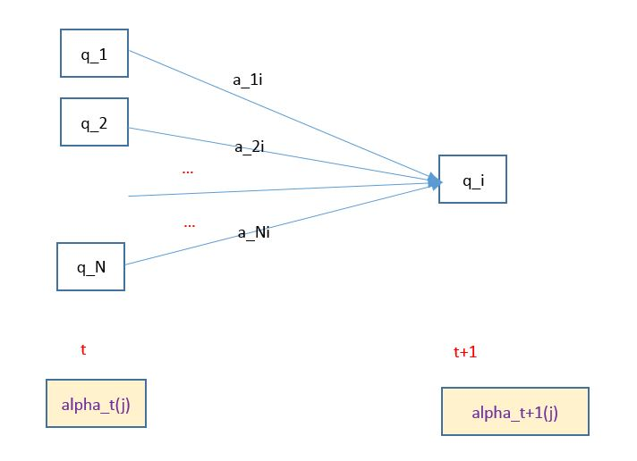
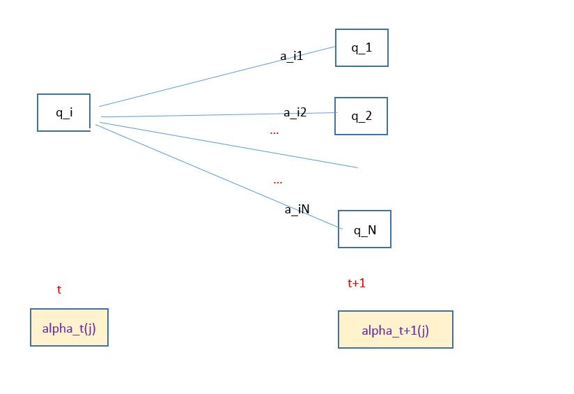
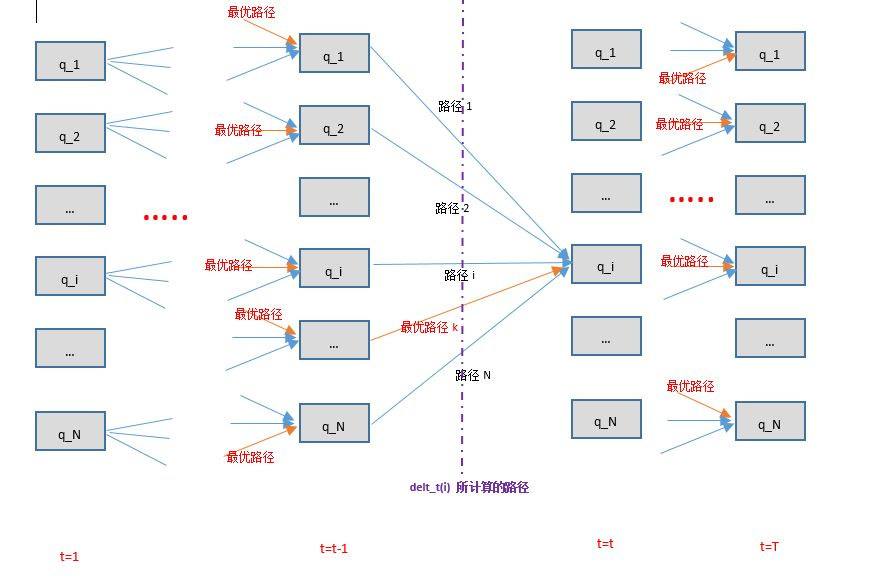
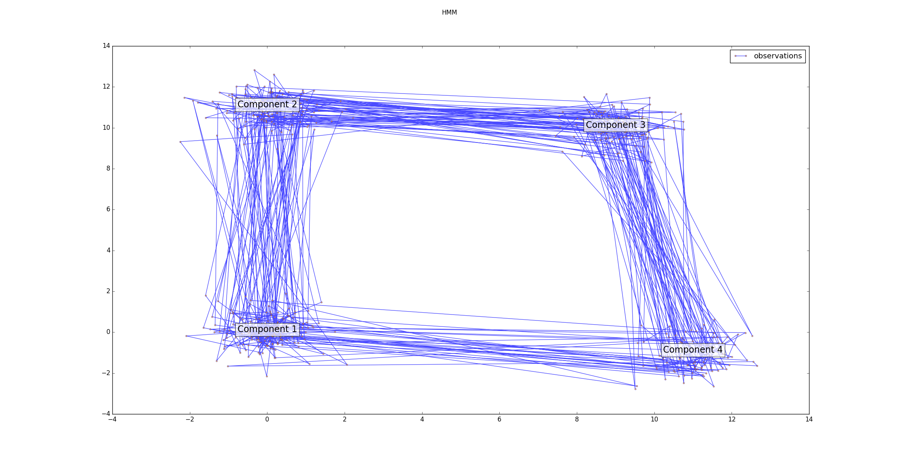

# 隐马尔可夫模型

## 隐马尔可夫模型

1.隐马尔可夫模型（`Hidden Markov model,HMM`）是可用于标注问题的统计学模型，描述了由隐藏的马尔可夫链随机生成观察序列的过程，属性生成模型。

2.隐马尔可夫模型：隐马尔可夫模型是关于时序的概率模型，描述由一个隐藏的马尔可夫链随机生成不可观测的状态随机序列，再由各个状态生成一个观察而产生观察随机序列的过程。

- 隐藏的马尔可夫链随机生成的状态的序列称作状态序列
- 每个状态生成一个观测，而由此产生的观测的随机序列称作观测序列
- 序列的每一个位置又可以看作是一个时刻

3.隐马尔可夫模型由初始概率分布、状态转移概率分布以及观察概率分布确定。隐马尔可夫模型定义如下：

- 设 \\(Q=\\{q_1,q_2,\cdots,q_N\\}\\) 是所有可能的状态的集合， \\(V=\\{v_1,v_2,\cdots,v_M\\}\\) 是所有可能的观测的集合，其中 N 是可能的状态数量，M 是可能的观测数量。
	> Q是状态的取值空间，V是观测的取值空间

- 设 \\(I=(i_1,i_2,\cdots,i_T)\\) 是长度为 T 的状态序列， \\(O=(o_1,o_2,\cdots,o_T)\\) 是对应的观测序列
	> I 中的每个元素都是一个随机变量，都随机选取 Q 中的值； O 中的每个元素也是一个随机变量，随机选取 V 中的值

- 设 A 为状态转移概率矩阵 
	$$A=\begin{bmatrix}
	a\_{11} & a\_{12} & \cdots & a\_{1N} \\\
	a\_{21} & a\_{22} & \cdots & a\_{2N} \\\
	\vdots &\vdots &\vdots&\vdots \\\
	a\_{N1} & a\_{N2} & \cdots & a\_{NN} 
	\end{bmatrix}$$

	其中 \\(a\_{ij}=P(i\_{t+1}=q_j/i_t=q_i),\quad i=1,2,\cdots,N;j=1,2,\cdots,N\\)，表示在时刻 t 处于状态 \\(q_i\\) 的条件下，在时刻 t+1 时刻转移到状态 \\(q_j\\) 的概率
- 设 B 为观测概率矩阵
	$$B=\begin{bmatrix}
	b_1(1) & b_1(2) & \cdots & b_1(M) \\\
	b_2(1) & b_2(2) & \cdots & b_2(M) \\\
	\vdots &\vdots &\vdots&\vdots \\\
	b_N(1) & b_N(2) & \cdots & b_N(M) 
	\end{bmatrix}$$

	其中 \\(b_j(k)=P(o_t=v_k/i_t=q_j),\quad k=1,2,\cdots,M;j=1,2,\cdots,N\\)，表示在时刻 t 处于状态 \\(q_j\\) 的条件下生成观测 \\(v_k\\) 的概率
- 设 \\(\pi\\) 是初始状态概率向量：\\(\pi=(\pi_1,\pi_2,\cdots,\pi_N),\quad \pi_i=P(i_1=q_i),\quad i=1,2,\cdots,N\\)， 是时刻 t=1 时，处于状态 \\(q_i\\) 的概率
	> \\(\pi\\) 的各元素之和为1.
- 隐马尔可夫模型由初始状态概率向量 \\(\pi\\)、状态转移概率矩阵 A 以及观测概率矩阵 B 决定
	- \\(\pi\\) 和 A 决定状态序列
	- B 决定观测序列

4.隐马尔可夫模型\\(\lambda\\) 可以用三元符号表示，即 \\(\lambda=(A,B,\pi)\\)，其中 \\(A,B,\pi\\) 称为隐马尔可夫模型的三要素

- 状态转移概率矩阵 A 和初始状态概率向量 \\(\pi\\) 确定了隐藏的马尔可夫链，生成不可观测的状态序列
- 观测概率矩阵 B 确定了如何从状态生成观测，与状态序列综合确定了如何产生观测序列

5.从定义可知，隐马尔可夫模型做了两个基本假设：

- 齐次性假设：即假设隐藏的马尔可夫链在任意时刻 t 的状态只依赖于它在前一时刻的状态，与其他时刻的状态和观测无关，也与时刻 t 无关，即： \\(P(i_t/i\_{t-1},o\_{t-1},\cdots,i_1,o_1)=P(i_t/i\_{t-1}),\quad t=1,2,\cdots,T\\)
- 观测独立性假设，即假设任意时刻的观测值只依赖于该时刻的马尔可夫链的状态，与其他观测及状态无关，即：\\(P(o_t/i_T,o_T,\cdots,i\_{t+1},o\_{t+1},i\_{t},i\_{t-1},o\_{t-1},\cdots,i_1,o_1)=P(o_t/i_t),\quad t=1,2,\cdots,T\\)

6.隐马尔可夫模型可以用于标注问题。

- 状态对应着标记
- 标注问题：给定观测的序列预测其对应的状态序列

7.一个长度为 T 的观测序列 \\(O=(o_1,o_2,\cdots,o_T)\\) 的生成算法：

- 输入：隐马尔可夫模型 \\(\lambda=(A,B,\pi)\\)，观测序列长度 T
- 输出：观测序列 \\(O=(o_1,o_2,\cdots,o_T)\\)
- 算法步骤：
	- 按照初始状态分布 \\(\pi\\) 产生状态 \\(i_1\\)
	- 令 t=1
	- 按照状态 \\(i_t\\) 的观测概率分布 \\(b_{i_t}(k)\\) 生成 \\(o_t\\)	
	- 按照状态 \\(i_t\\) 的状态转移概率分布 \\(a\_{ij}\\) 产生状态 \\(i\_{t+1},\quad i\_{t+1}=q_1,q_2,\cdots,q_N\\) 
	- 令 t=t+1； 如果 \\(t \lt T\\) ，则继续上面的两步；否则终止

8.隐马尔可夫模型的3个基本问题：

- 概率计算问题：给定模型 \\(\lambda=(A,B,\pi)\\) 和观测序列 \\(O=(o_1,o_2,\cdots,o_T)\\)，计算在模型 \\(\lambda\\) 下观测序列 O 出现的概率 \\(P(O;\lambda)\\)
- 学习问题：已知观测序列 \\(O=(o_1,o_2,\cdots,o_T)\\)，估计模型 \\(\lambda=(A,B,\pi)\\)  参数，使得在该模型下观测序列概率 \\(P(O;\lambda)\\) 最大。即用极大似然估计的方法估计参数
- 预测问题（也称为解码问题）：已知模型 \\(\lambda=(A,B,\pi)\\) 和观测序列  \\(O=(o_1,o_2,\cdots,o_T)\\)， 求对给定观测序列条件概率 \\(P(I/O)\\) 最大的状态序列 \\(I=(i_1,i_2,\cdots,i_T)\\)。即给定观测序列，求最可能的对应的状态序列 

## 概率计算问题

1.给定隐马尔可夫模型 \\(\lambda=(A,B,\pi)\\) 和观测序列 \\(O=(o_1,o_2,\cdots,o_T)\\)，计算在模型 \\(\lambda\\) 下观测序列 O 出现的概率 \\(P(O;\lambda)\\)。最直接的方法是按照概率公式直接计算：通过列举所有可能的长度为 T 的状态序列 \\(I=(i_1,i_2,\cdots,i_T)\\)，求各个状态序列 \\(I\\) 与观测序列  \\(O=(o_1,o_2,\cdots,o_T)\\) 的联合概率 \\(P(O,I;\lambda)\\)，然后对所有可能的状态序列求和，得到 \\(P(O;\lambda)\\)

- 状态序列 \\(I=(i_1,i_2,\cdots,i_T)\\) 的概率为： \\(P(I;\lambda)=\pi\_{i_1}a\_{i_1i_2}a\_{i_2i_3}\cdots a\_{i_{T-1}i_T}\\)
- 对固定的状态序列 \\(I=(i_1,i_2,\cdots,i_T)\\) ，观测序列 \\(O=(o_1,o_2,\cdots,o_T)\\) 的概率为： \\(P(O/I;\lambda)=b\_{i_1}(o_1)b\_{i_2}(o_2)\cdots b\_{i_T}(o_T)\\)
- O 和 I 同时出现的联合概率为： $$P(O,I;\lambda)=P(O/I;\lambda)P(I;\lambda)=\pi\_{i_1}a\_{i_1i_2}a\_{i_2i_3}\cdots a\_{i_{T-1}i_T}b\_{i_1}(o_1)b\_{i_2}(o_2)\cdots b\_{i_T}(o_T)$$
- 对所有可能的状态序列 I 求和，得到观测序列 O 的概率：
	$$P(O;\lambda)=\sum\_I P(O/I;\lambda)P(I;\lambda)\\\
	=\sum\_{i_1,i_2,\cdots,i_T} \pi\_{i_1}a\_{i_1i_2}a\_{i_2i_3}\cdots a\_{i_{T-1}i_T}b\_{i_1}(o_1)b\_{i_2}(o_2)\cdots b\_{i_T}(o_T)
	$$

	> 上式的算法复杂度为 \\(O(TN^{T})\\)，太复杂，实际应用中不太可行

2.前向概率：给定隐马尔可夫模型 \\(\lambda=(A,B,\pi)\\)，定义到时刻 t 时，观测序列为  \\( o_1,o_2,\cdots,o_t\\) 且状态为 \\(q_i\\) 的概率为前向概率，记作：\\(\alpha_t(i)=P(o_1,o_2,\cdots,o_t,i_t=q_i;\lambda)\\)

3.观测序列概率的前向算法：

- 输入：隐马尔可夫模型  \\(\lambda=(A,B,\pi)\\)，观测序列 O
- 输出： 观测序列概率 \\(P(O;\lambda)\\)
- 算法步骤：
	- 计算初值： \\(\alpha_1(i)=\pi_ib_i(o_1),\quad i=1,2,\cdots,N\\)
		> 该初值是初始时刻的状态 \\(i_1=q_i\\) 和观测 \\(o_1\\) 的联合概率
	- 递推：对于 \\(t=1,2,\cdots,T-1\\)：
		$$\alpha\_{t+1}(i)=\left[\sum\_{j=1}^{N}\alpha_t(j)a\_{ji}\right]b_i(o\_{t+1}),\quad i=1,2,\cdots,N$$
		> - \\(\alpha_t(j)\\) 是在时刻 t 观测到 \\( o_1,o_2,\cdots,o_t\\) 且在时刻 t 处于状态 \\(q_j\\) 的前向概率
		> - \\(\alpha_t(j)a\_{ji}\\) 为在时刻 t 观测到 \\( o_1,o_2,\cdots,o_t\\) 且在时刻 t 处于状态 \\(q_j\\) 且在 t+1 时刻达到状态 \\(q_i\\) 的联合概率。
		> 	- 对这个联合概率在时刻 t 的所有可能的 N 个状态 \\(q_j\\) 求和，结果就是到时刻 t 观测为 \\( o_1,o_2,\cdots,o_t\\) ，并且在时刻  t+1 时刻处于状态 \\(q_i\\) 的联合概率
		>	- 方括号里的值与观测概率 \\(b_i(o\_{t+1})\\) 的乘积就是到时刻 t+1 观测到 \\( o_1,o_2,\cdots,o_t,o\_{t+1}\\) ，并且在时刻  t+1 时刻处于状态 \\(q_i\\) 的前向概率

	- 终止： \\(P(O;\lambda)=\sum\_{i=1}^{N}\alpha_T(i)\\)
		> 因为 \\(\alpha_T(i)\\) 表示在时刻 T ，观测序列为 \\( o_1,o_2,\cdots,o_T\\)，且状态为 \\(q_i\\) 的概率，对所有可能的 N 个状态 \\(q_i\\) 求和则得到 \\(P(O;\lambda)\\)

   

4.前向算法是基于“状态序列的路径结构”递推计算 \\(P(O;\lambda)\\)。

- 其高效的关键是局部计算前向概率，然后利用路径结果将前向概率“递推”到全局
- 算法复杂度为 \\(O(TN^{2})\\)

5.后向概率：给定隐马尔可夫模型 \\(\lambda=(A,B,\pi)\\)，定义在时刻 t ，状态为 \\(q_i\\) 的条件下，从时刻 t+1 到 T 的观测序列为观测序列为  \\( o\_{t+1},o\_{t+2},\cdots,o_T \\) 的概率为后向概率，记作：\\(\beta_t(i)=P(o\_{t+1},o\_{t+2},\cdots,o_T/i_t=q_i;\lambda)\\)

6.观测序列概率的后向算法：

- 输入：隐马尔可夫模型  \\(\lambda=(A,B,\pi)\\)，观测序列 O
- 输出： 观测序列概率 \\(P(O;\lambda)\\)
- 算法步骤：
	- 计算初值： \\(\beta_T(i)=1,\quad i=1,2,\cdots,N\\)
		> 对最终时刻的所有状态 \\(q_i\\) ，规定 \\(\beta_T(i)=1\\) 
	- 递推：对 \\(t=T-1,T-2,\cdots,1\\):
	$$\beta_t(i)=\sum\_{j=1}^{N} a\_{ij}b\_j(o\_{t+1})\beta\_{t+1}(j),\quad i=1,2,\cdots,N$$
		> 即在时刻 t ，状态为 \\(q_i\\) 的条件下，从时刻 t+1 到 T 的观测序列为观测序列为  \\( o\_{t+1},o\_{t+2},\cdots,o_T \\) 的概率可以这样计算：
		>
		> 	- 考虑 t 时刻状态  \\(q_i\\) 经过  \\(a\_{ij}\\) 转移到 t+1 时刻的状态  \\(q_j\\)。而状态为  \\(q_j\\)的条件下，从时刻 t+2 到 T 的观测序列为观测序列为 \\( o\_{t+2},o\_{t+3},\cdots,o_T \\) 的概率为 \\(\beta\_{t+1}(j)\\)
		> 	- 则 t 时刻状态  \\(q_i\\) 经过  \\(a\_{ij}\\) 转移到 t+1 时刻的状态  \\(q_j\\)；从 t+1 时刻的状态，观测序列为 \\( o\_{t+1},o\_{t+2},\cdots,o_T \\)  的概率为 \\(b_j(o\_{t+1})\beta\_{t+1}(j)\\)
		> 	- 考虑所有可能的 \\(q_j\\)，则得到 \\(\sum\_{j=1}^{N} a\_{ij}b\_j(o\_{t+1})\beta\_{t+1}(j)\\)
	- 终止： \\(P(O;\lambda)=\sum\_{i=1}^{N}\pi_ib_i(o_1)\beta_1(i)\\)
		> \\(\beta_1(i)\\) 为在时刻 1， 状态为 \\(q_i\\) 的条件下，从时刻 2 到 T的观测序列为 \\( o\_{2},o\_{3},\cdots,o_T \\) 的概率。对所有的可能初始状态  \\(q_i\\) 求和并考虑 \\(o_1\\) 即可得到观测序列为 \\( o\_{1},o\_{2},\cdots,o_T \\) 的概率

  

7.利用前向概率和后向概率的定义，可以将观测序列概率 \\(P(O;\lambda)=\sum\_{i=1}^{N}\sum\_{j=1}^{N}\alpha_t(i)a\_{ij}b_j(o\_{t+1})\beta\_{t+1}(j),\quad t=1,2,\cdots,T-1\\)

- 当 \\(t=1\\) 时，就是前向概率算法
- 当 \\(t=T-1\\) 时，就是后向概率算法

8.给定模型 \\(\lambda=(A,B,\pi)\\)，观测序列 O ，在时刻 t 处于状态 \\(q_i\\) 的概率记作： \\(\gamma_t(i)=P(i_t=q_i/O;\lambda)\\)

- 根据定义： $$\gamma_t(i)=P(i_t=q_i/O;\lambda)=\frac{P(i_t=q_i,O;\lambda)}{P(O;\lambda)}$$
- 根据前向概率和后向概率的定义，有： \\(\alpha_t(i)\beta_t(i)=P(i_t=q_i,O;\lambda)\\)，则有：
	$$\gamma_t(i)=\frac{P(i_t=q_i,O;\lambda)}{P(O;\lambda)}=\frac{\alpha_t(i)\beta_t(i)}{P(O;\lambda)}=\frac{\alpha_t(i)\beta_t(i)}{\sum\_{j=1}^{N}\alpha_t(j)\beta_t(j)}$$

9.给定模型 \\(\lambda=(A,B,\pi)\\)，观测序列 O ，在时刻 t 处于状态 \\(q_i\\) 且在 t+1 时刻处于状态 \\(q_j\\)  的概率记作： \\(\xi_t(i,j)=P(i_t=q_i,i\_{t+1}=q_j/O;\lambda)\\)

- 根据$$\xi_t(i,j)=P(i_t=q_i,i\_{t+1}=q_j/O;\lambda)=\frac{P(i_t=q_i,i\_{t+1}=q_j,O;\lambda)}{P(O;\lambda)}\\\=\frac{P(i_t=q_i,i\_{t+1}=q_j,O;\lambda)}{\sum\_{i=1}^{N}\sum\_{j=1}^{N}P(i_t=q_i,i\_{t+1}=q_j,O;\lambda)}$$
- 考虑到前向概率和后向概率的定义有： \\(P(i_t=q_i,i\_{t+1}=q_j,O;\lambda)=\alpha_t(i)a\_{ij}b_j(o\_{t+1})\beta\_{t+1}(j)\\)，因此有：
	$$\xi_t(i,j)=\frac{\alpha_t(i)a\_{ij}b_j(o\_{t+1})\beta\_{t+1}(j)}{\sum\_{i=1}^{N}\sum\_{j=1}^{N}\alpha_t(i)a\_{ij}b_j(o\_{t+1})\beta\_{t+1}(j)}$$

9.一些期望值：

- 在观测 O 下状态 i 出现的期望值为： \\(\sum\_{t=1}^{T}\gamma_t(i)\\)
- 在观测 O 下，从状态 i  转移的期望值：  \\(\sum\_{t=1}^{T-1}\gamma_t(i)\\)
	> 因为时刻 T 的状态假若为 \\(q_i\\)，则此时不可能再转移，因为时间最大为 T

	> 这里的转移，表示状态 i 可能转移到任何可能的状态 

- 在观测 O 下，由状态 i  转移到状态 j 的期望值：  \\(\sum\_{t=1}^{T-1}\xi_t(i,j)\\)

## 学习问题

1.根据训练数据是包括观测序列和对应的状态序列，还是只有观测序列，隐马尔可夫模型的学习分别由监督学习和非监督学习实现。

2.监督学习方法：假设已给定训练数据包含 S 个长度相同（假设长度为 T ） 的观测序列和对应的状态序列 \\(\\{(O_1,I_1),(O_2,I_2),\cdots,(O_S,I_S)\\}\\) ， 则可以利用极大似然估计来估计隐马尔可夫模型的参数：
> 其中每个 \\(O_k,I_k,\quad k=1,2,\cdots,S\\) 均为长度为 T 的序列

- 转移概率 \\(a\_{ij}\\) 的估计：设样本中时刻 t 处于状态 i 时刻且时刻 t+1 转移到状态 j 的频数为 \\(A\_{ij}\\)，则状态转移概率 \\(a\_{ij}\\) 的估计是 $$\hat a\_{ij}=\frac{A\_{ij}}{\sum\_{j=1}^{N}A\_{ij}} ,\quad i=1,2,\cdots,N;j=1,2,\cdots,N$$
- 观测概率 \\(b_j(k)\\) 的估计：设样本中状态为 j 并且观测为 k 的频数为 \\(B\_{jk}\\)，则状态为 j 并且观测为 k  的概率  \\(b_j(k)\\)  的估计为 $$\hat b_j(k)=\frac{B\_{jk}}{\sum\_{k=1}^{M}B\_{jk}},\quad j=1,2,\cdots,N;k=1,2,\cdots,M$$
	> M 为所有可能的观测的集合的大小；N为所有可能的状态的集合的大小
- 初始状态概率的估计：\\(\pi_i\\) 的估计值 \\(\hat\pi_i\\) 就是 S 个样本中初始状态为 \\(q_i\\) 的频率

> 监督学习需要使用训练数据，由于训练数据需要人工标注而且人工标注训练数据往往代价很高，因此有时会利用非监督学习的方法。

3.`Baum-Welch`算法：

假设给定训练数据只包含 S 个长度为 T 的观测序列 \\(\\{O_1,O_2,\cdots,O_S\\}\\) 但是没有对应的状态序列，目标是学习隐马尔可夫模型 \\(\lambda=(A,B,\pi)\\) 的参数。

我们将观测序列数据看作观测数据 O ， 状态序列数据看作不可观测的隐数据 I ，那么隐马尔可夫模型事实上是一个含有隐变量的概率模型： \\(P(O;\lambda)=\sum_I P(O/I;\lambda)P(I;\lambda)\\)。它的参数学习可以由 EM 算法实现：

- 确定完全数据的对数似然函数：所有观测数据写成 \\(O=(o_1,o_2,\cdots,o_T)\\)，所有隐数据写成 \\(I=(i_1,i_2,\cdots,i_T)\\)，完全数据是 \\((O,I)=(o_1,o_2,\cdots,o_T,i_1,i_2,\cdots,i_T)\\)，完全数据的对数似然函数是： \\(\log P(O,I;\lambda)\\)
- EM 算法的 E 步：求 Q 函数 
	$$Q(\lambda,\bar \lambda)=E_I \left [\log P(O,I;\lambda)/O;\bar\lambda\right]=\sum_I\left [\log P(O,I;\lambda) P(I/O;\bar\lambda) \right]
	\\\=\sum_I\left [\log P(O,I;\lambda) \frac{P(O,I;\bar\lambda)}{P(O;\bar\lambda)} \right]
	$$
	省略对 \\(\lambda\\) 来说是常数项的 \\(P(O;\bar\lambda)\\)，则有：\\(Q(\lambda,\bar \lambda)=\sum_I \log P(O,I;\lambda)P(O,I;\bar \lambda)\\)
	> 其中 \\(\bar \lambda \\)  是隐马尔可夫模型参数的当前估计值

	- 考虑到 \\(P(O,I;\lambda)=\pi\_{i_1}b\_{i_1}(o_1)a\_{i_1i_2}b\_{i_2}(o_2)\cdots a\_{i_{T-1}i_T}b\_{i_T}(o_T)\\)，于是：
	$$Q(\lambda,\bar \lambda)=\sum\_I \log \pi\_{i_1}P(O,I;\bar\lambda)+\sum_I\left(\sum\_{t=1}^{T-1}\log a\_{i_ti\_{t+1}}\right)P(O,I;\bar\lambda)\\\
+\sum_I\left(\sum\_{t=1}^{T}\log b\_{i_t}(o_t)\right)P(O,I;\bar\lambda)$$
- EM 算法的 M 步：极大化 Q 函数 \\(Q(\lambda,\bar \lambda)\\) ，求模型参数 \\(A,B,\pi\\)

	由于极大化参数在 Q 函数中单独的出现在3个项中，所以只需要对各项分别极大化：
	- 对第一项极大化得到： $$\pi_i=\frac{P(O,i_1=i;\bar\lambda)}{P(O;\bar\lambda)}$$ 
	- 对第二项极大化得到： $$a\_{ij}=\frac{\sum\_{t=1}^{T-1}P(O,i_t=i,i\_{t+1}=j;\bar\lambda)}{\sum\_{t=1}^{T-1}P(O,i_t=i;\bar\lambda)}$$
	- 对第三项极大化得到： $$b_j(k)=\frac{\sum\_{t=1}^{T}P(O,i_t=j;\bar\lambda)I(o_t=v_k)}{\sum\_{t=1}^{T}P(O,i_t=j;\bar\lambda)}$$其中 \\(I(o_t=v_k)\\) 为示性函数，当 \\(o_t=v_k\\) 时，函数值为 1；否则函数值为 0。其中 \\(v_k\\) 表示观测值

4.利用 \\(\gamma_t(i),\xi_t(i,j)\\)，则 `Baum-Welch`模型参数估计为：
$$
a_\{ij}=\frac{\sum\_{t=1}^{T-1}\xi_t(i,j)}{\sum\_{t=1}^{T-1}\gamma_t(i)}\\\
b_j(k)=\frac{\sum\_{t=1,o_t=v_k}^{T}\gamma_t(i)}{\sum\_{t=1}^{T}\gamma_t(i)}\\\
\pi_i=\gamma_1(i)
$$

5.`Baum-Welch`算法：

- 输入：观测数据 \\(O=(o_1,o_2,\cdots,o_T)\\)
- 输出：隐马尔可夫模型参数
- 算法步骤：
	- 初始化：对 n=0，选取  \\(a\_{ij}^{(0)},b_j(k)^{(0)},\pi_i^{(0)}\\)，得到模型 \\(\lambda^{(0)}=(A^{(0)},B^{(0)},\pi^{(0)})\\)
	- 递推，对 \\(n=1,2,\cdots\\)：
	$$
	a_\{ij}^{(n+1)}=\frac{\sum\_{t=1}^{T-1}\xi_t(i,j)}{\sum\_{t=1}^{T-1}\gamma_t(i)}\\\
	b_j(k)^{(n+1)}=\frac{\sum\_{t=1,o_t=v_k}^{T}\gamma_t(i)}{\sum\_{t=1}^{T}\gamma_t(i)}\\\
	\pi_i^{(n+1)}=\gamma_1(i)
	$$
	其中右端各值按照观测 \\(O=(o_1,o_2,\cdots,o_T)\\) 和模型  \\(\lambda^{(n)}=(A^{(n)},B^{(n)},\pi^{(n)})\\) 计算
	- 终止，得到模型参数  \\(\lambda^{(n+1)}=(A^{(n+1)},B^{(n+1)},\pi^{(n+1)})\\)

## 预测问题

1.近似算法：

- 思想：在每个时刻 t 选择在该时刻最有可能出现的状态 \\(i_t^{\*}\\)，从而得到一个状态序列 \\(I^{\*}=(i_1^{\*},i_2^{\*},\cdots,i_T^{\*})\\)，然后将它作为预测的结果
- 算法：给定隐马尔可夫模型 \\(\lambda=(A,B,\pi)\\)，观测序列 O ，在时刻 t 它处于状态 \\(q_i\\) 的概率为 
	$$\gamma_t(i)=\frac{\alpha_t(i)\beta_t(i)}{P(O;\lambda)}=\frac{\alpha_t(i)\beta_t(i)}{\sum\_{j=1}^{N}\alpha_t(j)\beta_t(j)}$$
	在每个时刻 t 最可能的状态 $$i_t^{\*}=\arg\max\_{1 \le i \le N}\left[\gamma_t(i)\right],\quad t=1,2,\cdots,T $$
- 近似算法的优点是计算简单。缺点是：不能保证预测的状态序列整体是最有可能的状态序列，因为预测的状态序列可能有实际上不发生的部分。
	> - 近似算法是局部最优（每个点最优），但是不是整体最优的
	> - 近似算法无法处理这种情况： 转移概率为 0 。因为近似算法没有考虑到状态之间的迁移

2.维特比算法：维特比算法用动态规划来求解隐马尔可夫模型预测问题。它用动态规划求解概率最大路径（最优路径），这时一条路径对应着一个状态序列。

- 思想：
	- 根据动态规划原理，最优路径具有这样的特性：如果最优路径在时刻 t 通过结点 \\(i_t^{\*}\\)， 则这一路径从结点 \\(i_t^{\*}\\) 到终点  \\(i_T^{\*}\\) 的部分路径，对于从 \\(i_t^{\*}\\) 到 \\(i_T^{\*}\\) 的所有可能路径来说，也必须是最优的。
	- 我们只需要从时刻 t=1 开始，递推地计算在时刻 t 状态为 i 的各条部分路径的最大概率。于是在时刻 t=T 的最大概率即为最优路径的概率 \\(P^{\*}\\) ，最优路径的终结点 \\(i_T^{\*}\\) 也同时得到。
	- 之后为了找出最优路径的各个结点，从终结点  \\(i_T^{\*}\\)  开始，由后向前逐步求得结点  \\(i\_{T-1}^{\*},\cdots,i_1^{\*}\\)，得到最优路径 \\(I^{\*}=(i_1^{\*},i_2^{\*},\cdots,i_T^{\*})\\)
- 定义：
	-  定义在时刻 t 状态为 i 的所有单个路径 \\((i_1,i_2,\cdots,i_t)\\) 中概率最大值为：
	$$\delta_t(i)=\max\_{i_1,i_2,\cdots,i\_{t-1}} P(i_t=i,i\_{t-1},\cdots,i_1,o_t,\cdots,o_1;\lambda),\quad i=1,2,\cdots,N$$
	> 它就是算法导论中《动态规划》一章提到的“最优子结构”
	
	则根据定义，得到变量 \\(\delta\\)的递推公式：
	$$\delta\_{t+1}(i)=\max\_{i_1,i_2,\cdots,i\_{t}} P(i\_{t+1}=i,i\_{t},\cdots,i_1,o\_{t+1},\cdots,o_1;\lambda)\\\
	=\max\_{1 \le j \le N} \left[\delta_t(j)a\_{ji}\right]b_i(o\_{t+1}),\quad i=1,2,\cdots,N;t=1,2,\cdots,T-1$$
	- 定义在时刻 t 状态为 i 的所有单个路径中概率最大的路径的第 t-1 个结点为：
	$$\Psi_t(i)=\arg\max\_{1 \le j \le N} \left[\delta\_{t-1}(j)a\_{ji}\right],\quad i=1,2,\cdots,N$$
	> 即最优路径中，最后一个结点（其实就是 \\(q_i\\) 结点） 的前一个结点


  

3.维特比算法：

- 输入：隐马尔可夫模型 \\(\lambda=(A,B,\pi)\\)，观测序列 \\(O=(o_1,o_2,\cdots,o_T) \\)
- 输出：最优路径 \\(I^{\*}=(i_1^{\*},i_2^{\*},\cdots,i_T^{\*})\\)
- 算法步骤：
	- 初始化：
	$$\delta_1(i)=\pi_ib_i(o_1),\quad i=1,2,\cdots,N\\\
	\Psi_1(i)=0,\quad i=1,2,\cdots,N
	$$
	- 递推：对 \\(t=2,3,\cdots,T\\)
	$$
	\delta\_{t}(i)=\max\_{1 \le j \le N} \left[\delta\_{t-1}(j)a\_{ji}\right]b_i(o\_{t}),\quad i=1,2,\cdots,N;t=1,2,\cdots,T\\\
	\Psi_t(i)=\arg\max\_{1 \le j \le N} \left[\delta\_{t-1}(j)a\_{ji}\right],\quad i=1,2,\cdots,N
	$$
	- 终止：
	$$
	P^{\*}=\max\_{1 \le i \le N}\delta_T(i)\\\
	i^{\*}_T=\arg\max\_{1 \le i \le N}\left[\delta_T(i)\right]
	$$
	- 最优路径回溯：对 \\(t=T-1,T-2,\cdots,1\\)
	$$i^{\*}_t=\Psi\_{t+1}(i^{\*}\_{t+1}) $$
	- 最优路径 \\(I^{\*}=(i_1^{\*},i_2^{\*},\cdots,i_T^{\*})\\)

## 实践

1.`scikit-learn 0.17`之后就不再支持隐马尔可夫模型，而是将其独立拎出来作为单独的包。其中：

- `hmmlearn`：无监督隐马尔可夫模型
- `seqlearn`:监督隐马尔可夫模型

2.`hmmlearn`中有三种隐马尔可夫模型:`GaussianHMM`、`GMMHMM`、`MultinomialHMM`

3.`GaussianHMM`

```
class hmmlearn.hmm.GaussianHMM(n_components=1, covariance_type='diag', min_covar=0.001,
 startprob_prior=1.0, transmat_prior=1.0, means_prior=0, means_weight=0,
 covars_prior=0.01, covars_weight=1, algorithm='viterbi', random_state=None, 
n_iter=10, tol=0.01,verbose=False, params='stmc', init_params='stmc')
```

高斯分布的隐马尔可夫模型

- 参数：
	- `n_components`：一个整数，指定了状态的数量
	- `covariance_type`：一个字符串，指定了使用方差类型。可以为：
		- `'spherical'`：each state uses a single variance value that applies to all features
		- `'diag'`：each state uses a diagonal covariance matrix
		- `'full'`：each state uses a full (i.e. unrestricted) covariance matrix
		- `'tied'`：all states use the same full covariance matrix
	- `min_covar`：一个浮点数。给出了方差矩阵对角线上元素的最小值，用于防止过拟合
	- `startprob_prior`：一个数组，形状为`(n_components, )`。初始状态的先验概率分布
	- `transmat_prior`：一个数字，形状为`(n_components, n_components )`。先验的状态转移矩阵
	- `algorithm`：一个字符串。指定了`Decoder`算法。可以为 `'viterbi'`（维特比算法）或者`'map'`
	- `random_state`：一个整数（作为随机数生成器种子）或者`RandomState`或者`None`。该随机数用于混洗输入样本
	- `n_iter`：一个整数。指定最大的迭代次数
	- `tol`：一个浮点数。指定收敛的阈值。`EM`算法会在最大似然函数的增量小于该值时停止迭代
	- `verbose`：布尔值。如果是`True`，则每轮迭代的收敛报告会打印出来。你也可以查看`monitor_`来诊断收敛性
	- `params`：一个字符串。控制在训练过程中，哪些参数能够得到更新（你也可以指定它们的组合形式）：
		- `'s'`:初始概率
		- `'t'`:转移概率
		- `'m'`:均值
		- `'c'`：偏差
	- `init_params`：一个字符串。控制在训练之前，先初始化哪些参数（你也可以指定它们的组合形式）：
		- `'s'`:初始概率
		- `'t'`:转移概率
		- `'m'`:均值
		- `'c'`：偏差
- 属性：
	- `n_features`：一个整数，特征维度
	- `monitor_`：一个`ConvergenceMonitor`对象，可用它检查EM算法的收敛性
	- `transmat_`：一个矩阵，形状为 `(n_components, n_components)`，是状态之间的转移概率矩阵
	- `startprob_`：一个数组，形状为`(n_components, )`，是初始状态的概率分布
	- `means_`：一个数组，形状为`(n_components,n_features )`，每个状态的均值参数
	- `covars_`：一个数组，每个状态的方差参数，其形状取决于方差类型：
		- `'spherical'`：形状为`(n_components, )`
		- `'diag'`：形状为`(n_components,n_features )`
		- `'full'`：形状为`(n_components, n_features, n_features)`
		- `'tied'`：形状为`(n_features,n_features )`
- 方法：
	- `decode(X, lengths=None, algorithm=None)`：已知观测序列`X`,寻找最可能的状态序列
		- `X`：一个`array-like`，形状为 `(n_samples, n_features)`。指定了观测的样本
		- `lengths`：一个`array-like`，形状为 `(n_sequences, )`。指定了观测样本中，每个观测序列的长度，其累加值必须等于`n_samples`
			> 假设有100个观测样本，那么可能有5个观测序列，每个序列的长度为20，那么`lengths`为`[20,20,20,20,20]`
		- `algorithm`：一个字符串，指定解码算法。必须是`'viterbi'`（维特比）或者`'map'`。如果未指定，则使用构造函数中的`decoder`参数。
		- 返回值：
			- `logprob`:浮点数，代表产生的状态序列的对数似然函数。
			- `state_sequence`：一个数组，形状为`(n_samples, )`，代表状态序列。
	- `fit(X, lengths=None)`:根据观测序列 `X`，来训练模型参数。在训练之前会执行初始化的步骤。如果你想避开这一步，那么可以在构造函数中通过提供`init_params`关键字参数来避免
		- `X`：一个`array-like`，形状为 `(n_samples, n_features)`。指定了观测的样本 
 		- `lengths`：一个`array-like`，形状为 `(n_sequences, )`。指定了观测样本中，每个观测序列的长度，其累加值必须等于`n_samples`
			> 假设有100个观测样本，那么可能有5个观测序列，每个序列的长度为20，那么`lengths`为`[20,20,20,20,20]`

		- 返回`self`
	- `predict(X, lengths=None)`:已知观测序列`X`,寻找最可能的状态序列
		- `X`：一个`array-like`，形状为 `(n_samples, n_features)`。指定了观测的样本
		- `lengths`：一个`array-like`，形状为 `(n_sequences, )`。指定了观测样本中，每个观测序列的长度，其累加值必须等于`n_samples`
			> 假设有100个观测样本，那么可能有5个观测序列，每个序列的长度为20，那么`lengths`为`[20,20,20,20,20]`
		- 返回值：
			- `state_sequence`：一个数组，形状为`(n_samples, )`，代表状态序列。		
	- `predict_proba(X, lengths=None)`：计算每个状态的后验概率
		- `X`：一个`array-like`，形状为 `(n_samples, n_features)`。指定了观测的样本
		- `lengths`：一个`array-like`，形状为 `(n_sequences, )`。指定了观测样本中，每个观测序列的长度，其累加值必须等于`n_samples`
  
    	- `sample(n_samples=1, random_state=None)`：从当前模型中生成随机样本
		- `n_samples`：生成样本的数量
		- `random_state`：一个整数（随机数种子）或者`RandomState`实例。如果为`None`，则使用构造函数中的`random_state`
		- 返回值：
			- `X`：观测序列，长度为`n_samples`
			- `state_sequence`：状态序列`n_samples`
	- `score(X, lengths=None)`：计算预测结果的对数似然函数
		- `X`：一个`array-like`，形状为 `(n_samples, n_features)`。指定了观测的样本
		- `lengths`：一个`array-like`，形状为 `(n_sequences, )`。指定了观测样本中，每个观测序列的长度，其累加值必须等于`n_samples`
		- 返回值：对 `X` 预测的对数似然函数


4.`GMMHMM`

```
hmmlearn.hmm.GMMHMM(n_components=1, n_mix=1, startprob_prior=1.0, transmat_prior=1.0,
 covariance_type='diag', covars_prior=0.01, algorithm='viterbi', random_state=None,
 n_iter=10, tol=0.01, verbose=False, params='stmcw', init_params='stmcw')
```

混合高斯分布的隐马尔可夫模型

- 参数：
	- `n_components`：一个整数，指定了状态的数量
	- `n_mix`：一个整数，指定了混合高斯分布中的分模型数量
	- `covariance_type`：一个字符串，指定了使用方差类型。可以为：
		- `'spherical'`：each state uses a single variance value that applies to all features
		- `'diag'`：each state uses a diagonal covariance matrix
		- `'full'`：each state uses a full (i.e. unrestricted) covariance matrix
		- `'tied'`：all states use the same full covariance matrix
	- `startprob_prior`：一个数组，形状为`(n_components, )`。初始状态的先验概率分布
	- `transmat_prior`：一个数字，形状为`(n_components, n_components )`。先验的状态转移矩阵
	- `algorithm`：一个字符串。指定了`Decoder`算法。可以为 `'viterbi'`（维特比算法）或者`'map'`
	- `random_state`：一个整数（作为随机数生成器种子）或者`RandomState`或者`None`。该随机数用于混洗输入样本
	- `n_iter`：一个整数。指定最大的迭代次数
	- `tol`：一个浮点数。指定收敛的阈值。`EM`算法会在最大似然函数的增量小于该值时停止迭代
	- `verbose`：布尔值。如果是`True`，则每轮迭代的收敛报告会打印出来。你也可以查看`monitor_`来诊断收敛性
	- `params`：一个字符串。控制在训练过程中，哪些参数能够得到更新（你也可以指定它们的组合形式）：
		- `'s'`:初始概率
		- `'t'`:转移概率
		- `'m'`:均值
		- `'c'`：偏差
	- `init_params`：一个字符串。控制在训练之前，先初始化哪些参数（你也可以指定它们的组合形式）：
		- `'s'`:初始概率
		- `'t'`:转移概率
		- `'m'`:均值
		- `'c'`：偏差
- 属性：
	- `monitor_`：一个`ConvergenceMonitor`对象，可用它检查EM算法的收敛性
	- `transmat_`：一个矩阵，形状为 `(n_components, n_components)`，是状态之间的转移概率矩阵
	- `startprob_`：一个数组，形状为`(n_components, )`，是初始状态的概率分布
	- `gmms_`：一个列表，指定了每个状态的混合高斯分布的分模型
- 方法：
	- `decode(X, lengths=None, algorithm=None)`：已知观测序列`X`,寻找最可能的状态序列
		- `X`：一个`array-like`，形状为 `(n_samples, n_features)`。指定了观测的样本
		- `lengths`：一个`array-like`，形状为 `(n_sequences, )`。指定了观测样本中，每个观测序列的长度，其累加值必须等于`n_samples`
			> 假设有100个观测样本，那么可能有5个观测序列，每个序列的长度为20，那么`lengths`为`[20,20,20,20,20]`
		- `algorithm`：一个字符串，指定解码算法。必须是`'viterbi'`（维特比）或者`'map'`。如果未指定，则使用构造函数中的`decoder`参数。
		- 返回值：
			- `logprob`:浮点数，代表产生的状态序列的对数似然函数。
			- `state_sequence`：一个数组，形状为`(n_samples, )`，代表状态序列。
	- `fit(X, lengths=None)`:根据观测序列 `X`，来训练模型参数。在训练之前会执行初始化的步骤。如果你想避开这一步，那么可以在构造函数中通过提供`init_params`关键字参数来避免
		- `X`：一个`array-like`，形状为 `(n_samples, n_features)`。指定了观测的样本 
 		- `lengths`：一个`array-like`，形状为 `(n_sequences, )`。指定了观测样本中，每个观测序列的长度，其累加值必须等于`n_samples`
			> 假设有100个观测样本，那么可能有5个观测序列，每个序列的长度为20，那么`lengths`为`[20,20,20,20,20]`

		- 返回`self`
	- `predict(X, lengths=None)`:已知观测序列`X`,寻找最可能的状态序列
		- `X`：一个`array-like`，形状为 `(n_samples, n_features)`。指定了观测的样本
		- `lengths`：一个`array-like`，形状为 `(n_sequences, )`。指定了观测样本中，每个观测序列的长度，其累加值必须等于`n_samples`
			> 假设有100个观测样本，那么可能有5个观测序列，每个序列的长度为20，那么`lengths`为`[20,20,20,20,20]`
		- 返回值：
			- `state_sequence`：一个数组，形状为`(n_samples, )`，代表状态序列。		
	- `predict_proba(X, lengths=None)`：计算每个状态的后验概率
		- `X`：一个`array-like`，形状为 `(n_samples, n_features)`。指定了观测的样本
		- `lengths`：一个`array-like`，形状为 `(n_sequences, )`。指定了观测样本中，每个观测序列的长度，其累加值必须等于`n_samples`
  
    	- `sample(n_samples=1, random_state=None)`：从当前模型中生成随机样本
		- `n_samples`：生成样本的数量
		- `random_state`：一个整数（随机数种子）或者`RandomState`实例。如果为`None`，则使用构造函数中的`random_state`
		- 返回值：
			- `X`：观测序列，长度为`n_samples`
			- `state_sequence`：状态序列`n_samples`
	- `score(X, lengths=None)`：计算预测结果的对数似然函数
		- `X`：一个`array-like`，形状为 `(n_samples, n_features)`。指定了观测的样本
		- `lengths`：一个`array-like`，形状为 `(n_sequences, )`。指定了观测样本中，每个观测序列的长度，其累加值必须等于`n_samples`
		- 返回值：对 `X` 预测的对数似然函数	

5.`MultinomialHMM`

```
class hmmlearn.hmm.MultinomialHMM(n_components=1, startprob_prior=1.0, 
transmat_prior=1.0, algorithm='viterbi', random_state=None, n_iter=10, tol=0.01,
 verbose=False, params='ste', init_params='ste')
```

多项式分布的隐马尔可夫模型

- 参数：
	- `n_components`：一个整数，指定了状态的数量
	- `startprob_prior`：一个数组，形状为`(n_components, )`。初始状态的先验概率分布
	- `transmat_prior`：一个数字，形状为`(n_components, n_components )`。先验的状态转移矩阵
	- `algorithm`：一个字符串。指定了`Decoder`算法。可以为 `'viterbi'`（维特比算法）或者`'map'`
	- `random_state`：一个整数（作为随机数生成器种子）或者`RandomState`或者`None`。该随机数用于混洗输入样本
	- `n_iter`：一个整数。指定最大的迭代次数
	- `tol`：一个浮点数。指定收敛的阈值。`EM`算法会在最大似然函数的增量小于该值时停止迭代
	- `verbose`：布尔值。如果是`True`，则每轮迭代的收敛报告会打印出来。你也可以查看`monitor_`来诊断收敛性
	- `params`：一个字符串。控制在训练过程中，哪些参数能够得到更新（你也可以指定它们的组合形式）：
		- `'s'`:初始概率
		- `'t'`:转移概率
		- `'m'`:均值
		- `'c'`：偏差
	- `init_params`：一个字符串。控制在训练之前，先初始化哪些参数（你也可以指定它们的组合形式）：
		- `'s'`:初始概率
		- `'t'`:转移概率
		- `'m'`:均值
		- `'c'`：偏差
- 属性：
	- `n_features`：一个整数，特征维度
	- `monitor_`：一个`ConvergenceMonitor`对象，可用它检查EM算法的收敛性
	- `transmat_`：一个矩阵，形状为 `(n_components, n_components)`，是状态之间的转移概率矩阵
	- `startprob_`：一个数组，形状为`(n_components, )`，是初始状态的概率分布
	- `emissionprob_`：一个数组，形状为`(n_components, n_features)`，Probability of emitting a given symbol when in each state
- 方法：
	- `decode(X, lengths=None, algorithm=None)`：已知观测序列`X`,寻找最可能的状态序列
		- `X`：一个`array-like`，形状为 `(n_samples, n_features)`。指定了观测的样本
		- `lengths`：一个`array-like`，形状为 `(n_sequences, )`。指定了观测样本中，每个观测序列的长度，其累加值必须等于`n_samples`
			> 假设有100个观测样本，那么可能有5个观测序列，每个序列的长度为20，那么`lengths`为`[20,20,20,20,20]`
		- `algorithm`：一个字符串，指定解码算法。必须是`'viterbi'`（维特比）或者`'map'`。如果未指定，则使用构造函数中的`decoder`参数。
		- 返回值：
			- `logprob`:浮点数，代表产生的状态序列的对数似然函数。
			- `state_sequence`：一个数组，形状为`(n_samples, )`，代表状态序列。
	- `fit(X, lengths=None)`:根据观测序列 `X`，来训练模型参数。在训练之前会执行初始化的步骤。如果你想避开这一步，那么可以在构造函数中通过提供`init_params`关键字参数来避免
		- `X`：一个`array-like`，形状为 `(n_samples, n_features)`。指定了观测的样本 
 		- `lengths`：一个`array-like`，形状为 `(n_sequences, )`。指定了观测样本中，每个观测序列的长度，其累加值必须等于`n_samples`
			> 假设有100个观测样本，那么可能有5个观测序列，每个序列的长度为20，那么`lengths`为`[20,20,20,20,20]`

		- 返回`self`
	- `predict(X, lengths=None)`:已知观测序列`X`,寻找最可能的状态序列
		- `X`：一个`array-like`，形状为 `(n_samples, n_features)`。指定了观测的样本
		- `lengths`：一个`array-like`，形状为 `(n_sequences, )`。指定了观测样本中，每个观测序列的长度，其累加值必须等于`n_samples`
			> 假设有100个观测样本，那么可能有5个观测序列，每个序列的长度为20，那么`lengths`为`[20,20,20,20,20]`
		- 返回值：
			- `state_sequence`：一个数组，形状为`(n_samples, )`，代表状态序列。		
	- `predict_proba(X, lengths=None)`：计算每个状态的后验概率
		- `X`：一个`array-like`，形状为 `(n_samples, n_features)`。指定了观测的样本
		- `lengths`：一个`array-like`，形状为 `(n_sequences, )`。指定了观测样本中，每个观测序列的长度，其累加值必须等于`n_samples`
  
    	- `sample(n_samples=1, random_state=None)`：从当前模型中生成随机样本
		- `n_samples`：生成样本的数量
		- `random_state`：一个整数（随机数种子）或者`RandomState`实例。如果为`None`，则使用构造函数中的`random_state`
		- 返回值：
			- `X`：观测序列，长度为`n_samples`
			- `state_sequence`：状态序列`n_samples`
	- `score(X, lengths=None)`：计算预测结果的对数似然函数
		- `X`：一个`array-like`，形状为 `(n_samples, n_features)`。指定了观测的样本
		- `lengths`：一个`array-like`，形状为 `(n_sequences, )`。指定了观测样本中，每个观测序列的长度，其累加值必须等于`n_samples`
		- 返回值：对 `X` 预测的对数似然函数

6.实例

```
import numpy as np
import matplotlib.pyplot as plt
from hmmlearn import hmm

######## 初始条件  ############
startprob = np.array([0.6, 0.3, 0.1, 0.0]) # 先验概率分布
transmat = np.array([[0.7, 0.2, 0.0, 0.1], # 初始转移矩阵
                     [0.3, 0.5, 0.2, 0.0],
                     [0.0, 0.3, 0.5, 0.2],
                     [0.2, 0.0, 0.2, 0.6]])

means = np.array([[0.0,  0.0], # 每个状态都是一个随机变量，服从正态分布。这里是均值
                  [0.0, 11.0],
                  [9.0, 10.0],
                  [11.0, -1.0]])
covars = .5 * np.tile(np.identity(2), (4, 1, 1)) # 每个分量的方差


############ 创建 HMM ############
model = hmm.GaussianHMM(n_components=4, covariance_type="full")

# .fit 方法理论上可以跳过，因为我们手动设置了HMM的属性。但是如果没有这一步，scikit-learn报错
X=np.random.randint(0,100,(100,2))
model.fit(X,lengths=[25,25,25,25])

model.transmat_ = transmat ## 我们既可以在构造函数中设置，也可以通过属性设置
model.means_ = means
model.covars_ = covars

########## 生成模型 #########
X, Z = model.sample(500) ## X为观察序列，Z为状态序列

########### 绘图 ##########
fig=plt.figure()
ax=fig.add_subplot(1,1,1)
ax.plot(X[:, 0], X[:, 1], ".-", label="observations", ms=6, mfc="orange", alpha=0.7)

####### 绘制文字########
for i, m in enumerate(means):
    ax.text(m[0], m[1], 'Component %i' % (i + 1),
             size=17, horizontalalignment='center',
             bbox=dict(alpha=.7, facecolor='w'))
ax.legend(loc='best')
fig.suptitle("HMM")
plt.show()
```

  


7.`seqlearn`:它扩展了`scikit-learn`的功能，实现了隐马尔可夫模型的监督学习。其中监督学习的意思是：每一个观察序列都被正确的人工标定

8.监督学习的`MultinomialHMM`模型：

```
seqlearn.hmm.MultinomialHMM(decode='viterbi', alpha=0.01)
```

- 参数：
	-  `decode`一个字符串。指定解码算法。可以为：
		- `'bestfirst'`：最大后验概率算法
		- `'viterbi'`：维特比算法 
	- `alpha`:一个浮点数，用于平滑参数
- 方法：
	- `fit(X, y, lengths)`：训练数据。其中`lengths`是个整数列表，它将样本切分成多个序列，它指定的就是每个序列的长度