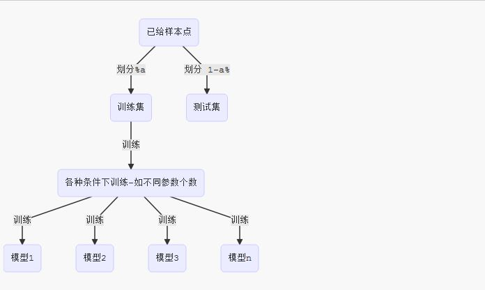

# 统计学习方法概论

## 统计学习三要素

1.统计学习的对象是数据

~~~mermaid
graph LR;
A[数据]-- 提取 -->B[数据特征];
B--建立-->C[数据模型];
C--求解-->D[模型参数];
D--应用-->E[新数据预测];
~~~

2.统计学习的前提：同类数据具有一定的统计规律。
	> 同类：具有某种共同性质的数据

3.监督学习的要素：
	
- 训练数据集合：给定的、有限的数据集合。 用于学习过程，且假设这些数据独立同分布产生。
- 学习的模型：假定数域某一类函数的集合。称之为假设空间
- 策略：应用某种评价准测（比如最小化误差率，比如最大化效用等等），从假设空间中选择一个最优的模型，使得它对于已知训练数据和未知测试数据在给定评价准则下具有最优的预测。
- 算法：用于实现最优模型的选取。

任何种类的统计学习都包含模型、策略、算法这三要素。其中模型用于建模、策略用于给出目标函数、算法给出如何求解模型参数使得目标函数最优
> 监督的含义：训练数据集是人工给出的，所以称之为监督学习

4.**特征向量**：每个具体的输入时一个实例，由特征向量表示；  
**特征空间**：所有特征向量构成的空间  
**输入空间**：所有输入的可能取值  
**输出空间**：所有输出的可能取值

- 特征空间的每一个维度对应一种特征
- 可以将输入空间等同于特征空间。但是也可以不同。通过映射，从输入中提取输出

~~~mermaid
graph LR;
A[输入空间]-- 映射 -->B[特征空间];
~~~
- 模型是定义在特征空间上的5.

5.通常输入变量用 \\(\mathrm{X}\\) 表示，输出变量用  \\(\mathrm{Y}\\) 表示。具体的输入取值记作 \\(\mathbf x\\) ，具体的输出取值记作 \\(\mathbf y\\),取值既可以是标量也可以是向量。

这里所有的向量均为列向量，其中输入实例 \\(\mathbf x\\) 的特征向量记作：

$$
\mathbf{x}=
\begin{pmatrix}
\mathbf x^{(1)} \\\
\mathbf x^{(2)} \\\
\vdots\\\
\mathbf x^{(n)} \\\
\end{pmatrix}
$$

这里  \\(\mathbf x^{(i)}\\) 为  \\(\mathbf x\\)  的第 \\(i\\) 个特征的取值，这里假设特征空间为 n 维

第  \\(i\\)  个输入记作 \\( \mathbf x_i \\)，它的意义不同于  \\(\mathbf x^{(i)}\\) 

6.训练数据由输入、输出对组成。通常训练集表示为：

$$
\mathbf{T=\\{(x_1,y_1),(x_2,y_2),\cdots,(x_N,y_N)\\}}
$$
测试数据也由输入、输出对组成。
> 输入、输出对又称作样本/样本点

7.输入变量 \\(\mathrm{X}\\) 和输出变量  \\(\mathrm{Y}\\) 可以是连续的，也可以是离散的。

-  \\(\mathrm{X}\\) 和 \\(\mathrm{Y}\\) 均为连续的：这一类问题称为回归问题
-  \\(\mathrm{Y}\\) 为离散的，且是有限的：这一类问题称之为分类问题
-  \\(\mathrm{X}\\) 和 \\(\mathrm{Y}\\) 均为变量序列：这一类问题称为标准问题

标注问题看上去好像是在序列上的分类，但是它与分类的最大区别是：标注采用的特征是有上下文分类结果的，这个结果你是不知道的。比如你要确定一个单词的分类首先必须知道上一个单词的分类，所以必须整句话所有单词一起解，没办法一个词一个词的解。  

而分类是只需要判别当前单词的类别，不需要考虑前一个单词分配的结果。

8.监督学习假设输入与输出的随机变量\\(\mathrm{X}\\) 和 \\(\mathrm{Y}\\)  遵循联合概率分布 \\( \mathrm{P(X,Y)}\\)

- 学习过程中，假定这个联合概率分布存在，但是具体定义未知
- 训练数据与测试数据视为依联合概率分布 \\( \mathrm{P(X,Y)}\\) 独立同部分产生。

> 这是监督学习关于数据的基本假设

9.监督学习的目的在于学习一个由输入到输出的映射，该映射由模型表示。

- 模型属于由输入空间到输出空间的映射的集合（该集合就是假设空间）
- 假设空间的确定意味着学习范围的确定（如，确定假设空间就是多项式，那么确定了学习范围就是学习多项式的参数）
- 监督学习的模型可以为概率模型或者非概率模型
	- 概率模型由条件概率分布 \\(P(Y/X)\\)  表示
	- 非概率模型由决策函数 \\(Y=f(X)\\) 表示
	
	预测具体输出时，记作 \\(P(\mathbf{y/x})\\) 或者记作  \\(\mathbf y=f( \mathbf x)\\)

10.监督学习的形式化描述：

- 监督学习氛围学习和预测两个过程，由学习系统和预测系统完成
- \\(\mathbf{\\{(x_1,y_1),(x_2,y_2),\cdots,(x_N,y_N)\\}}\\) 为 N 个样本， \\(\mathbf x_i \in  \mathcal X \\) 为输入的观测值，\\(\mathbf y_i \in  \mathcal Y \\) 是输出的观测值

	假设训练数据与测试数据是依据联合概率分布 \\(P(X,Y)\\) 独立同分布的
- 学习系统利用给定的训练集，通过学习/训练得到一个模型，表示为条件概率分布 \\(\hat P(Y/X)\\) 或者决策函数 \\(Y=\hat f(X)\\)
- 预测系统对给定的测试样本集中的输入 \\(\mathbf x_{N+1}\\) ，根据模型：

$$
\mathbf y\_{N+1}=\arg\_{\mathbf y\_{N+1}} \max \hat P(\mathbf{y\_{N+1}/x\_{N+1}})\\\
\text{or :} \quad \mathbf y\_{N+1}=\hat f(\mathbf x_{N+1})
$$

   给出  \\(\mathbf y_{N+1}\\) 
> \\(\arg\max\\) 的意思是： 求得某个参数  \\(\mathbf y_{N+1}\\)  使得   \\(P(\mathbf{y\_{N+1}/x\_{N+1}})\\)  最大，返回这个 \\(\mathbf y\_{N+1}\\) 值

11.统计学习三要素：方法=模型+策略+算法

- **模型**：定义了解空间。监督学习中，模型就是要学习的条件概率分布或者决策函数。模型的假设空间包含了所有可能的条件概率分布或者决策函数，因此假设空间中的模型有无穷多个。
	- 假设空间 \\( \mathcal F=\\{f/Y=f(X)\\}\\) 为决策函数的集合。 \\(X \in \mathcal X, Y \in \mathcal Y \\) 为变量，其中 \\(\mathcal X\\) 为输入空间，  \\(\mathcal Y\\) 为输出空间
		> 通常 \\( \mathcal F\\)是由一个参数向量 \\(\vec \theta=(\theta^{(1)},\cdots,\theta^{(n)})\\) 决定的函数族。 \\( \mathcal F=\\{f/Y=f_{\vec\theta}(X),\vec\theta \in \mathbb R^{n}\\}\\)， \\(f\_{\vec\theta}\\) 只与 \\(\vec\theta\\) 有关，称 \\(\vec\theta\\) 为参数空间
	- 假设空间 \\( \mathcal F=\\{P/P(Y/X)\\}\\) 为条件概率的集合。\\(X \in \mathcal X, Y \in \mathcal Y \\) 为随机变量，其中 \\(\mathcal X\\) 为输入空间，  \\(\mathcal Y\\) 为输出空间
		> 通常 \\( \mathcal F\\)是由一个参数向量 \\(\vec \theta=(\theta^{(1)},\cdots,\theta^{(n)})\\) 决定的概率分布族。 \\( \mathcal F=\\{P/P_{\vec\theta}(Y/X),\vec\theta \in \mathbb R^{n}\\}\\)， \\(P\_{\vec\theta}\\) 只与 \\(\vec\theta\\) 有关，称 \\(\vec\theta\\) 为参数空间

- **策略**：定义了优化目标。策略考虑的是按照什么样的准则学习。通常有下列准则：
	- **损失函数**：对于给定的输入 \\(X\\)， 由 \\(f(X) \quad or \quad  P(Y/X)\\)  预测的输出值与 \\(Y\\) 真实值可能不一致，用损失函数度量错误的程度，记作 \\(L(Y,f(X))\\) 或者 \\(L(Y,P(Y/X))\\) 。也称作代价函数。常用的损失函数有：
		- 0-1 损失函数： \\(L(Y,f(X)=1,if \quad Y \ne f(X);L(Y,f(X)=0,if \quad Y = f(X); \\)
		- 平方损失函数： \\(L(Y,f(X))=(Y-f(X))^{2}\\)
		- 绝对损失函数： \\(L(Y,f(X))=|Y-f(X)|\\)
		- 对数损失函数： \\(L(Y,P(Y/X))=- \log P(Y/X)\\)
			> 因为 Y 已经出现，因此理论上 \\(P(Y/X) \\) 为1.如果它不为1，则说明预测有误差。越远离1，说明误差越大。
	- **风险函数**：（也叫做期望损失）。通常损失函数值越小，模型就越好。但是由于模型的输入输出都是随机变量，遵从联合分布 \\(P(X,Y)\\)， 因此定义风险函数为损失函数的期望：
$$
R\_{exp}(f)=E_p[L(Y,f(X))]=\int_{\mathcal{X \times Y}}L(y,f(x))P(x,y)dxdy
$$
	其中 \\(\mathcal{X , Y}\\) 分别为输入空间和输出空间。学习的目标是选择风险函数最小的模型。
	> 求\\( R_{exp}(f)\\) 的过程中要用到 \\(P(x,y)\\) ,但是  \\(P(x,y)\\) 未知。实际上如果它已知，则可以轻而易举求得条件概率分布，也就不需要学习。因此监督学习也就成为一个病态的问题。
	- **经验风险**：也叫经验损失。给定训练集 \\(\mathbf{T=\\{(x_1,y_1),(x_2,y_2),\cdots,(x_N,y_N)\\}}\\)，模型 \\(f(X)\\) 关于 T 的经验风险定义为：
$$
R_{emp}(f)=\frac 1{N} \sum\_{i=1}^{N}L(\mathbf y_i,f(\mathbf x_i))
$$
	经验风险是模型在 T 上的平均损失。根据大数定律，当  \\(N \rightarrow \infty \\) 时， \\(R\_{emp}(f) \rightarrow R\_{exp}(f) \\)。但是由于现实中训练集中样本数量有限，甚至很小，所以需要对经验风险进行矫正。

	常用有两种策略：
	- **经验风险最小化**(`empirical risk minimization:ERM`):经验风险最小的模型就是最优的模型：即
	$$\min_{ f\in \mathcal{F}} \frac{1}{N}\sum\_{i=1}^{N}  L(\mathbf y_i,f(\mathbf x_i))$$
	- **结构风险最小化**(`structurel risk minimization:SRM`)：它是在经验风险上加上表示模型复杂度的正则化项（或者称之为罚项）。它是为了防止过拟合而提出的。结构风险定义为：
	$$R\_{srm}(f)=\frac{1}{N} \sum_{i=1}^{N}L(\mathbf y_i,f(\mathbf x_i))+\lambda J(f)$$
	其中  \\(J(f)\\) 为模型复杂度，是定义在假设空间 \\(\mathcal F\\) 上的泛函。 \\(f\\) 越复杂，则   \\(J(f)\\) 越大。 \\(\lambda \ge 0\\) 为系数，用于权衡经验风险和模型复杂度。SRM策略认为：结构风险最小的模型是最优的模型：
	$$\min\_{f \in \mathcal F} \frac{1}{N} \sum\_{i=1}^{N}L(\mathbf y_i,f(\mathbf x_i))+\lambda J(f)$$
		> 结构风险小，要求经验风险与模型复杂度都同时小
		>
		> SRM策略符合奥卡姆剃刀原理：能够很好的解释已知数据且十分简单才是最好的模型
- **算法**: 指学习模型的具体计算方法。通常用数值计算的方法求解。
	> 即用什么方法求解最优模型（求解最优化问题的算法）

12.极大似然估计就是经验风险最小化的例子。
极大似然估计：已知样本点为： \\(\mathbf{T=\\{(x_1,y_1),(x_2,y_2),\cdots,(x_N,y_N)\\}}\\)，则出现这种训练集的概率为： \\(\prod_{i=1}^{N}P(\mathbf{ y_i/x_i})\\)，则由 T 出现概率最大：
$$
\max \prod\_{i=1}^{N}P(\mathbf{ y_i/x_i})\rightarrow \max\sum\_{i=1}^{N}\log P(\mathbf{ y_i/x_i})\\\
\rightarrow \min \sum\_{i=1}^{N}(-\log P(\mathbf{ y_i/x_i}))\\\
def: L(Y,P(Y/X))=-\log P( Y/X)\\\
\min \sum\_{i=1}^{N}(-\log P(\mathbf{ y_i/x_i}))\rightarrow  \min \sum\_{i=1}^{N}L(\mathbf y_i,P(\mathbf{ y_i/x_i}))\\\
\rightarrow  \min \frac{1}{N}\sum\_{i=1}^{N}L(\mathbf y_i,P(\mathbf{ y_i/x_i}))
$$ 
即 ERM

13.最大后验概率估计就是结构风险最小化的例子。已知样本点为： \\(\mathbf{T=\\{(x_1,y_1),(x_2,y_2),\cdots,(x_N,y_N)\\}}\\)，假设已知参数 \\(\mathbf\theta\\)  的先验分布为 \\(g(\theta)\\)，则出现这种训练集的概率为： \\(\prod_{i=1}^{N}P(\mathbf{ y_i/x_i})g(\theta)\\)，则由 T 出现概率最大： 
$$
\max \prod\_{i=1}^{N}P(\mathbf{ y_i/x_i})g(\theta)\rightarrow \max\sum\_{i=1}^{N}\log P(\mathbf{ y_i/x_i})+\log g(\theta)\\\
\rightarrow \min \sum\_{i=1}^{N}(-\log P(\mathbf{ y_i/x_i}))+\log \frac{1}{g(\theta)}\\\
def: L(Y,P(Y/X))=-\log P( Y/X),\lambda=\frac{1}{N},J(f)=\log \frac{1}{g(\theta)}\\\
\min \sum\_{i=1}^{N}(-\log P(\mathbf{ y_i/x_i}))+\log \frac{1}{g(\theta)}\rightarrow  \min \sum\_{i=1}^{N}L(\mathbf y_i,P(\mathbf{ y_i/x_i}))+J(f)\\\
\rightarrow  \min \frac{1}{N}\sum\_{i=1}^{N}L(\mathbf y_i,P(\mathbf{ y_i/x_i}))+\lambda J(f)
$$ 
即 SRM

14.训练时采用的损失函数不一定是评估时的损失函数。但通常二者是一致的。

## 模型评估、选择与验证

1.**训练误差**:关于训练集的平均损失。假设学习到的模型为\\(Y=\hat f(X)\\)，则训练误差为：
$$Remp(\hat f)=\frac{1}{N} \sum_{i=1}^{N} L(\mathbf y_i,\hat f(\mathbf x_i))$$
其中 N 为训练样本容量。

**测试误差**:模型关于测试集的平均损失：
$$e\_{test}=\frac{1}{N^{\prime}} \sum_{i=1}^{N^{\prime}} L(\mathbf y_i,\hat f(\mathbf x_i))$$
其中 \\(N^{\prime}\\) 为训练样本容量。

**测试准确率**:测试数据集上的准确率：
$$r\_{test}=\frac{1}{N^{\prime}} \sum_{i=1}^{N^{\prime}}I(\mathbf y_i=\hat f(\mathbf x_i))$$
其中 \\(I \\)为是示性函数。

** 测试误差率**:测试数据集上的误差率：
$$e\_{test}=\frac{1}{N^{\prime}} \sum_{i=1}^{N^{\prime}}I(\mathbf y_i \ne \hat f(\mathbf x_i))$$
其中 \\(I \\) 为是示性函数。它也是损失函数为 0-1 损失时的测试误差

2.测试误差反应了学习方法对未知测试数据集的预测能力。
> 训练误差的大小虽然有意义，但是本质上不重要

3.当假设空间含有不同复杂度的模型（如参数个数不同），面临模型选择问题时：

- 若假设空间存在“真”模型，则所选模型应该逼近真模型（所选参数个数与真模型相同）
- 若单方面追求提高对训练数据的预测能力，则所选模型的复杂度往往比真模型更高，这种现象称为过拟合。
- 过拟合指的是学习时选择的模型包含的参数过多，以至于该模型对于已知数据预测得很好，但是对于未知数据预测的很差的现象。
	> 模型的选取要避免过拟合

4.模型复杂度增大时，训练误差会逐渐减小并趋向于0（因为可以设计一个非常复杂的模型，使得它完全拟合训练数据从而使得训练误差为0）；但是测试误差会先减小后增大（发生过拟合）

5.防止过拟合：用正则化与交叉验证。

6.**正则化**：基于结构化风险最小化（SRM）策略的实现，其中 \\(J(f)\\) 为正则化项。

在不同的问题中，正则化项可以有不同的形式：

- 回归问题中：损失函数是平方损失，正则化项是参数向量的 \\(L_2\\) 范数
- 贝叶斯估计中，正则化项对应于模型的先验概率 \\(\log \frac{1}{g(\theta)}\\)

7.**交叉验证**：当样本数据充足时，随机地将数据切分为三部分（也可以切分成两部分，此时训练集也是验证集）：

- **训练集**:用于训练模型
- **验证集**:用于模型选择，选择对验证集有最小预测误差的模型
- **测试集**：用于对学习方法的评估

交叉验证的基本思想是：重复使用数据。把给定的数据进行切分，将切分的数据集组合为训练集与测试集。在此基础上反复训练、测试以及模型选择：

- **简单交叉验证**: 

	  
 
  然后在测试集上评估各个模型的测试误差。
- **S折交叉验证**：
	- 数据随机划分为 S 个互不相交且大小不同的子集
	- 利用 S-1 个子集数据训练模型，利用余下的子集测试模型。（一共有 \\( C_s^{s-1} =S\\) 种组合）
	- 对 S 种组合依次重复进行，最后选出 S 次评估中平均测试误差最小的模型
- 留一交叉验证： 当 S 等于样本点数量时的 S 折交叉验证。这种方法一般是在数据缺乏的时候使用。

8.**学习方法的泛化能力**：由该学习方法学到的模型对未知数据的预测能力。它是学习方法本质上最重要的性质。

- 现实中采用最多的办法是通过测试误差评估学习方法的泛化能力。由于测试数据集时有限的，因此通常这种评估结果不可靠
- 泛化误差可以反映学习方法的泛化能力。泛化误差越小，该学习方法越有效。

	泛化误差定义为所学习模型的期望风险，即：
	$$R_{exp}(\hat f)=E[L(Y,\hat f(X))]=\int\_{\mathcal{X \times Y}}L(\mathbf y,\hat f(\mathbf x))P(\mathbf x,\mathbf y)d \mathbf xd \mathbf y$$
	> 通常泛化误差是不可知的，因为无法获取联合概率分布 \\(P(\mathbf x,\mathbf y)\\) 以及无限的采样点。

- 泛化误差的概率上界简称为泛化误差上界。通常比较两种学习方法的泛化误差上界来比较它们的优劣。
	- 泛化误差上界是样本容量的函数。当样本容量增加时，泛化上界趋于0
	- 泛化误差上界是假设空间容量的函数。当假设空间容量越大，模型就越难学，泛化误差上界就越大

## 统计学习问题的分类

1.监督学习又分为生成方法和判别方法，所用到的模型分别称为生成模型和判别模型：

- **生成方法**：通过数据学习联合概率分布 \\(P(X,Y)\\) ，然后求出条件概率分布 \\(P(Y/X)\\) 作为预测的模型，即生成模型:
	$$P(Y/X)=\frac{P(X,Y)}{P(X)}$$
	优点是：能还原概率分布、\P(X,Y)\\)，收敛速度快。且当存在隐变量时只能用生成方法。
	>生成方法有：朴素贝叶斯法，隐马尔可夫链
- **判别方法**：由学习决策函数 \\(f(X)\\) 或者条件概率分布 \\(P(Y/X)\\) 作为预测的模型，即判别模型。优点是直接预测，一般准确率更高，且一般比较简化问题。

2.**分类问题**：当输出变量 Y 取有限个离散值时，预测问题便成为分类问题
	> 输入变量 X 可以是离散的，也可以是连续的

- **分类器**：从数据中学习的分类模型或者分类决策函数
- **分类**：分类器对新的输入进行输出的预测
- **二类分类问题**：分类的类别只有两类
- 评价分类器性能指标一般是分类准确率（在测试集上）： 分类器正确分类样本数 / 总样本数 × 100%
	> 它也等于损失函数为 0-1 损失时，分类器在测试数据集上的正确率
- 通常将关注的类分为正类，其他类分为负类。分类器在测试集上的预测或者正确或者不正确。令：
	- TP:分类器将正类预测为正类的数量
	- FN：分类器将正类预测为负类的数量
	- FP：分类器将负类预测为正类的数量
	- TN：分类器将负类预测为负类的数量

	定义：
	- 精确率为： \\(P=\frac{TP}{TP+FP}\\)，即所有预测为正类的结果中，真正的正类的比例
	- 召回率为： \\(R=\frac{TP}{TP+FN}\\)，即真正的正类中，被分类器找出来的比例
	- 精确率与召回率的调和均值：\\(\frac{2}{F_1}=\frac {1}{P}+\frac{1}{R}\\)
	> 不同的问题中，判别标准不同。对于推荐系统，更侧重于精确率（即推荐的结果中，用户真正感兴趣的比例）；对于医学诊断系统，更侧重与召回率（即疾病被发现的比例）

3.**标注问题**：标注问题的输入是一个观测序列，输出时一个标记序列或者状态序列。
> 如文字翻译工作。输入：一段英文单词；输出：一段中文单词

问题描述：给定训练集：\\(\mathbf{T=\\{(x_1,y_1),(x_2,y_2),\cdots,(x_N,y_N)\\}}\\) ,其中 \\(\mathbf x_i=(\mathbf x_i^{(1)},\mathbf x_i^{(2)},\cdots,\mathbf x_i^{(n)}),\mathbf y_i=(\mathbf y_i^{(1)},\mathbf y_i^{(2)},\cdots,\mathbf y_i^{(n)}),i=1,2,\cdots,N\\), \\(\mathbf x_i\\) 为输入的观测序列，\\(\mathbf y_i\\) 为相应的输出标记序列。每一维元素为序列的成员。

要学习的模型为条件概率分布： \\(P(\mathbf Y/\mathbf X)=P(Y^{(1)},Y^{(2)},\cdots,Y^{(n)}/X^{(1)},X^{(2)},\cdots,X^{(n)})\\)，这里每个 \\(X^{(i)},i=1,2,\cdots,n\\)  取值为所有可能的观测，每个  \\(Y^{(i)},i=1,2,\cdots,n\\)  取值为所有可能的标记。

- 标注系统根据学习到的条件概率分布模型，对每个新的输入观测序列：\\(\mathbf x_{N+1}=(\mathbf x\_{N+1}^{(1)},\mathbf x\_{N+1}^{(2)},\cdots,\mathbf x\_{N+1}^{(n)})\\) ，求出使得条件概率\\(P(\mathbf{y\_{N+1}/x\_{N+1}})=P(\mathbf y\_{N+1}^{(1)},\mathbf y\_{N+1}^{(2)},\cdots,\mathbf y\_{N+1}^{(n)}/\mathbf x\_{N+1}^{(1)},\mathbf x\_{N+1}^{(2)},\cdots,\mathbf x\_{N+1}^{(n)})\\) 最大的标记序列 \\(\mathbf y\_{N+1}=(\mathbf y\_{N+1}^{(1)},\mathbf y\_{N+1}^{(2)},\cdots,\mathbf y\_{N+1}^{(n)})\\)
- 常用的评价指标有标注准确率，、精确率和召回率。定义与分类模型相同

4.**回归问题**： 用于预测输入变量和输出变量之间的关系。回归问题的学习等价于函数拟合。

- 回归问题分为一元回归和多元回归；也可以分为线性回归和非线性回归
- 回归学习最常用的损失函数是平方损失函数。

## 多类分类问题

1.某些算法原生的允许多类分类（比如决策树、最近邻算法等）。但是有些算法只能求解二类分类问题（如感知机，支持向量机）。而有些算法既可以求解二类分类，又可以求解多类分类（如`logistic`回归）。

2.对于只能求解二类分类问题的算法，一旦遇到问题是多类别的，则有两种策略来利用二类分类来解决多类分类：

- `One-vs-rest`：该策略的原理是：对每一个类别训练一个分类器。假设类别为 \\(c_1,c_2,\cdots,c_K\\)。那么训练 K 个分类器：\\(CLF_1,CLF_2,\cdots,CLF_K\\):
	- 训练 \\(CLF_i\\) 时，对于类别为 \\(c_i\\) 的样本点定义为正类；对于类别不是\\(c_i\\) 的样本点定义为负类
	- 训练分类器 \\(CLF_i\\) 的打分能力而不是贴标签能力，该分数作为分类器\\(CLF_i\\) 的评估能力
	- 预测：对于未知的实例,用训练出来的 K 个分类器打分。假设分数最高的分类器为   \\(CLF_j\\) ，则该实例的类别为 \\(c_j\\)
	
	该方法有个问题：当训练集中每一类样本都是平衡的（即每一类的规模都差不多），则训练每个分类器时样本不平衡了（正类偏少，负类太多）。
- `one-vs-one`：该策略的原理是：对每一对类别训练一个分类器。假设类别为 \\(c_1,c_2,\cdots,c_K\\)。那么训练 \\(\frac{K(K-1)}{2}\\) 个分类器：\\(CLF\_{1,2},CLF\_{1,3},\cdots,CLF\_{i,j},\cdots,CLF\_{K-1,K}\\)。
	- \\(CLF\_{i,j},i\lt j\\) 分类器从原始训练集中提取类别为 \\(c_i,c_j\\) 的样本点作为新的训练集，然后训练 \\(CLF\_{i,j},i\lt j\\)（即该分类器只需要识别类别 \\(c_i,c_j\\) ）
	- 预测：对于未知的实例，对它进行投票。
		- 首先设投票结果为 \\(s_0=0,s_1=0,\cdots,s_K=0\\)：
		- 然后对每个分类器 \\(CLF\_{i,j},\quad i\lt j;i,j=1,2,\cdots,K\\)，对未知实例进行预测：
			- 若预测结果是类别 \\(c_i\\)，则 \\(s_i+=1\\)
			- 若预测结果是类别 \\(c_j\\)，则 \\(s_j+=1\\)
		- 最后假设 \\(s_m\\) 最大，则该未知的实例分类为 \\(c_m\\)

	该方法的问题是，计算量太大。

