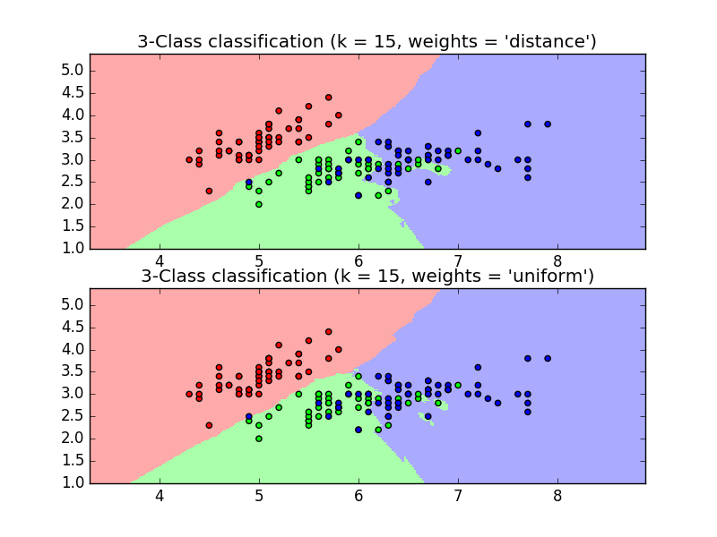
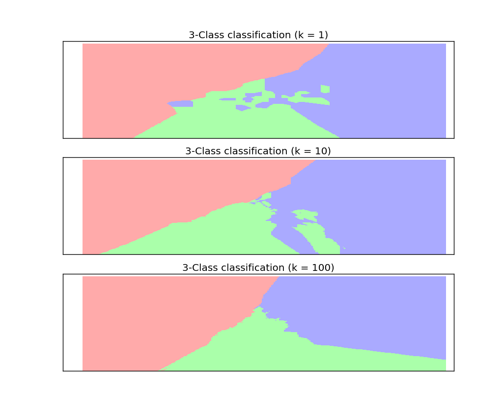
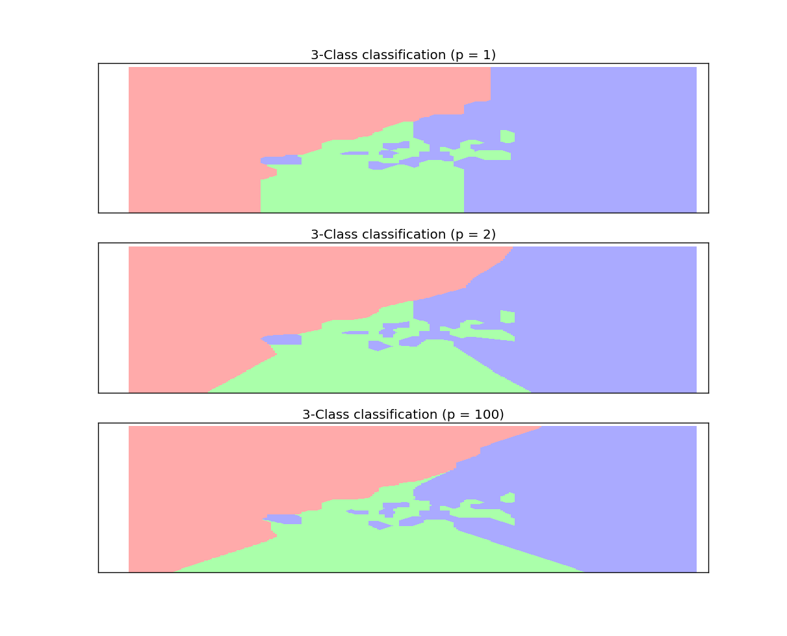

# k 近邻法

## k 近邻算法

1.k 近邻法是一种基本的分类与回归方法。它的输入为实例的特征向量，输出为实例的类别。分类时，对于新的实例，根据其 k 个最近邻的训练实例的类别，通过多数表决等方式进行预测

- k 近邻法不具有显式的学习过程
- k 近邻法实际上利用训练数据集对特征向量空间进行划分，并且作为其分类的"模型"
- k 近邻法的三要素： k 值选择、距离度量、分类决策规则

2.k 近邻法的直观理解：给定一个训练数据集，对于新的输入实例，在训练集中找到与该实例最邻近的 k 个实例。这 k 个实例的多数属于某个类别，则该输入实例就划分为这个类别。

3.k 近邻法的算法描述：

- **输入**： 训练数据集 \\(T=\\{(\mathbf x_1,y_1),(\mathbf x_2,y_2),\cdots,(\mathbf x_N,y_N)\\},\mathbf x_i \in \mathcal X \subseteq \mathbb R^{n}\\) 为实例的特征向量。 \\(y_i \in \mathbb Y=\\{c_1,c_2,\cdots,c_k\\}\\)，为实例的类别。 \\(i=1,2,\cdots,N\\)。 给定实例特征向量 \\(\mathbf x\\)
- **输出**： 实例 \\(\mathbf x\\) 所属的类别 \\(y\\)
- 步骤：
	- 根据给定的距离度量，在 T 中寻找与 \\(\mathbf x\\) 最近邻的 k 个点。定义涵盖这 k 个点的 \\(\mathbf x\\) 的邻域记作 \\(N_k(\mathbf x)\\)
	- 从  \\(N_k(\mathbf x)\\) 中，根据分类决策规则（如多数表决） 决定  \\(\mathbf x\\) 的类别  \\(y\\)：
	$$
	y=\arg \max_{c_j} \sum\_{\mathbf x_i \in N_k(\mathbf x) } I(y_i=c_j),i=1,2,\cdots,N;j=1,2,\cdots,k
	$$ 其中I 为指示函数： \\(I(true)=1,I(false)=0\\)
>- 最近邻算法：当 k=1 时的 k 近邻算法称为最近邻算法。此时将 T 中与 \\(\mathbf x\\) 最近的点的类别作为 \\(\mathbf x\\) 的分类
>- k 近邻法没有显式的学习过程，它是直接决策

4.k 近邻法使用的模型实际上对应于特征空间的划分。当训练集 T 、距离度量（比如欧氏距离）、k值 以及分类决策规则（如多数表决）确定后，对于任何一个新的输入实例，它所属的分类唯一地确定
> 这相当于根据上述条件将特征空间划分为一些子空间，并确定了子空间里的每个点的所属的分类

- 特征空间中，对每个训练实例点 \\(\mathbf x_i\\) ，距离该点比其他点更近的所有点组成一个区域叫做单元。每个训练实例点拥有一个单元。所有训练实例点的单元构成对特征空间的一个划分。**最近邻法** 将实例 \\(\mathbf x_i\\) 的类 \\(y_i\\) 作为其单元中所有点的类标记。
	
5.特征空间中两个实例点的距离是两个实例点的相似程度的反映。

- k 近邻模型的特征空间一般是 n 维实数向量空间 \\( \mathbb R^{n}\\)
- k 近邻模型的特征空间的距离一般为欧氏距离，也可以是一般的 \\(L_p\\) 距离：
	$$
	L_p(\mathbf{x_i,x_j})=(\sum_{l=1}^{n}|\mathbf x_i^{(l)}- \mathbf x_j^{(l)}|^{p})^{1/p}\\\
	\mathbf{x_i,x_j} \in \mathcal X=\mathbb R^{n}\\\
	\mathbf x_i=(\mathbf x_i^{(1)},\mathbf x_i^{(2)},\cdots,\mathbf x_i^{(n)})\\\
	\mathbf y_i=(\mathbf y_i^{(1)},\mathbf y_i^{(2)},\cdots,\mathbf y_i^{(n)})\\\
	p \ge 1
	$$
	- 当 p=2 时，为欧氏距离： \\(L_2(\mathbf{x_i,x_j})=(\sum_{l=1}^{n}|\mathbf x_i^{(l)}- \mathbf x_j^{(l)}|^{2})^{1/2}\\)
	- 当 p=1 时，为曼哈顿距离： \\(L_1(\mathbf{x_i,x_j})=\sum_{l=1}^{n}|\mathbf x_i^{(l)}- \mathbf x_j^{(l)}|\\)
	- 当 \\(p=\infty\\) 时，为各维度距离中的最大值： \\(L\_{\infty}(\mathbf{x_i,x_j})=\max_l|\mathbf x_i^{(l)}- \mathbf x_j^{(l)}|\\)

6.不同的距离度量所确定的最近邻点是不同的

7.k 值的选择会对 k 近邻法的结果产生重大影响

- 若 k 值较小，则相当于用较小的邻域中的训练实例进行预测，"学习"的近似误差减小。只有与输入实例较近的训练实例才会对预测起作用

	缺点是"学习"的估计误差会增大，预测结果会对近邻的实例点非常敏感。若近邻的训练实例点刚好是噪声，则预测会出错。
	>  即 k 值的减小意味着模型整体变复杂，易发生过拟合

- 若 k 值较大，则相当于用较大的邻域中的训练实例进行预测。
	- 优点：减少学习的估计误差
	- 缺点： 学习的近似误差会增大。这时输入实例较远的训练实例也会对预测起作用，使预测发生错误
	> 即 k 值增大意味着模型整体变简单。当 k=N 时，无论输入实例是什么，都将它预测为训练实例中最多的类（即预测结果是一个常量）。此时模型过于简单，完全忽略了训练实例中大量有用的信息。

应用中，k 值一般取一个较小的数值。通常采用交叉验证法来选取最优的 k 值

8.k 近邻法的分类规则往往采用多数表决。设分类的损失函数为 0-1 损失函数，分类函数为 \\(f:\mathbb R^{n} \rightarrow \\{c_1,c_2,\cdots,c_k\\}\\) ，误分类概率为： \\(P(Y \ne f(X)=1-P(Y=f(X))\\)

给定实例  \\(\mathbf x \in \mathcal X\\) ，其最邻近的 k 个训练点构成集合   \\(N_k(\mathbf x)\\)。 设涵盖 \\(N_k(\mathbf x)\\) 区域的类别为  \\(c_j\\)，则误分类率为：
$$
\frac {1}{k}\sum_{\mathbf x_i \in N_k(\mathbf x)}I(y_i \ne c_j)=1-\frac{1}{k}\sum\_{\mathbf x_i \in N_k(\mathbf x)}I(y_i = c_j)
$$

误分类率就是训练数据的经验风险。要是误分类率最小，即经验风险最小，则使得  \\(\sum\_{\mathbf x_i \in N_k(\mathbf x)}I(y_i = c_j)\\) 最大。即多数表决规则等价于经验风险最小化

## kd树

1.实现 k 近邻法时，注意考虑问题是如何对训练数据进行快速 k 近邻搜索

- 最简单的实现方法：线性扫描。此时要计算输入实例与每个训练实例的距离。当训练集很大时，计算非常耗时
- 用 kd 树存储训练数据时，可以大幅提高 k 近邻搜索的效率

2.**kd树**：是一种对 k 维空间中的实例点进行存储一边对其进行快速检索的树型数据结构。

- kd 树是二叉树，表示对 k 维空间的一个划分。构造 kd 树的过程相当于不断的用垂直于坐标轴的超平面将 k 维空间切分的过程。 kd 树的每个结点对应于一个 k 维超矩形区域
- 构造平衡 kd 树的算法：
	- 输入： k 维空间数据集 \\(T=\\{\mathbf x_1,\mathbf x_2,\cdots,\mathbf x_N\\},\mathbf x_i \in \mathcal X \subseteq \mathbb R^{k}\\)
	- 输出： kd 树
	- 算法步骤：
		- 开始：构造根结点。根结点对应于包含 T 的 k 维超矩形。

			选择 \\(\mathbf x^{(1)}\\) 为轴，以 T 中所有实例的 \\(\mathbf x^{(1)}\\) 坐标的中位数为切分点，将根结点的超矩形切分为两个子区域。（切分由通过切分点且与 \\(\mathbf x^{(1)}\\) 轴垂直的超平面实现）

			切分产生深度为 1 的左、右子结点。左子结点对应于坐标 \\(\mathbf x^{(1)}\\) 小于切分点的子区域；右子结点对应于坐标 \\(\mathbf x^{(1)}\\) 大于切分点的子区域；落在切分超平面上的点保存在根结点
		- 重复：对深度为 j 的结点，选择 \\(\mathbf x^{(l)}\\) 为切分的坐标轴， \\(l=j\pmod k+1\\)。本次切分之后，树的深度为 j+1。这里取模，而不是 \\(l=j+1\\) 是因为树的深度可以超过维度 k，此时切分轴又重复回到 \\(\mathbf x^{(1)}\\)，轮转坐标轴进行切分
		- 结束：直到所有结点两个子域中没有实例存在时，切分停止。此时形成 kd 树的区域划分。

3.用 kd 树的最近邻搜索（k 近邻搜索依次类推）：

- 输入： 已构造的 kd 树；测试点 \\(\mathbf x\\)
- 输出： \\(\mathbf x\\) 的最近邻测试点
- 步骤：
	- 在 kd 树中找到包含测试点 \\(\mathbf x\\) 的叶结点： 从根结点出发，递归向下访问 kd 树：
		- 若测试点  \\(\mathbf x\\)  当前维度的坐标小于切分点的坐标，则查找当前结点的左子结点
		- 若测试点  \\(\mathbf x\\)  当前维度的坐标大于切分点的坐标， 则查找当前节点的右子结点

		在访问过程中记录下访问的各结点的顺序（以便于后面的回退）
	- 以此叶结点为”当前最近“ \\(\mathbf x_{nst}\\) 。真实最近点一定在  \\(\mathbf x\\)  与 ”当前最近点“构成的超球体内。 \\(\mathbf x\\)  为球心
	- 递归向上回退，设取出的结点为结点  \\(\mathbf x_i\\)（每次回退都是退到 kd 树的父节点，假设回退之前的结点是父节点的左子节点），考察结点 \\(\mathbf x_i\\) 所在的超平面与以 \\(\mathbf x\\) 为球心、以 \\(\mathbf x\\) 到当前最近点  \\(\mathbf x_{nst}\\) 的距离为半径的超球体是否相交：
		- 若相交，则进入结点 \\(\mathbf x_i\\)的右子结点进行搜索并回退。
		- 若不相交，则直接回退
	- 当回退到根结点时，搜索结束。最后的”当前最近点“即为  \\(\mathbf x\\)  的最近邻点

4.kd 树搜索的平均计算复杂度为 \\(O(\log N)\\) 。N 为训练集大小。 kd 树适合 \\(N >> k\\)的情形。当 N 与 维度 k 接近时，效率会迅速下降。

## 实践

1.下面给出`sklearn`中的 K近邻算法的例子。

```
import numpy as np
import matplotlib.pyplot as plt
from matplotlib.colors import ListedColormap
from sklearn import neighbors, datasets

n_neighbors = 15 # k值

# 导入数据集
iris = datasets.load_iris()
X = iris.data[:, :2]  # 仅仅使用前两个特征，这样的目的是为了绘制图形方便（二维图形）
y = iris.target

h = .02  # step size in the mesh

# 分类和绘图
cmap_light = ListedColormap(['#FFAAAA', '#AAFFAA', '#AAAAFF']) #用于绘制网格图
cmap_bold = ListedColormap(['#FF0000', '#00FF00', '#0000FF']) # 用于绘制散点图

figure=plt.figure()
ax1=figure.add_subplot(2,1,1)
ax2=figure.add_subplot(2,1,2)
ax=[ax1,ax2]
for weights in ['uniform', 'distance']: #两种不同的权重
    ########## 创建 Neighbours Classifier 然后训练数据########
    clf = neighbors.KNeighborsClassifier(n_neighbors, weights=weights)
    clf.fit(X, y)
    ##### 将图形划分成若干个网格，判断每个网格所属的分类##########
     x_min, x_max = X[:, 0].min() - 1, X[:, 0].max() + 1 ## x轴边界
    y_min, y_max = X[:, 1].min() - 1, X[:, 1].max() + 1 ## y轴边界
    xx, yy = np.meshgrid(np.arange(x_min, x_max, h),
                         np.arange(y_min, y_max, h)) ## 划分
    Z = clf.predict(np.c_[xx.ravel(), yy.ravel()]) ## 对每个网格交点，判断它的类型
    Z = Z.reshape(xx.shape) #变形为 xx的形状
    ax[weights=='uniform'].pcolormesh(xx, yy, Z, cmap=cmap_light) ##绘制一个color plot

    ###### 绘制训练样本的分类 #####
    ax[weights=='uniform'].scatter(X[:, 0], X[:, 1], c=y, cmap=cmap_bold)
    ax[weights=='uniform'].set_xlim(xx.min(), xx.max())
    ax[weights=='uniform'].set_ylim(yy.min(), yy.max())
    ax[weights=='uniform'].set_title("3-Class classification (k = %i, weights = '%s')"
              % (n_neighbors, weights))
    figure.savefig("F:/knn.png")
```

   


- 类声明：

```
sklearn.neighbors.KNeighborsClassifier(n_neighbors=5, weights='uniform',
 algorithm='auto', leaf_size=30, p=2, metric='minkowski',
 metric_params=None, n_jobs=1, **kwargs)
```
- 其参数意义为：

	- `n_neighbors`：k 值。即取多少个邻居
	- `weights`：权重类型。即这些邻居投票权可以为相同或者不同。
		- `'uniform'`：本节点的所有邻居节点的投票权重都相等	
		- `'distance'`：本节点的所有邻居节点的投票权重与距离成反比。即越近的节点，其投票权重越大
		- `[callable]`：一个可调用对象。它传入距离的数组，返回同样形状的权重
	- `algorithm`：计算最近邻的算法。可以为：
		- `'ball_tree'`：使用 `BallTree`算法
		- `'kd_tree`：使用 `KDTree`算法
		- `'brute'`：使用暴力搜索法
		- `'auto'`：自动决定最合适的算法
	- `leaf_size`：传给`BallTree`或者 `KDTree` `Leaf size`。它影响了树的构建和查询速度
	- `metric`：距离度量。默认为`'minkowski'`距离。
	- `p`:整数值，是在`'Minkowski'`度量上的指数。如果 `p=1`，对应于曼哈顿距离；`'p=2'`对应于欧拉距离。
	- `n_jobs`：并行性。默认为 `-1`表示派发任务到所有计算机的 CPU上


可以看到:

- 随着`k`值的增大，每个网格所属的类型会趋同，类别的甄别能力会下降。
- 随着 `p`值的增大，边界过渡会变得缓慢，但是总体形状保持不变（相当于空间映射）

  
 
   