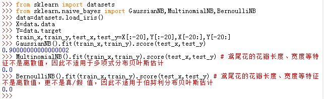

# 朴素贝叶斯法

## 朴素贝叶斯法的原理

1.朴素贝叶斯法是基于贝叶斯定理与特征条件独立假设的分类方法：

- 对给定的训练集，首先基于特征条件独立假设学习输入、输出的联合概率分布。然后基于此模型，对给定的输入 \\(\mathbf x\\) ，利用贝叶斯定理求出后验概率最大的输出 \\(y\\)
- 朴素贝叶斯法不是贝叶斯估计。
> 贝叶斯估计即最大后验估计

2.先验概率：根据以往经验和分析得到的概率。如：
你在山洞门口，你觉得山洞中有熊出现的事件为 Y 。然后你听到山洞中传来一阵熊吼的事件为 X 。一开始你以为山洞中有熊的概率为 P(Y) 。听到熊吼之后认为有熊的概率为 P(Y/X) 。很明显 P(Y/X) > P(Y)。这里：

- P(Y) 为先验概率（根据以往的数据分析或者经验得到的概率）
- P(Y/X) 为后验概率（得到本次试验的信息从而重新修正的概率）

3.设 S 为试验 E 的样本空间。 \\(B_1,B_2,\cdots,B_n\\) 为 E 的一组事件。若 ：

- \\(B_i \bigcap B_j=\phi,i \ne j,i,j=1,2,\cdots,n\\)
- \\(B_1 \bigcup B_2 \bigcup \cdots \bigcup B_n=S\\)

则称 \\(B_1,B_2,\cdots,B_n\\) 为样本空间 S 的一个划分。

如果 \\(B_1,B_2,\cdots,B_n\\) 为样本空间 S 的一个划分，则对于每次试验，事件 \\(B_1,B_2,\cdots,B_n\\) 中有且仅有一个事件发生。

4.**全概率公式**：设试验 E 的样本空间为 S， A 为 E的事件， \\(B_1,B_2,\cdots,B_n\\) 为样本空间 S 的一个划分，且 \\(P(B_i) \ge 0(i=1,2,\cdots,n)\\) ，则有：
$$P(A)=P(A/B_1)P(B_1)+P(A/B_2)P(B_2)+\cdots+P(A/B_n)P(B_n)=\sum_{j=1}^{n}P(A/B_j)P(B_j)$$

5.**贝叶斯定理**：设试验 E 的样本空间为 S， A 为 E的事件， \\(B_1,B_2,\cdots,B_n\\) 为样本空间 S 的一个划分，且 \\(P(A) \gt 0,P(B_i) \ge 0(i=1,2,\cdots,n)\\) ，则有：
$$P(B_i/A)=\frac{P(A/B_i)P(B_i)}{\sum_{j=1}^{n}P(A/B_j)P(B_j)}$$

## 朴素贝叶斯法算法

1.**贝叶斯分类器**：

设输入空间 \\(\mathcal X \subseteq \mathbb R^{n}\\) 为 n  维向量的集合。输出空间为类标记集合 \\(\mathcal Y =\\{ c_1,c_2,\cdots,c_k\\}\\) ， \\(X\\) 为定义在  \\(\mathcal X\\) 上的随机向量，\\(Y\\) 为定义在  \\(\mathcal Y\\) 上的随机变量。则 \\(P(X,Y)\\) 为 X 和 Y 的联合概率分布。训练数据集 \\(T=\\{(\mathbf x_1,y_1),(\mathbf x_2,y_2),\cdots,(\mathbf x_N,y_N)\\}\\)   由 \\(P(X,Y)\\) 独立同分布产生

- 朴素贝叶斯法通过训练数据集学习联合概率分布 \\(P(X,Y)\\)。具体的学习下列概率分布：
	- 先验概率分布： \\(P(Y=c_k),k=1,2,\cdots,K\\)
	- 条件概率分布： \\(P(X=\mathbf x/Y=c_k)=P(X^{(1)}=\mathbf x^{(1)},X^{(2)}=\mathbf x^{(2)},\cdots, X^{(n)}=\mathbf x^{(n)}/Y=c_k),k=1,2,\cdots,K\\)
- 朴素贝叶斯法对条件概率做了条件独立性假设：
	$$P(X=\mathbf x/Y=c_k)=P(X^{(1)}=\mathbf x^{(1)},X^{(2)}=\mathbf x^{(2)},\cdots, X^{(n)}=\mathbf x^{(n)}/Y=c_k)\\\
=\prod_{j=1}^{n}P(X^{(j)}=\mathbf x^{(j)})\\\
,k=1,2,\cdots,K$$
	这意味着： 在分类确定的条件下，用于分类的特征是条件独立的。该假设使得朴素贝叶斯法变得简单，但是可能牺牲一定的分类准确率。

- 根据贝叶斯定理：
	$$
	P(Y=c_k/X=\mathbf x)=\frac{P(X= \mathbf x/Y=c_k)P(Y=c_k)}{\sum_{j=1}^{K} P(X=\mathbf x/Y=c_j)P(Y=c_j)}
	$$

	由于分类特征的条件独立假设有：
	$$P(Y=c_k/X=\mathbf x)=\frac{P(Y=c_k)\prod\_{i=1}^{n}P(X^{(i)}= \mathbf x^{(i)}/Y=c_k)}{\sum_{j=1}^{K} P(X=\mathbf x/Y=c_j)P(Y=c_j)},k=1,2,\cdots,K$$

	于是朴素贝叶斯分类器表示为：
	$$
	y=f(\mathbf x)=\arg \max\_{c_k}\frac{P(Y=c_k)\prod\_{i=1}^{n}P(X^{(i)}= \mathbf x^{(i)}/Y=c_k)}{\sum_{j=1}^{K} P(X=\mathbf x/Y=c_j)P(Y=c_j)}
	$$

	意思是：给定\\(\mathbf x\\)，求得使\\( \frac{P(Y=c_k)\prod\_{i=1}^{n}P(X^{(i)}= \mathbf x^{(i)}/Y=c_k)}{\sum_{j=1}^{K} P(X=\mathbf x/Y=c_j)P(Y=c_j)}\\)最大的那个 \\(c_k\\)，该 \\(c_k\\)就是 \\(f(\mathbf x)\\) 的值。

	由于对有所的 \\(c_k,k=1,2,\cdots,K\\) ，上式的分母都相同（均为 \\(P(\mathbf x)\\)），因此上式重写为：$$y=f(\mathbf x)=\arg \max\_{c_k}{P(Y=c_k)\prod\_{i=1}^{n}P(X^{(i)}= \mathbf x^{(i)}/Y=c_k)}$$

2.贝叶斯分类器是后验概率最大化，等价于期望风险最小化。

令损失函数为：
$$
L(Y,f(X))= \begin{cases}
1, & Y \ne f(X) \\\
0, & Y=f(X)
\end{cases} \\\
R_{exp}(f)=E[L(Y,f(X)]=\sum\_{\mathbf x \in \mathcal X}\sum\_{y \in \mathcal Y}[L(y,f(\mathbf x))P(X=\mathbf x,Y=y)]
$$

根据特征的条件概率独立性假设，有：
$$
R_{exp}(f)=E[L(Y,f(X)]=\sum\_{\mathbf x \in \mathcal X}\sum\_{y \in \mathcal Y}[L(y,f(\mathbf x))P(X=\mathbf x,Y=y)]\\\
= \sum\_{\mathbf x \in \mathcal X}\sum\_{k=1}^{K}[L(c_k,f(\mathbf x))P(X=\mathbf x,Y=c_k)]\\\
=E_X[\sum\_{k=1}^{K}L(c_k,f(\mathbf x))P(c_k/X=\mathbf x)]
$$

为了使得期望风险最小化，只需要对 \\(X=\mathbf x\\) 逐个极小化。因此有：
$$
f(x)=\arg \min_{y \in \mathcal Y} \sum\_{k=1}^{K}L(c_k,f(x))P(c_k/X=\mathbf x)\\\
= \arg \min\_{y \in \mathcal Y} \sum\_{k=1}^{K} P(y \ne c_k/X=\mathbf x)\\\
= \arg \min\_{y \in \mathcal Y}(1-P(y=c_k/X=\mathbf x))\\\
= \arg \max\_{y \in \mathcal Y}P(y=c_k/X=\mathbf x)\\\
$$

即得到了后验概率最大化。

3.在朴素贝叶斯法中，学习意味着估计概率：

- \\(P(Y=c_k)\\)
- \\(P(X^{(j)}=\mathbf x^{(j)}/Y=c_k)\\)

可以用极大使然估计相应概率。

- 先验概率 \\(P(Y=c_k)\\) 的极大似然估计是 \\(P(Y=c_k)=\frac {1}{N} \sum_{i=1}^{N}I(y_i=c_k),k=1,2,\cdots,K\\)
- 设第 j 个特征 \\(\mathbf x^{(j)}\\) 可能的取值为 \\(a\_{j1},a\_{j2},\cdots,a\_{js_j}\\)。则条件概率
\\(P(X^{(j)}=a_{j\;l}/Y=c_k)\\) 的极大似然估计为：

$$
P(X^{(j)}=a\_{j\;l}/Y=c_k)=\frac{\sum\_{i=1}^{N}I(\mathbf x_i^{(j)}=a\_{j \; l},y_i=c_k)}{\sum_{i=1}^{N}I(y_i=c_k)}\\\
j=1,2,\cdots,n; \\\l=1,2,\cdots,s_j;\\\k=1,2,\cdots,K
$$

4.**朴素贝叶斯算法**：

- **输入**：
	- 训练集 \\(T=\\{(\mathbf x_1,y_1),(\mathbf x_2,y_2),\cdots,(\mathbf x_N,y_N)\\}\\) ,\\(\mathbf x_i=(\mathbf x_i^{(1)},\mathbf x_i^{(2)},\cdots,\mathbf x_i^{(n)})\\), \\(\mathbf x_i^{(j)}\\) 为第 i 个样本的第 j 个特征，其中 \\(\mathbf x_i^{(j)} \in \\{a\_{j1},a\_{j2},\cdots,a\_{js_j}\\}\\)， \\(a_{j \; l}\\)为第 \\(j\\) 个特征可能取到的第 \\(l\\) 个值， \\(j=1,2,\cdots,n,\quad l=1,2,\cdots,s_j,\quad y_i \in \\{c_1,c_2,\cdots,c_k\\}\\)
	- 实例  \\(\mathbf x\\)
- **输出**：实例  \\(\mathbf x\\) 的分类
- 算法步骤：
	- 计算先验概率以及条件概率：
	$$
	P(Y=c_k)=\frac {\sum\_{i=1}^{N}I(y_i=c_k)}{N},k=1,2,\cdots,K\\\
	P(X^{(j)}=a\_{j\;l}/Y=c_k)=\frac{\sum_{i=1}^{N}I(\mathbf x\_i^{(j)}=a\_{j\;l},y_i=c_k)}{\sum\_{i=1}^{N}I(y_i=c_k)}\\\
	j=1,2,\cdots,n; \quad l=1,2,\cdots,s_j; \quad k=1,2,\cdots,K
	$$
	- 对于给定的实例 \\(\mathbf x=(\mathbf x^{(1)}，\mathbf x^{(2)},\cdots,\mathbf x^{(n)})\\),计算
	$$P(Y=c_k)\prod_{j=1}^{n}P(X^{(j)}=\mathbf x^{(j)}/Y=c_k),k=1,2,\cdots,K$$
	- 确定实例 \\(\mathbf x\\) 的分类：
	$$y=\arg \max\_{c_k} P(Y=c_k)\prod_{j=1}^{n}P(X^{(j)}=\mathbf x^{(j)}/Y=c_k)$$

5.**贝叶斯估计**：

设第 j 个特征 \\(\mathbf x^{(j)}\\) 可能的取值为 \\(a\_{j1},a\_{j2},\cdots,a\_{js_j}\\)。则条件概率
\\(P(X^{(j)}=a_{j\;l}/Y=c_k)\\) 的极大似然估计为：

$$
P(X^{(j)}=a\_{j\;l}/Y=c_k)=\frac{\sum\_{i=1}^{N}I(\mathbf x_i^{(j)}=a\_{j \; l},y_i=c_k)}{\sum_{i=1}^{N}I(y_i=c_k)}\\\
j=1,2,\cdots,n; \\\l=1,2,\cdots,s_j;\\\k=1,2,\cdots,K
$$

用极大似然估计可能会出现分母 \\(\sum_{i=1}^{N}I(y_i=c_k)\\) 为0的情况。此时可以采用贝叶斯估计（最大后验估计）：

$$
P\_\lambda(X^{(j)}=a\_{j\;l}/Y=c_k)=\frac{\sum\_{i=1}^{N}I(\mathbf x_i^{(j)}=a\_{j \; l},y_i=c_k)+\lambda}{\sum_{i=1}^{N}I(y_i=c_k)+s_j\lambda}\\\
j=1,2,\cdots,n; \\\l=1,2,\cdots,s_j;\\\k=1,2,\cdots,K
$$
> 它等价于在 \\( X^{(j)}\\) 的各个取值的频数上赋予了一个正数  \\(\lambda\\)

它满足概率分布的条件：

$$
P\_\lambda(X^{(j)}=a_{j\;l}/Y=c_k) \gt 0, l=1,2,\cdots,s_j,\quad k=1,2,\cdots,K\\\
\sum\_{l=1}^{s_j}P\_\lambda(X^{(j)}=a\_{j\;l}/Y=c_k)=1
$$

而\\(P(Y=c_k)\\)  的贝叶斯估计为:
$$P\_\lambda(Y=c_k)=\frac{\sum_{i=1}^{N}I(y_i=c_k)+\lambda}{N+K\lambda}$$

- 当 \\(\lambda=0\\) 时，为极大似然估计
- 当 \\(\lambda=1\\) 时，为拉普拉斯平滑

## 实践

1.在`scikit`中有多种不同的朴素贝叶斯分类器。他们的区别就在于它们假设了不同的 \\(P(X^{(j)}/y=c_k)\\) 分布
。

- 高斯贝叶斯分类器`sklearn.naive_bayes.GaussianNB`：假设\\(P(X^{(j)}/y=c_k)\\) 服从高斯分布。其属性有：
	- `class_prior_`：一个数组，形状为`(n_classes,)`，是每个类别的概率
	- `class_count_`：一个数组，形状为`(n_classes,)`,是每个类别包含的训练样本数量
	- `sigma_`：一个数组，形状为`(n_classes,n_features)`，是每个类别每个特征上的`variance`
- 多项式贝叶斯分类器`sklearn.naive_bayes.MultinomialNB`：假设 \\(P(X^{(j)}/y=c_k)\\) 服从多项式分布 （即上面理论部分提到的算法）。其构造函数为：`MultinomialNB(alpha=1.0, fit_prior=True, class_prior=None)`。参数为：
	- `alpha`：浮点数。即上述理论中的 \\(\lambda\\) 。当它为0时，没有平滑；当它为1时，为拉普拉斯平滑
	- `class_prior`：一个`array-like`对象，大小为 `(n_classes,)`，给出了每个类别的先验概率。如果该值给出，则先验概率就不从数据中计算。
	- `fit_prior`：布尔值。是否学习类别的先验概率。如果为 False,则不学习类别的先验概率，将类别的先验概率用 `uniform` 替代。
	

	多项式贝叶斯分类器的属性有：
	- `class_log_prior_`：一个数组对象，形状为`(n_classes,)`：给出了每个类别的平滑的经验概率分布的对数值
	- `feature_log_prob_ `: 一个数组对象，形状为` (n_classes, n_features)`。给出了\\(P(X^{(j)}/y=c_k)\\) 的经验概率分布的对数值
	- `class_count_`：一个数组，形状为`(n_classes,)`。训练过程中，每个类别遇到的样本数
	- `feature_count_ `：一个数组，形状为` (n_classes, n_features)`。训练过程中，每个类别每个特征遇到的样本数
	 
- 伯奴利贝叶斯分类器`sklearn.naive_bayes.BernoulliNB`：假设 \\(P(X^{(j)}/y=c_k)\\) 服从伯努力分布。其初始化函数为：`BernoulliNB(alpha=1.0, binarize=0.0, fit_prior=True, class_prior=None)`。参数有：
	-  `alpha`：浮点数。即上述理论中的 \\(\lambda\\) 。当它为0时，没有平滑；当它为1时，为拉普拉斯平滑
	- `binarize`：浮点或者None。指定二元阈值从而将输入数据分离成`0,1`。如果为 None则 认为输入数据已经二元化。
	- `fit_prior`：布尔值。是否学习类别的先验概率。如果为 False,则不学习类别的先验概率，将类别的先验概率用 `uniform` 替代。
	- `class_prior`：一个`array-like`对象，大小为 `(n_classes,)`，给出了每个类别的先验概率。如果该值给出，则先验概率就不从数据中计算。

	伯奴利贝叶斯分类器的属性有：
	- `class_log_prior_`：一个数组对象，形状为`(n_classes,)`：给出了每个类别的平滑的经验概率分布的对数值
	- `feature_log_prob_ `: 一个数组对象，形状为` (n_classes, n_features)`。给出了\\(P(X^{(j)}/y=c_k)\\) 的经验概率分布的对数值
	- `class_count_`：一个数组，形状为`(n_classes,)`。训练过程中，每个类别遇到的样本数
	- `feature_count_ `：一个数组，形状为` (n_classes, n_features)`。训练过程中，每个类别每个特征遇到的样本数

> - 多项式分布贝叶斯分类器只适用于：特征取值是离散的情形，且特征取值是整数（但是实际应用中，离散的小数也可以）
> - 伯努利分布贝叶斯分类器只适用于：特征取值是离散的情形。它与多项式分布贝叶斯分类器的区别在于：伯努利分布贝叶斯分诶其要求特征取值不仅离散，而且还是 真/假 取值；

  

2.朴素贝叶斯分类器性能相当好，它速度快，可以避免维度灾难。但是它作为分类器很好，而不能作为`estimator`使用。如果你用它来评估概率分布，则不合适。因此朴素贝叶斯分类器的`.predict_proba`输出没有太大的作用

3.朴素贝叶斯分类器能够训练大量的数据。上述三个分类器都有一个`.partial_fit`方法，它能够递增地学习。另外多项式贝叶斯分类器和伯奴利贝叶斯分类器还支持样本的权重。
其中 `partial_fit`的原型为：`partial_fit(X, y, classes=None, sample_weight=None)`

- `X`:样本数据
- `y`：样本标记
- `classes`：一个数组对象，形状为`(n_classes,)`。它列出了所有可能的类别。记住：第一次调用`pritial_fit`时，必须传入该参数。后续的调用不必传入该参数
- `sample_weight`：一个数组对象，形状为`(n_samples,)`。给出每个样本的权重。如果未指定，则全 1

	该方法使用时，最好每次数据块都足够大（最好充满整个内存）
