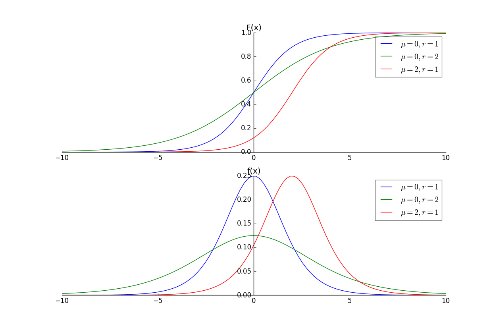
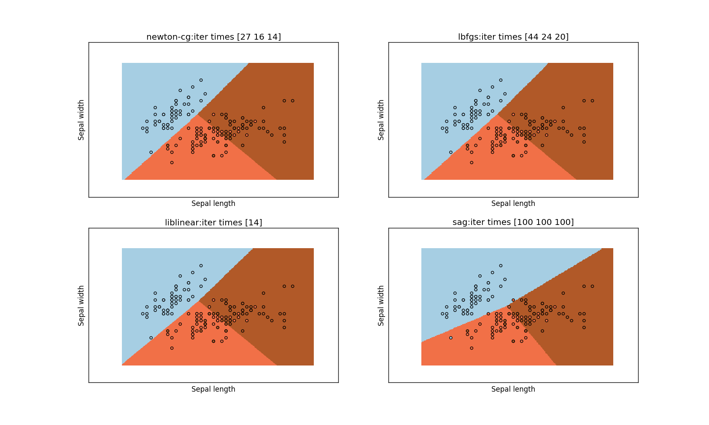
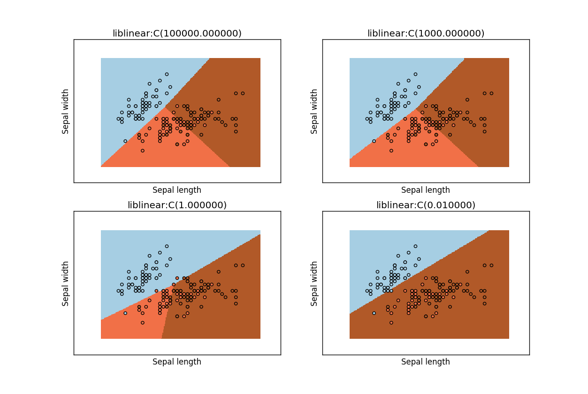
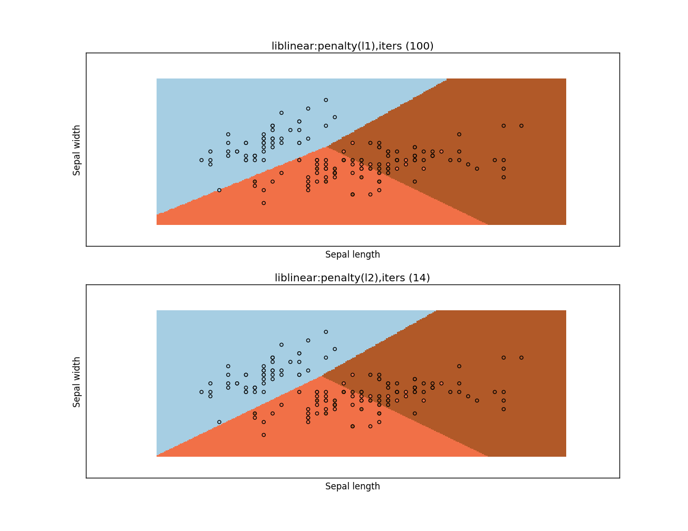

# logistic 回归与最大熵模型

## losistic 回归模型

1.logistic回归是统计学习中的经典分类方法。

最大熵是概率模型学习的一个准则，将其推广到分类问题得到最大熵模型。

- logistic 回归模型与最大熵模型都是对数线性模型

2.logistic 分布：假设 X 为连续随机变量， X 服从 logistic 分布是指 X 具有下列分布函数和密度函数：
$$
F(x)=P(X \le x)=\frac{1}{1+e^{-(x-\mu)/r{}}}\\\
f(x)=F'(X)=\frac{e^{-(x-\mu)/r{}}}{r(1+e^{-(x-\mu)/r{}})^{2}}
$$
其中 \\(\mu\\) 为位置参数， \\(r \gt 0\\) 为形状参数。

- F(x) 以点\\((\mu,\frac{1}{2})\\) 为中心对称，即：\\(F(-x+\mu)-\frac 12=-F(x+\mu)+\frac 12\\) 曲线在点\\((\mu,\frac{1}{2})\\) 附件增长较快，在两端增长较慢
	- r 越小，则曲线在中心附近越陡峭

```
import numpy as np
import matplotlib.pyplot as plt

def F_X(x,mu,r):
	return 1/(1+np.e**(-(x-mu)/r))

def f_X(x,mu,r):
	return np.e**(-(x-mu)/r)/(r*((1+np.e**(-(x-mu)/r))**2))

fig=plt.figure()
ax1=fig.add_subplot(2,1,1)
ax2=fig.add_subplot(2,1,2,sharex=ax1)
x=np.linspace(-10,10,100)
####  绘制  F(x)
ax1.plot(x,F_X(x,0,1),label=r'$\mu=0, r=1$')
ax1.plot(x,F_X(x,0,2),label=r'$\mu=0, r=2$')
ax1.plot(x,F_X(x,2,1),label=r'$\mu=2, r=1$')
ax1.set_title("F(x)")
ax1.legend(framealpha=0.5)
#### 绘制 f(x)
ax2.plot(x,f_X(x,0,1),label=r'$\mu=0,r=1$')
ax2.plot(x,f_X(x,0,2),label=r'$\mu=0,r=2$')
ax2.plot(x,f_X(x,2,1),label=r'$\mu=2,r=1$')
ax2.set_title("f(x)")
ax2.legend(framealpha=0.5)
### 平移坐标轴
ax1.spines['right'].set_color('none')
ax1.spines['top'].set_color('none')
ax1.xaxis.set_ticks_position('bottom')
ax1.spines['bottom'].set_position(('data',0))
ax1.yaxis.set_ticks_position('left')
ax1.spines['left'].set_position(('data',0))

ax2.spines['right'].set_color('none')
ax2.spines['top'].set_color('none')
ax2.xaxis.set_ticks_position('bottom')
ax2.spines['bottom'].set_position(('data',0))
ax2.yaxis.set_ticks_position('left')
ax2.spines['left'].set_position(('data',0))

plt.show()
```

  

3.二项 logistic 回归模型：它是如下的条件概率分布：
$$
P(Y=1/X=\mathbf x)=\frac{\exp(\mathbf{w\cdot x}+b)}{1+\exp(\mathbf{w\cdot x}+b)}\\\
P(Y=0/X=\mathbf x)=\frac{1}{1+\exp(\mathbf{w\cdot x}+b)}
$$
其中 \\(\mathbf x \in \mathbb R^{n}\\) 为输入； \\(Y\in \\{0,1\\}\\) 为输出。 \\(\mathbf w \in \mathbb R ^{n}, b \in \mathbb R\\) 为参数。称 \\(\mathbf w\\) 为权值向量，\\(b\\) 为偏置。\\(\mathbf{w\cdot x}\\) 为\\(\mathbf w\\)  与 \\(\mathbf x\\) 的内积。

- 对于给定的输入实例 \\(\mathbf x \\) ，根据该条件概率分布可以求得 \\(P(Y=1/\mathbf x)\\) 以及   \\(P(Y=0/\mathbf x)\\) 。 logistic 回归比较这两个条件概率值的大小，将实例 \\(\mathbf x \\) 划分到概率值较大的那一类中。
- 为了方便，令 \\(\mathbf w=(\mathbf w^{(1)},\mathbf w^{(2)},\cdots,\mathbf w^{(n)},b),\mathbf x=(\mathbf x^{(1)},\mathbf x^{(2)},\cdots,\mathbf x^{(n)},1)\\), 则 logistic 回归模型成为：
$$
P(Y=1/X=\mathbf x)=\frac{\exp(\mathbf{w\cdot x})}{1+\exp(\mathbf{w\cdot x})}\\\
P(Y=0/X=\mathbf x)=\frac{1}{1+\exp(\mathbf{w\cdot x})}$$

4.二项 logistic 回归模型的物理意义：

令事件的几率为：一个事件发生的概率与不发生的概率的比值。若事件发生的概率为 p ，则该事件的几率是 ： \\(\frac {p}{1-p}\\)，则事件的对数几率为： \\(\text{logit}(p)=\log \frac{p}{1-p}\\)。

对于 logistic 回归，有 \\(Y=1\\) 的对数几率为：\\(\log\frac{P(Y=1/\mathbf x)}{P(Y=0/\mathbf x)}=\mathbf {w\cdot x}\\)。 即 \\(Y=1\\) 的对数几率是输入 \\(\mathbf x\\) 的线性函数。

5.logistic 回归模型参数估计：给定训练数据集 \\(T=\\{(\mathbf x_1,y_1),(\mathbf x_2,y_2),\cdots,(\mathbf x_N,y_N)\\}\\)，其中 \\(\mathbf x_i \in \mathbb R^{n}, y_i \in \\{0,1\\}\\)。可以用极大似然估计法估计模型参数，从而得出模型。

令 \\(P(Y=1/\mathbf x)=\pi(\mathbf x),P(Y=0/\mathbf x)=1-\pi(\mathbf x)\\)，则似然函数为：
$$\prod_{i=1}^{N}[\pi(\mathbf x_i)]^{y_i}[1-\pi(\mathbf x_i)]^{1-y_i}$$

对数似然函数为：
$$
L(\mathbf w)=\sum\_{i=1}^{N}[y_i\log\pi(\mathbf x_i)+(1-y_i)\log(1-\pi(\mathbf x_i))]\\\
=\sum\_{i=1}^{N}[y_i\log\frac{\pi(\mathbf x_i)}{1-\pi(\mathbf x_i)}+\log(1-\pi(\mathbf x_i))]
$$

又由于 \\(\pi(\mathbf x)=\frac{\exp(\mathbf{w\cdot x})}{1+\exp(\mathbf{w\cdot x})}\\)，因此：
$$
L(\mathbf w)=\sum\_{i=1}^{N}[y_i(\mathbf{w\cdot x}_i)-\log(1+\exp(\mathbf w \cdot \mathbf x_i))]
$$

对 \\(L(\mathbf w)\\) 求极大值，得到 \\(\mathbf w\\) 的估计值。设估计值为 \\(\hat{\mathbf w}\\)，则 logistic 回归模型为：
$$
P(Y=1/X=\mathbf x)=\frac{\exp(\mathbf{\hat w\cdot x})}{1+\exp(\mathbf{\hat w\cdot x})}\\\
P(Y=0/X=\mathbf x)=\frac{1}{1+\exp(\mathbf{\hat w\cdot x})}
$$

> 通常用梯度下降法或者拟牛顿法来求解该最大值问题

6.可以推广二类分类的 logistic 回归模型到多类分类问题：

设离散型随机变量 Y 的取值集合为： \\(\\{1,2,\cdots,K\\}\\)，则多项 logistic 回归模型为：
$$
P(Y=k/\mathbf x)=\frac{\exp(\mathbf w_k \cdot \mathbf x)}{1+\sum\_{k=1}^{K-1}\exp(\mathbf w_k \cdot \mathbf x)},k=1,2,\cdots,K-1\\\
P(Y=K/\mathbf x)=\frac{1}{1+\sum\_{k=1}^{K-1}\exp(\mathbf w_k \cdot \mathbf x)},\mathbf x \in \mathbb R^{n+1},\mathbf w_k \in \mathbb R^{n+1}
$$
其参数估计方法类似二项 logistic 回归模型

## 最大熵模型

1.最大熵原理：学习概率模型时，在所有可能的概率模型（即概率分布）中，熵最大的模型是最好的模型。
> 通常还有其他约束条件来确定概率模型的集合，因此最大熵原理为：在满足约束条件情况下，选取熵最大的模型
 
设随机变量 X 的概率分布为 P(X)，熵为：\\(H(P)=-\sum_X P(X)\log P(X)\\)，可以证明：\\(0 \le H(P) \le \log |X| \\) ，其中 \\(|X|\\) 为 X 的取值的个数。当且仅当 X 的分布为均匀分布是，有 \\(H(P)=\log |X|\\)
> 即 X 服从均匀分布时， 熵最大。直观理解最大熵原理：在满足已知条件前提下，如果没有更多的信息，则那些不确定部分都是“等可能的”。熵最大化来表示等可能性

2.最大熵原理选取熵最大的模型，而决策树的划分目标选取熵最小的划分。原因在于：

- 分布未知时，等概率分布的熵最大。最大熵原理认为在满足相关约束的条件之后，分布是均匀的（也就是不应该再施加任何额外的约束）
- 决策树的划分目标是为了通过不断的划分从而不断的降低实例所属的类的不确定性，最终给实例一个合适的分类。因此这是一个不确定性不断减小的过程，所以选取熵最小的划分。

3.最大熵模型：设分类模型是一个条件概率分布 \\(P(Y/X=\mathbf x),X \in \mathcal X \subseteq \mathbb R^{n}\\) 为输入， \\(Y \in \mathcal Y\\) 为输出。

给定一个训练数据集 \\(T=\\{(\mathbf x_1,y_1),(\mathbf x_2,y_2),\cdots,(\mathbf x_N,y_N)\\}\\)，学习的目标是用最大熵原理选取最好的分类模型。

- 确定联合分布 \\(P(X,Y)\\) 的经验分布和 \\(P(X)\\) 的经验分布 \\(\tilde P(X,Y),\tilde P(X)\\)：
	$$\tilde P(X=\mathbf x,Y=y)=\frac{\upsilon(X=\mathbf x, Y=y)}{N},\tilde P(X)=\frac{\upsilon(X=\mathbf x)}{N}$$
	其中 \\(N\\) 为样本容量， \\(\upsilon\\) 为频数
- 用特征函数 \\(f(\mathbf x,y)\\) 描述输入 \\(\mathbf x\\) 和输出 y 之间的某个事实：
	$$
	f(\mathbf x,y)= \begin{cases}
	1, & \text{if $\mathbf x,y$ statisfy the fact.} \\\
	0, & \text{or else.}
	\end{cases}
	$$
	- 特征函数 \\(f(\mathbf x,y)\\) 关于经验分布  \\(\tilde P(X,Y)\\) 的期望定义为 \\(E\_{\tilde P}(f)\\) 
	$$E\_{\tilde P}(f)=\sum\_{\mathbf x,y}\tilde P(\mathbf x,y)f(\mathbf x,y)$$
	- 特征函数 \\(f(\mathbf x,y)\\) 关于模型 \\(P(Y/X)\\) 与经验分布 \\(\tilde P(X)\\) 的期望用  \\(E\_{P}(f)\\) 表示：
	$$E\_{P}(f)=\sum\_{\mathbf x,y}\tilde P(\mathbf x)P(y/\mathbf x)f(\mathbf x,y)$$

	我们可以假设这两个期望相等，即：\\(E\_{\tilde P}(f)=E\_{P}(f)\\)。我们将这个作为模型学习的约束条件
	- 假设有 n 个特征函数 \\(f_i(\mathbf x,y),i=1,2,\cdots,n\\)，则有 n 个约束条件
- 最大熵模型：假设满足所有约束条件的模型集合为：\\(\mathcal C=\\{P \in \mathcal P \mid E_P(f_i)=E_{\tilde P}(f_i),i=1,2,\cdots,n\\}\\) 。定义在条件概率分布 \\(P(Y/X)\\) 上的条件熵为：
	$$H(P)=-\sum\_\{\mathbf x,y}\tilde P(\mathbf x)P(y/\mathbf x)\log P(y/\mathbf x)$$
	则模型集合 \\(\mathcal C\\) 中条件熵最大的模型称为最大熵模型

4.最大熵模型的学习：就是求解最大熵的过程。该过程可以形式化为约束最大化问题：
> 即求得条件概率 \\(P(y/\mathbf x)\\) 

对给定的训练数据集 \\(T=\\{(\mathbf x_1,y_1),(\mathbf x_2,y_2),\cdots,(\mathbf x_N,y_N)\\}\\)，以及特征函数 \\(f_i(\mathbf x,y),i=1,2,\cdots,n\\) 最大熵模型的学习等价于约束最优化问题：
$$
\max\_{P\in \mathcal C} H(P)=-\sum\_\{\mathbf x,y}\tilde P(\mathbf x)P(y/\mathbf x)\log P(y/\mathbf x)\\\
s.t. E\_P(f_i)=E\_{\tilde P}(f_i),i=1,2,\cdots,n\\\
\sum_y P(y/\mathbf x)=1
$$
将其转化为最小化问题：
$$
\min\_{P\in \mathcal C} -H(P)=\sum\_\{\mathbf x,y}\tilde P(\mathbf x)P(y/\mathbf x)\log P(y/\mathbf x)\\\
s.t. E\_P(f_i)-E\_{\tilde P}(f_i)=0,i=1,2,\cdots,n\\\
\sum_y P(y/\mathbf x)=1
$$
> 其中\\(\tilde P(\mathbf x)，E\_{\tilde P}(f_i)\\) 是已知的， \\(P(y/\mathbf x)， E\_P(f_i)\\) 是未知的。

- 将约束最优化的原始问题转换为无约束最优化的对偶问题。通过求解对偶问题来求解原始问题
- 引入拉格朗日乘子 \\(w_0,w_1,\cdots,w_n\\)，定义拉格朗日函数 \\(L(P,\mathbf w)\\)
	$$L(P,\mathbf w)=-H(P)+w_0(1-\sum_y P(y/\mathbf x))+\sum\_{i=1}^{n}w_i(E\_{\tilde P}(f_i)-E\_P(f_i))\\\
	=\sum\_{\mathbf x,y}\tilde P(\mathbf x)P(y/\mathbf x)\log P(y/\mathbf x)+w_0(1-\sum_y P(y/\mathbf x))\\\
+\sum\_{i=1}^{n}w_i(\sum\_{\mathbf x,y}\tilde P(\mathbf x,y)f_i(\mathbf x,y)-\sum\_{\mathbf x,y}\tilde P(\mathbf x)P(y/\mathbf x)f_i(\mathbf x,y))
	$$
	最优化的原始问题是 \\(\min\_{P \in \mathcal C} \max\_{\mathbf w} L(P,\mathbf w)\\)，对偶问题是
\\(\max\_{\mathbf w} \min\_{P \in \mathcal C} L(P,\mathbf w)\\)。由于拉格朗日函数  \\(L(P,\mathbf w)\\) 是凸函数，因此原始问题的解与对偶问题的解是等价的。
- 求解对偶问题：
	- 先求解内部的极小化问题：\\(\min\_{P \in \mathcal C} L(P,\mathbf w)\\)，它是一个 \\(\mathbf w\\)的函数，将其记作 \\(\Psi(\mathbf w)=\min\_{P \in \mathcal C} L(P,\mathbf w)=L(P_\mathbf w,\mathbf w)\\)
		- 具体的，先对 \\(L(P,\mathbf w)\\) 对 \\(P(y/\mathbf x)\\) 求偏导数：
		$$
		\frac{\partial L(P,\mathbf x)}{\partial P(y/\mathbf x)}=\sum\_{\mathbf x,y}\tilde P(\mathbf x)(\log P(y/\mathbf x)+1)-\sum_y w_0-\sum\_{\mathbf x,y}(\tilde P(\mathbf x)\sum\_{i=1}^{n}w_if_i(\mathbf x,y))\\\
	=\sum\_{\mathbf x,y} \tilde P(\mathbf x)(\log P(y/\mathbf x)+1-w_0-\sum\_{i=1}^{n}w_i f_i(\mathbf x,y))
		$$
		令偏导数为0.在 \\(\tilde P(\mathbf x) \gt 0\\) 时，解得：
		$$P(y/\mathbf x)=\exp(\sum\_{i=1}^{n}w_i f_i(\mathbf x,y)+w_0-1)=\frac{\exp(\sum\_{i=1}^{n}w_i f_i(\mathbf x,y))}{\exp(1-w_0)}$$
		由于 \\(\sum_y P(y/\mathbf x)=1\\)，则有：$$\sum_y \frac{\exp(\sum\_{i=1}^{n}w_i f_i(\mathbf x,y))}{\exp(1-w_0)}=1$$则有：\\(\exp(1-w_0)=\sum_y \exp(\sum\_{i=1}^{n}w_i
 f_i(\mathbf x,y))\\)。
		定义 \\(Z\_\mathbf w(\mathbf x)=\sum\_y \exp(\sum\_{i=1}^{n}w_i
 f_i(\mathbf x,y))\\) 为规范因子，则  $$P\_\mathbf w(y/\mathbf x)=\frac{1}{Z\_\mathbf w(\mathbf x)} \exp(\sum\_{i=1}^{n}w_i f_i(\mathbf x,y))$$由该式表示的模型 \\(P\_\mathbf w=P_\mathbf w(y/\mathbf x)\\) 就是最大熵模型。
	- 之后求解对偶问题外部的极大化问题：\\(\max\_\mathbf w \Psi(\mathbf w)\\)，将其解记作 \\(\mathbf w^{\*}\\)，即：\\(\mathbf w^{\*}=\arg\max\_\mathbf w \Psi(\mathbf w)\\)
	- 求得 \\(\mathbf w^{\*}\\) 之后，用它来表示 \\(P\_\mathbf w=P_\mathbf w(y/\mathbf x)\\)，得到 \\(P^{\*}=P\_{\mathbf w^{\*}}=P\_{\mathbf w^{\*}}(y/\mathbf x)\\) 即得到最大熵模型

> 总结为：先求对偶问题的内部极小化，得到  \\(\Psi(\mathbf w)\\) 函数，以及极值点 \\(P_\mathbf w(y/\mathbf x)\\)；再求  \\(\Psi(\mathbf w)\\) 函数的极大值，得到 \\(\mathbf w^{\*}\\) 。最后将  \\(\mathbf w^{\*}\\)  代入 \\(P\_\mathbf w(y/\mathbf x)\\) 得到最终模型 \\(P^{\*}\\)

5.可以证明： \\(\Psi(\mathbf w)\\) 函数的最大化，等价于最大熵模型的极大似然估计。

已知训练数据的经验概率分布为 \\(\tilde P(\mathbf x,y)\\)， 条件概率分布为 \\(P(y/\mathbf x)\\) 的对数似然函数为： \\(\log \prod_{\mathbf x,y}P(y/\mathbf x)^{\tilde P(\mathbf x,y)}=\sum\_{\mathbf x,y}\tilde P(\mathbf x,y) \log P(y/\mathbf x)\\)
> 这里 \\(\tilde P(\mathbf x,y)\\) 作为指数的原因：假设 某个  \\(\mathbf x_i,y_i\\) 出现了 k 次，则条件概率中， \\(P(y/\mathbf x)\\) 的指数应该是 k（频数） 。但是如果对所有的 \\(\mathbf x,y\\) 取遍历乘法，指数取  \\(\tilde P(\mathbf x,y)\\) （频率）

再利用:\\(P\_\mathbf w(y/\mathbf x)=\frac{1}{Z\_\mathbf w(\mathbf x)} \exp(\sum\_{i=1}^{n}w_i f_i(\mathbf x,y))\\) 代入，最后化简合并，最终发现它就是  \\(\Psi(\mathbf w)\\)

6.最大熵模型与  logistic 回归模型有类似的形式。它们又称为对数线性模型。

- 模型学习就是在给定训练数据条件下对模型进行极大似然估计或者正则化的极大似然估计。
- 他们的目标函数具有很好的性质：光滑的凸函数。因此有多种最优化方法可用，且保证能得到全局最优解。
	- 最常用的方法有：改进的迭代尺度法、梯度下降法、牛顿法、拟牛顿法

7.改进的迭代尺度法(`improved iterative scaling`:IIS)：

改进的迭代尺度法是一种最大熵模型学习的最优化算法。

已知最大熵模型为： \\(P\_\mathbf w(y/\mathbf x)=\frac{1}{Z\_\mathbf w(\mathbf x)} \exp(\sum\_{i=1}^{n}w_i f_i(\mathbf x,y))\\),其中  \\(Z\_\mathbf w(\mathbf x)=\sum\_y \exp(\sum\_{i=1}^{n}w_i
 f_i(\mathbf x,y))\\) ，则对数似然函数为：

$$L(\mathbf w)=\log \prod\_{\mathbf x,y}P(y/\mathbf x)^{\tilde P(\mathbf x,y)}=\sum\_{\mathbf x,y}\tilde P(\mathbf x,y) \log P(y/\mathbf x)\\\
=\sum\_{\mathbf x,y}\tilde P(\mathbf x,y)\sum\_{i=1}^{n}w\_i f\_i(\mathbf x,y)-\sum\_{\mathbf x}\tilde P(\mathbf x)\log Z\_\mathbf w(\mathbf x)$$
目标是通过极大似然函数学习模型参数，求出使得极大似然函数最大的参数 \\(\hat{\mathbf w}\\)

- IIS 原理：假设最大熵模型当前的参数向量是 \\(\mathbf w=(w_1,w_2,\cdots,w_n)\\)，我们希望找到一个新的参数向量 \\(\mathbf w +\delta=(w_1+\delta_1,w_2+\delta_2,\cdots,w_n+\delta_n)\\)，使得模型的对数似然函数值增大。若能找到这样的新参数向量，则更新 \\(\mathbf w \leftarrow \mathbf w+\delta\\)。重复这一过程，直到找到对数似然函数的最大值。
	- 对于给定的经验分布 \\(\tilde P(\mathbf x,y)\\)，模型参数从 \\(\mathbf w\\) 到  \\(\mathbf w+ \delta\\) 之间，对数似然函数的改变量为：
	$$L(\mathbf w+ \delta)-L(\mathbf w)=\sum\_{\mathbf x,y}\tilde P(\mathbf x,y)\sum\_{i=1}^{n}\delta\_i f\_i(\mathbf x,y)-\sum\_{\mathbf x}\tilde P(\mathbf x)\log \frac{Z\_\mathbf {w+\delta}(\mathbf x)}{Z\_\mathbf w(\mathbf x)}
	$$

	利用不等式 \\( -\log \alpha \ge 1-\alpha,\alpha \gt 0\\) ， 有：
	$$
	L(\mathbf w+ \delta)-L(\mathbf w) \ge \sum\_{\mathbf x,y}\tilde P(\mathbf x,y)\sum\_{i=1}^{n}\delta\_i f\_i(\mathbf x,y)+1-\sum\_{\mathbf x}\tilde P(\mathbf x)\frac{Z\_\mathbf {w+\delta}(\mathbf x)}{Z\_\mathbf w(\mathbf x)}\\\
	= \sum\_{\mathbf x,y}\tilde P(\mathbf x,y)\sum\_{i=1}^{n}\delta\_i f\_i(\mathbf x,y)+1-\sum_\mathbf x \tilde P(\mathbf x) \sum\_y P\_\mathbf w(y/\mathbf x)\exp\sum\_{i=1}^{n}\delta\_if\_i(\mathbf x,y)
	$$
	>代入 \\(P\_\mathbf w(y/\mathbf x)=\frac{1}{Z\_\mathbf w(\mathbf x)} \exp(\sum\_{i=1}^{n}w_i f_i(\mathbf x,y))\\) 可得上式
	
	令 \\(A(\delta\mid\mathbf w)=\sum\_{\mathbf x,y}\tilde P(\mathbf x,y)\sum\_{i=1}^{n}\delta\_i f\_i(\mathbf x,y)+1-\sum_\mathbf x \tilde P(\mathbf x) \sum\_y P\_\mathbf w(y/\mathbf x)\exp\sum\_{i=1}^{n}\delta\_if\_i(\mathbf x,y)\\)，则  \\(L(\mathbf w+ \delta)-L(\mathbf w) \ge A(\delta/\mathbf w)\\)
	
	如果能找到合适的 \\(\delta\\) 使得  \\(A(\delta\mid\mathbf w)\\) 提高，则对数似然函数也会提高。但是 \\(\delta\\)是个向量，不容易同时优化。我们可以每次只优化一个变量 \\(\delta_i\\)

	为达到这个目的，我们引入一个变量 \\(f^{o}(\mathbf x,y)=\sum_{i=1}f_i(\mathbf x,y)\\)。

	> 因为  \\(f\_i\\) 是二值函数，因此 \\((\mathbf x,y)\\) 出现的次数。

	- \\(A(\delta\mid\mathbf w)\\) 改写为：
	$$
A(\delta\mid\mathbf w)=\sum\_{\mathbf x,y}\tilde P(\mathbf x,y)\sum\_{i=1}^{n}\delta\_i f\_i(\mathbf x,y)+1\\\
-\sum\_\mathbf x \tilde P(\mathbf x) \sum\_y P\_\mathbf w(y/\mathbf x)\exp[f^{o}(\mathbf x,y)\sum\_{i=1}^{n}\frac{\delta\_if\_i(\mathbf x,y)}{f^{o}(\mathbf x,y)}]
	$$
	根据指数函数的凸性，根据 \\(\frac{f\_i(\mathbf x,y)}{f^{o}(\mathbf x,y)} \ge 0\\)，以及  \\(\sum\_{i=1}^{n}\frac{f\_i(\mathbf x,y)}{f^{o}(\mathbf x,y)}=1\\)这一事实，以及`Jensen` 不等式有：
	$$
	\exp[f^{o}(\mathbf x,y)\sum\_{i=1}^{n}\frac{\delta\_if\_i(\mathbf x,y)}{f^{o}(\mathbf x,y)}] \le \sum\_{i=1}^{n}\frac{f\_i(\mathbf x,y)}{f^{o}(\mathbf x,y)}\exp(\delta\_i f^{o}(\mathbf x,y))
	$$
	于是：
	$$
	A(\delta\mid\mathbf w) \ge \sum\_{\mathbf x,y}\tilde P(\mathbf x,y)\sum\_{i=1}^{n}\delta\_i f\_i(\mathbf x,y)+1\\\
	-\sum\_\mathbf x \tilde P(\mathbf x) \sum\_y P\_\mathbf w(y/\mathbf x)\sum\_{i=1}^{n}\frac{f\_i(\mathbf x,y)}{f^{o}(\mathbf x,y)}\exp(\delta\_i f^{o}(\mathbf x,y))
	$$	令 $$B(\delta\mid\mathbf w)=\sum\_{\mathbf x,y}\tilde P(\mathbf x,y)\sum\_{i=1}^{n}\delta\_i f\_i(\mathbf x,y)+1\\\
	-\sum\_\mathbf x \tilde P(\mathbf x) \sum\_y P\_\mathbf w(y/\mathbf x)\sum\_{i=1}^{n}\frac{f\_i(\mathbf x,y)}{f^{o}(\mathbf x,y)}\exp(\delta\_i f^{o}(\mathbf x,y))$$
	则： \\(L(\mathbf w+\delta)-L(\mathbf w)\ge B(\delta\mid \mathbf w)\\)， 这里 \\(B(\delta\mid \mathbf w)\\) 是对数似然函数改变量的一个新的（相对不那么紧）的下界。
	- 求 \\(B(\delta\mid \mathbf w)\\) 对 \\(\delta_i \\) 的偏导数，令偏导数为 0 即可得出 \\(\delta_i\\) 从而获得 \\(\delta\\)
	$$\frac{\partial B(\delta\mathbf w)}{\partial \delta_i}=\sum_{\mathbf x,y}\tilde P(\mathbf x,y)f_i(\mathbf x,y)-\sum\_{\mathbf x}\tilde P(\mathbf x)\sum_yP\_{\mathbf w}(y/\mathbf x)f_i(\mathbf x,y)\exp(\delta_i,f^{o}(\mathbf x,y))=0\\\
\sum\_{\mathbf x}\tilde P(\mathbf x)\sum_yP\_{\mathbf w}(y/\mathbf x)f_i(\mathbf x,y)\exp(\delta_i,f^{o}(\mathbf x,y))=E\_{\tilde P}(f_i)
$$


8.IIS 算法：

- 输入：特征函数 \\(f_1,f_2,\cdots,f_n\\)， 经验分布 \\(\tilde P(X,Y)\\), 模型 \\(P_\mathbf w(y/\mathbf x)\\)
- 输出：最优参数 \\(w_i^{\*}\\),最优模型 \\(P_{\mathbf w^{\*}}(y/\mathbf x)\\)
- 算法步骤：
	- 取 \\(w_i=0,i=1,2,\cdots,n\\)
	- 对每一个 i ：
		- 令：\\(\delta_i\\) 是方程： \\(\sum\_{\mathbf x}\tilde P(\mathbf x)\sum_yP\_{\mathbf w}(y/\mathbf x)f_i(\mathbf x,y)\exp(\delta_i,f^{o}(\mathbf x,y))=E\_{\tilde P}(f_i)\\) 的解，其中： \\(f^{o}(\mathbf x,y)=\sum_{i=1}^{n}f_i(\mathbf x,y)\\)
		- 更新 \\(w_i \leftarrow w_i + \delta_i\\)
	- 若不是所有  \\(w_i \\) 均收敛，则重复上面的步骤2（`即对每一个 i `这一步）


9.拟牛顿法：
目标函数： $$\min\_{\mathbf w \in \mathbb R^{n}}f(\mathbf w)=\sum\_{\mathbf x}\tilde P(\mathbf x)\log \sum\_y \exp(\sum\_{i=1}^{n}w_i
 f_i(\mathbf x,y))- \sum\_{\mathbf x,y}\tilde P(\mathbf x,y)\sum\_{i=1}^{n}w\_i f\_i(\mathbf x,y)$$
梯度:
$$
g(\mathbf w)=(\frac{\partial f(\mathbf w)}{\partial w_1},\frac{\partial f(\mathbf w)}{\partial w_2},\cdots,\frac{\partial f(\mathbf w)}{\partial w_n}),\\\
\frac{\partial f(\mathbf w)}{\partial w_i}=\sum\_{\mathbf x}\tilde P(\mathbf x)P_{\mathbf w}(y/\mathbf x)f_i(\mathbf x,y)- E\_{\tilde P}(f_i),i=1,2,\cdots,n
$$

- 输入：特征函数 \\(f_1,f_2,\cdots,f_n\\)，经验分布  \\(\tilde P(\mathbf x,y)\\),目标函数 \\(f(\mathbf w)\\),梯度 \\(g(\mathbf w)=\nabla f(\mathbf w)\\)，精度要求 \\(\varepsilon\\)
- 输出：最优参数值 \\(\mathbf w^{\*}\\),最优模型 \\(P_{\mathbf w^{\*}}(y/\mathbf w)\\)
- 算法步骤：
	- 选定初始点 \\(\mathbf w^{<0\>}\\)，取 \\(B_0\\) 为正定对阵矩阵，置 k=0
	- 计算  \\(\mathbf g_k=g(\mathbf w^{<k\>})\\):
		- 若 \\(|\mathbf g_k| \lt \varepsilon\\) ，停止计算，得到 \\(\mathbf w^{\*}=\mathbf w^{<k\>}\\)
		- 若 \\(|\mathbf g_k| \ge \varepsilon\\):
			- 由 \\(B_k \mathbf p_k=-\mathbf g_k\\) 求得 \\(\mathbf p_k\\)
			- 一维搜索：求出 \\(\lambda_k\\) 使得 \\(f(\mathbf w^{<k\>}+\lambda_k\mathbf p_k)=\min_{\lambda \ge 0}f(\mathbf w^{<k\>}+\lambda_k\mathbf p_k)\\)
			- 置 \\(\mathbf w^{<k+1\>}=\mathbf w^{<k\>}+\lambda_k\mathbf p_k\\)
			- 计算 \\(\mathbf g_{k+1}=g(\mathbf w^{<k+1\>})\\)。 若 \\(|\mathbf g\_{k+1}| \lt \varepsilon\\) ，停止计算，得到 \\(\mathbf w^{\*}=\mathbf w^{<k+`\>}\\)
			- 否则计算 \\(B\_{k+1}\\):$$B\_{k+1}=B\_k+\frac{\mathbf y_k \mathbf y_k^{T}}{\mathbf y_k^{T} \delta_k}-\frac{B_k \delta_k \delta_k^{T} B_k}{\delta_k^{T} B_k \delta_k}$$
		其中： \\(\mathbf y_k=\mathbf g\_{k+1}-\mathbf g_k, \quad \delta_k=\mathbf w^{<k+1\>}-\mathbf w^{<k\>}\\)
			- 置 k=k+1 ，继续迭代

10.`logistic`回归于最大熵模型本质上是等价的。

- 假设`logistic regression`的自变量为 \\(\mathbf x=(\mathbf x^{(1)},\mathbf x^{(2)},\cdots,\mathbf x^{(n)})\\)，响应变量是 \\(y\\) ，那么`logistic regre
ssion`是假设 \\(y\\)  对 \\(\mathbf x=(\mathbf x^{(1)},\mathbf x^{(2)},\cdots,\mathbf x^{(n)})\\) 的模型为指数族分布，并且使用最大似然法求解未知参数。

	等价于

	设 \\(\mathbf x=(\mathbf x^{(1)},\mathbf x^{(2)},\cdots,\mathbf x^{(n)})\\) 为变量 \\(y\\) 的观测特征，最大熵分布是求取满足 \\(\mathbf x=(\mathbf x^{(1)},\mathbf x^{(2)},\cdots,\mathbf x^{(n)})\\) 的经验期望和模型期望相等约束下的熵最大的 \\(y\\) 的分布。可以证明，这个最优分布正是指数族分布，恰好
是`logistic regression`所假设的那个分布。

- 有几篇文章讨论或证明最大似然估计与最大熵模型的关系，其中一篇比较有名的是`della pietra` 兄弟发表在`pami`上的`inducing features for random fields`. 

## 实践

1.`scikit-learn`中的 `LogisticRegression`类：一个 `Logistic Regression classifier`，采用`logit`函数或者 最大熵模型。初始化函数为：

``` 
sklearn.linear_model.LogisticRegression(penalty='l2', dual=False, tol=0.0001, C=1.0,
 fit_intercept=True, intercept_scaling=1, class_weight=None, random_state=None,
 solver='liblinear', max_iter=100, multi_class='ovr', verbose=0, warm_start=False,
 n_jobs=1
```

参数：

- `penalty`：一个字符串，指定正则化选项。可以为 `l1`或者 `l2`：
	- `'l1'`：损失函数为 \\(\min\_{w,c}||w||_1+C\sum\_{i=1}^{n}\log(\exp(-y_i(\mathbf x_i^{T}w+c))+1)\\)
	- `'l2'`：损失函数为 \\(\min\_{w,c}\frac 12 w^{T}w+C\sum\_{i=1}^{n}\log(\exp(-y_i(\mathbf x_i^{T}w+c))+1)\\)
		> `newton-cg`和`lbfgs`算法器只支持`'l2'`正则化项
- `dual`：布尔值。如果为`True`，则解决对偶问题；如果是`False`,则解决原始问题。对偶问题必须要求采用`liblinear`求解器以及`l2`正则化项。当`n_samples > n_features`时，倾向于采用`False`。
- `C`：一个浮点数，是正则化项强度的倒数。该值必须大于0，且该值越小，正则化力度越强
- `fit_intercept`：一个布尔值。如果为 `True`，则决策函数添加一个常数项；否则不添加常数项
- `intercept_scaling`：一个浮点数。只有当算法器是 `liblinear`时有效。当`fit_intercept`为 `True`时，向量 x 变成 `[x,intercept_scaling]`\
- `class_weight`：一个字典或者`'balanced'`字符串。指定每个类别的权重。若未指定，则假设权重都是1.
	- 字典格式为：`{class_label:weight}`
	- 如果为`'balanced'`，则每个类别的权重与它们出现的频率成反比
- `max_iter`：一个整数。指定算法器的最大迭代次数。这对于`newton-cg,sag,lbfgs`算法器有效
- `random_state`：一个整数，`RandomState`或者`None`，用于指定一个随机数生成器来混洗数据
- `solver`：一个字符串，用于指定算法器的名字。该算法器用于求解非线性最优化问题。
	- 一共有四个选项：`'newton-cg','lbfgs','liblinear','sag'`
	- 对于小型数据集，`'liblinear'`很好；对于大型数据集`'sag'`更优
	- 对多类分类问题，只能用`'newton-cg'`和`'lbfgs'`handle   multinomial loss; ‘sag’ and ‘liblinear’ are limited to one-versus-rest schemes
	- `'newton-cg', 'lbfgs' l, 'sag'` 只处理 L2 正则化项 
- `tol`：一个浮点数，指定终止条件，即 \\(\varepsilon\\)
- `multi_class`：一个字符串。可以是`'ovr'`或者`'multinomial'`。该选项只对`'lbfgs'`算法器有效
	- `'ovr'`：对每个分类都看作一个二类分类问题。分类结果是：对于每个类别，要么是该类，要么不是该类。因此有`nclasses`个分类，就需要`nclasses`个二类分类器。
	- `'multinomial'`：视为一个整体的多分类问题，只需要一个分类器
- `verbose`：一个整数，用于开启输出。对于`liblinear`和`lbfgs`求解器，该值为任何正数则会开启输出。
- `warm_start`：一个布尔值。如果为`True`，则使用前一个问题的解作为初始化值；否则清除前一个解。
	- 对于`liblinear`算法器，该选项无效
- `n_jobs`：一个整数。指定将该任务分配到多少个CPU上。如果为 -1 则使用所有的CPU

属性：

- `coef_`：一个数组，形状为`(n_classes, n_features)`，指定了决策函数中每个特征的系数
- `ntercept_ `: 一个数字,形状为` (n_classes,)`，指定了决策函数中的截距，即决策函数中的常数项。如果 `fit_intercept`为 `False`，则这一项为全0.
- `n_iter_ `:一个数字，形状是`(n_classes,) or (1, )`。指定了每个分类的真实迭代次数。如果是二类分类问题，或者是多类分类但是采用`multinomial`方法分类，则返回一个值； 如果是多类分类且采用`one-vs-rest`策略，则返回一个`(n_classes,)`数组。对于`liblinear `求解器，只返回所有的类别的迭代次数中最大的那个迭代次数。

```
# 四种算法器区别
import numpy as np
import matplotlib.pyplot as plt
from sklearn import linear_model, datasets

# 加载数据
iris = datasets.load_iris()
X = iris.data[:, :2]  #只是用前两个特征
Y = iris.target
###### 设置变量
h = .02  # step size in the mesh
solvers=['newton-cg', 'lbfgs', 'liblinear', 'sag']
C=[1e5,1]

fig=plt.figure()

for i,solver in enumerate(solvers):
    logreg = linear_model.LogisticRegression(C=1e5,solver=solver)
    logreg.fit(X, Y) #训练分类器

    ### 划分网格，预测每个网格
    x_min, x_max = X[:, 0].min() - .5, X[:, 0].max() + .5
    y_min, y_max = X[:, 1].min() - .5, X[:, 1].max() + .5
    xx, yy = np.meshgrid(np.arange(x_min, x_max, h), np.arange(y_min, y_max, h))
    Z = logreg.predict(np.c_[xx.ravel(), yy.ravel()])

    ########## 绘图
    ### 绘制网格
    Z = Z.reshape(xx.shape)
    ax=fig.add_subplot(2,2,i+1)
    ax.pcolormesh(xx, yy, Z, cmap=plt.cm.Paired)
    ax.scatter(X[:, 0], X[:, 1], c=Y, edgecolors='k', cmap=plt.cm.Paired,label=solver)
    ax.set_xlabel('Sepal length')
    ax.set_ylabel('Sepal width')
    ax.set_xticks(())
    ax.set_yticks(())
    ax.set_title("%s:iter times %s"%(solver,logreg.n_iter_))
plt.show()
```
四种不同的算法器

  


正则化项的不同比重：C越大，正则化项比重越小。可以看到当 C=0.01 时，正则化项占绝对主导，此时模型非常简单。

  

两种不同的正则化想： L1 范数和 L2 范数。可以看到 L2 范数连续性和可导性较好，因此迭代收敛较快

  