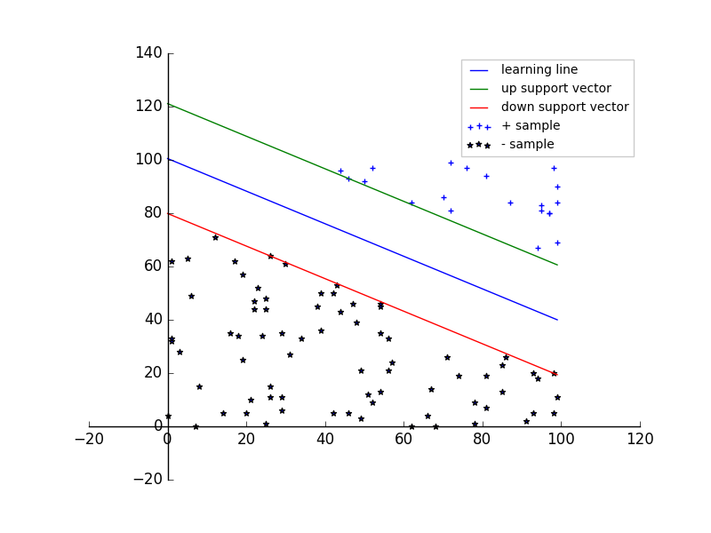
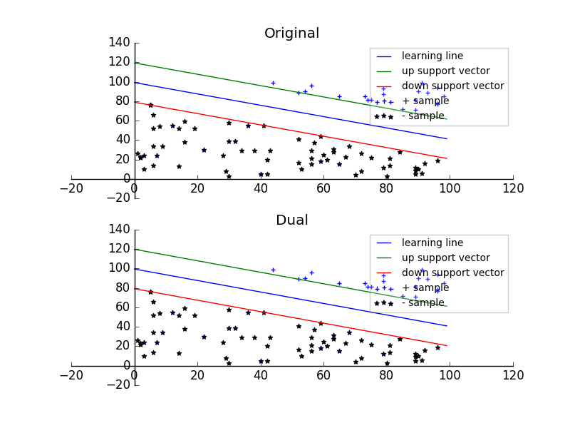
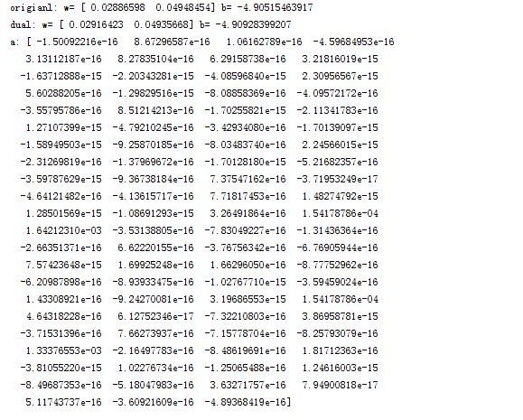
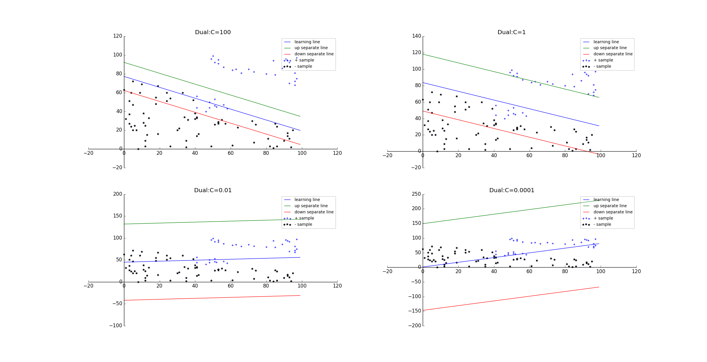
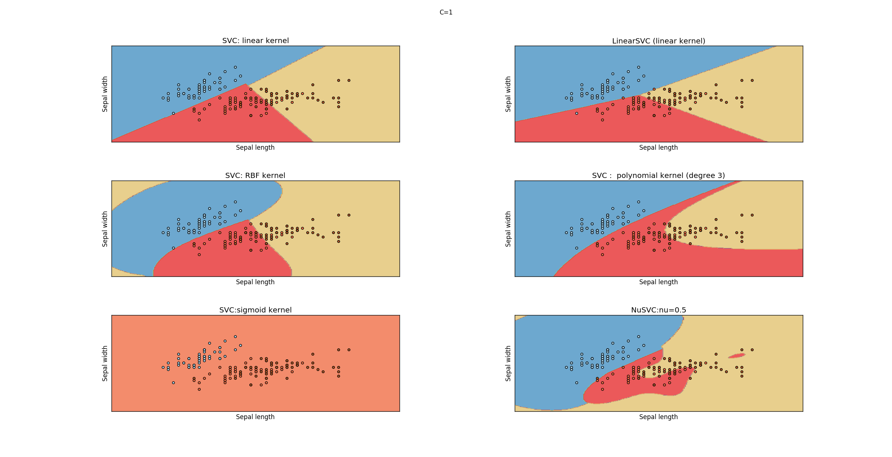
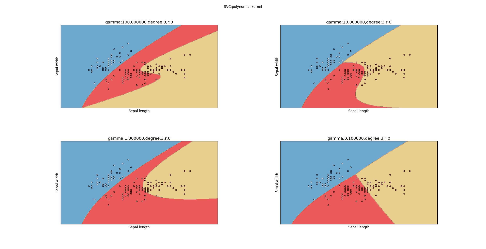
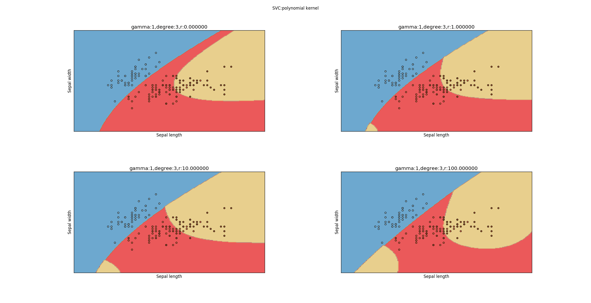
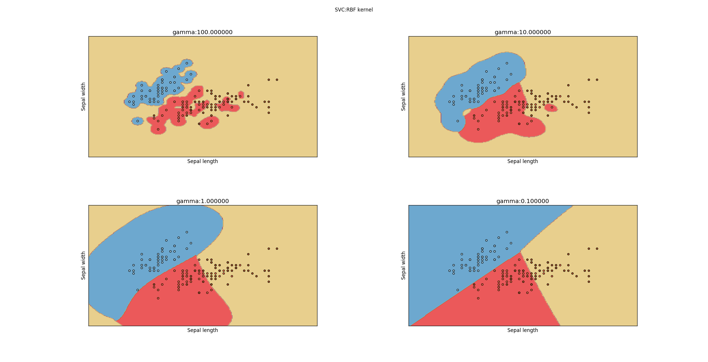

# 支持向量机

1.支持向量机(`support vector machines`，`SVM`）是一种二类分类模型。它的基本模型是定义在特征空间上的间隔最大的线性分类器

- 间隔最大使它有别于感知机
	> 如果数据集是线性可分的，那么感知机获得的模型可能有很多个。而支持向量机选择的是间隔最大的那一个
- 支持向量机还包括核技巧，从而使它成为实质上的非线性分类器

2.支持向量机支持各种复杂的情况：

- 当训练数据线性可分时，通过硬间隔最大化，学习一个线性分类器，即线性**可分**支持向量机（也称作硬间隔支持向量机）
- 当训练数据近似线性可分时，通过软间隔最大化，学习一个线性分类器，即线性支持向量机（也称为软间隔支持向量机）
- 当训练数据不可分时，通过使用核技巧以及软间隔最大化，学习非线性支持向量机

3.当输入空间为欧氏空间或离散集合、特征空间为希尔伯特空间时，核函数表示将输入从输入空间映射到特征空间得到的特征向量之间的内积。使用核函数可以学习非线性支持向量机，等价于隐式的在高维的特征空间中学习线性支持向量机。这种方法称作核技巧。

- 欧氏空间是有限维度的，希尔伯特空间为无穷维度的

> 欧式空间 \\(\subseteq\\) 希尔伯特空间 \\(\subseteq\\) 内积空间 \\(\subseteq \\) 赋范空间

> 越抽象的空间具有的性质越少，在这样的空间中能得到的结论就越少。不过反过来，如果发现了赋范空间中的某些性质，那么前面那些空间也都具有这个性质。

>我们生活在三维空间，把它拓展到n维空间就是欧式空间，这是我们比较熟悉的空间，具有一切美好的性质。当我们不局限于有限维度，就来到了希尔伯特空间。从有限到无限是一个质变，很多美好的性质消失了，一些非常有悖常识的现象会出现。如果再进一步去掉完备性，就来到了内积空间。如果再进一步去掉"角度"的概念，就来到了赋范空间。在这里，起码我们还有“长度”和“距离”的概念。


## 线性可分支持向量机

1.假设输入空间与特征空间为两个不同的空间。

- 输入空间为欧氏空间或离散集合
- 特征空间为欧氏空间或者希尔伯特空间

则有：

- 线性可分支持向量机、线性支持向量机假设这两个空间的元素一一对应，并将输入空间中的输入映射为特征空间中的特征向量
- 非线性支持向量机利用一个从输入空间到特征空间的非线性映射将输入映射为特征向量。

所有输入都由输入空间转换到特征空间，支持向量机的学习是在特征空间进行的。

2.假设给定一个特征空间上的训练数据集 \\(T=\\{(\mathbf x_1,y_1),(\mathbf x_2,y_2),\cdots,(\mathbf x_N,y_N)\\}\\)，其中 \\(\mathbf x_i \in \mathcal X = \mathbb R^{n},y_i \in \mathcal Y=\\{+1,-1\\},i=1,2,\cdots,N\\)。 \\(\mathbf x_i\\) 为第 i 个特征向量，也称作实例； \\(y_i\\) 为  \\(\mathbf x_i\\)  的类标记； 当  \\(y_i=+1\\) 时，称 \\(\mathbf x_i\\) 为正例；当  \\(y_i=-1\\) 时，称 \\(\mathbf x_i\\) 为负例。 \\((\mathbf x_i,y_i)\\) 称作样本点。

假设训练数据集是线性可分的。则学习的目标是在特征空间中找到一个分离超平面，能将实例分到不同的类。分离超平面对应于方程 \\(\mathbf w \cdot \mathbf x+b=0\\)， 它由法向量 \\(\mathbf w\\) 和截距 b 决定，可以用 \\((\mathbf w,b)\\) 来表示。

一般地，当训练数据集线性可分时，存在无穷个分离超平面可以将两类数据正确分开。感知机利用误分类最小的策略，求出分离超平面。但是此时的解有无穷多个。线性可分支持向量机利用间隔最大化求得最优分离超平面，这样的解只有唯一的一个。

3.**线性可分支持向量机**：给定线性可分训练数据集，通过间隔最大化或者等价地求解相应的凸二次规划问题学习得到的分离超平面为：\\(\mathbf w^{\*}\cdot \mathbf x+b^{\*}=0\\)。 相应的分类决策函数：\\(f(\mathbf x)=\text{sign}(\mathbf w^{\*}\cdot \mathbf x+b^{\*})\\) 称为线性可分支持向量机

4.通常可以将一个点距离分离超平面的远近来表示分类预测的确信程度。

- 一个点距离分离超平面越远，则该点的分类越可靠
- 一个点距离分离超平面越近，则该店的分类则不那么确信

在超平面 \\(\mathbf w \cdot \mathbf x+b=0\\) 确定的情况下:

-  \\(|\mathbf w \cdot \mathbf x+b|\\) 能够相对地表示点 \\(\mathbf x\\) 距离超平面的远近
-  \\(\mathbf w \cdot \mathbf x+b\\) 的符号与类标记 \\(y\\) 的符号是否一致能表示分类是否正确
	> - \\(\mathbf w \cdot \mathbf x_i+b \gt 0\\) 时，即 \\(\mathbf x_i\\) 位于超平面上方，将 \\(\mathbf x_i\\) 划分为正类，此时 \\(y_i=+1\\)
	> - \\(\mathbf w \cdot \mathbf x_i+b \lt 0\\) 时，即 \\(\mathbf x_i\\) 位于超平面下方，将 \\(\mathbf x_i\\) 划分为负类，此时 \\(y_i=-1\\)

所以可以用 \\(y(\mathbf w \cdot \mathbf x+b)\\) 来表示分类的正确性以及确信度（符号决定了正确性，范数决定了确信度）。这就是函数间隔的概念。

5.**函数间隔**：对于给定的训练数据集 T 和超平面 \\((\mathbf w,b)\\)，定义超平面  \\((\mathbf w,b)\\) 关于样本点 \\((\mathbf x_i,y_i)\\) 的函数间隔为： \\(\hat\gamma_i=y_i(\mathbf w\cdot \mathbf x_i+b)\\)

定义超平面 \\((\mathbf w,b)\\) 关于训练集 T 的函数间隔为超平面  \\((\mathbf w,b)\\) 关于T中所有样本点 \\((\mathbf x_i,y_i)\\) 的函数间隔之最小值： \\(\hat\gamma=\min \hat\gamma_i\\)
> \\(\hat\gamma_i\\) 是关于样本点的间隔， \\(\hat\gamma\\) 是关于训练集的间隔

6.对于函数间隔，只需要成比例的改变 \\(\mathbf w\\) 和 \\(b\\) ，比如将它们改变为 \\(100\mathbf w\\)和 \\(100b\\)，超平面 \\(100\mathbf w\cdot \mathbf x+100b=0\\) 还是原来的超平面，但是函数间隔却成为原来的100倍。

因此我们需要对分离超平面施加某些约束，如规范化，令 \\(||\mathbf w||=1\\)，使得函数间隔是确定的。此时的函数间隔成为几何间隔。

7.**几何间隔**：对于给定的训练数据集 T 和超平面 \\((\mathbf w,b)\\)，定义超平面  \\((\mathbf w,b)\\) 关于样本点 \\((\mathbf x_i,y_i)\\) 的几何间隔为： \\(\gamma_i=y_i(\frac{\mathbf w}{||\mathbf w||}\cdot \mathbf x_i+\frac{b}{||\mathbf w||})\\)

定义超平面 \\((\mathbf w,b)\\) 关于训练集 T 的几何间隔为超平面  \\((\mathbf w,b)\\) 关于T中所有样本点 \\((\mathbf x_i,y_i)\\) 的几何间隔之最小值： \\(\gamma=\min \gamma_i\\)
> \\(\gamma_i\\) 是关于样本点的间隔， \\(\gamma\\) 是关于训练集的间隔

由定义可知函数间隔和几何间隔有下列的关系： \\(\gamma_i=\frac{\hat\gamma_i}{||\mathbf w||}\\) , \\(\gamma=\frac{\hat\gamma}{||\mathbf w||}\\)

- 当 \\(||\mathbf w||=1\\) 时，函数间隔和几何间隔相等
- 当超平面参数 \\(\mathbf w,b\\) 等比例改变时（超平面并没有变化），函数间隔也按比例改变，而几何间隔不变

8.支持向量机学习基本思想：求解能够正确划分训练数据集并且几何间隔最大的分离超平面。

对于线性可分的训练数据集而言，线性可分分离超平面有无穷多个（等价于感知机），但几何间隔最大的分离超平面是唯一的。这里的间隔最大化又称作硬间隔最大化。

间隔最大化的直观解释为：不仅将正负实例点分开，而且对于最难分辨的实例点（距离超平面最近的那些点）也有足够大的确信度来讲它们分开。

9.求解几何间隔最大的分离超平面可以表示为约束的最优化问题：
$$
\max\_{\mathbf w,b} \gamma\\\
s.t. \quad y_i(\frac{\mathbf w}{||\mathbf w||}\cdot \mathbf x_i+\frac{b}{||\mathbf w||}) \ge \gamma, i=1,2,\cdots,N
$$

考虑几何间隔和函数间隔的关系，改写问题为：
$$
\max\_{\mathbf w,b} \frac{\hat\gamma}{||\mathbf w||}\\\
s.t. \quad y_i(\mathbf w \cdot \mathbf x_i+b) \ge \hat\gamma, i=1,2,\cdots,N
$$

函数间隔 \\(\hat \gamma\\) 并不影响最优化问题的解。假设将 \\(\mathbf w,b\\) 按比例的改变为 \\(\lambda \mathbf w,\lambda b\\)，此时函数间隔变成 \\(\lambda \hat\gamma\\)。这一变化对求解最优化问题的不等式约束没有任何影响，对最优化目标函数也没有影响。因此令 \\(\hat\gamma =1\\)。同时注意到 \\(\max \frac{1}{||\mathbf w||}\\)和 \\(\min \frac 12 ||\mathbf w||^{2}\\) 是等价的，于是最优化问题改写为：
$$
\min\_{\mathbf w,b} \frac 12 ||\mathbf w||^{2}\\\
s.t. \quad y_i(\mathbf w \cdot \mathbf x_i+b) -1 \ge 0, i=1,2,\cdots,N
$$
这是一个凸二次规划问题。

10.**凸优化问题**：指约束最优化问题：
$$
\min\_{\mathbf w}f(\mathbf w)\\\
s.t. \quad g_i(\mathbf w) \le0,i=1,2,\cdots,k\\\
h_i(\mathbf w)=0,i=1,2,\cdots,l
$$

其中：

- 目标函数 \\(f(\mathbf w)\\) 和约束函数 \\(g_i(\mathbf w)\\) 都是 \\(\mathbb R^{n}\\) 上的连续可微的凸函数
- 约束函数 \\(h_i(\mathbf w)\\) 是 \\(\mathbb R^{n}\\) 上的仿射函数
	> \\(h(\mathbf x)\\) 称为仿射函数，如果它满足 \\(h(\mathbf x)=\mathbf a\cdot\mathbf x+b,\quad \mathbf a\in \mathbb R^{n},b \in \mathbb R, x \in \mathbb R^{n}\\)

当目标函数 \\(f(\mathbf w)\\) 是二次函数且约束函数 \\(g_i(\mathbf w)\\) 是仿射函数时，上述凸最优化问题成为凸二次规划问题。

11.线性可分支持向量机学习算法--------最大间隔法的算法：

- 输入：线性可分训练数据集 \\(T=\\{(\mathbf x_1,y_1),(\mathbf x_2,y_2),\cdots,(\mathbf x_N,y_N)\\}\\) ，其中 \\(\mathbf x_i \in \mathcal X = \mathbb R^{n},y_i \in \mathcal Y=\\{+1,-1\\},i=1,2,\cdots,N\\)
- 输出：最大几何间隔的分离超平面和分类决策函数
- 算法步骤：
	- 构造并且求解约束最优化问题：
	$$
	\min\_{\mathbf w,b} \frac 12 ||\mathbf w||^{2}\\\
	s.t. \quad y_i(\mathbf w \cdot \mathbf x_i+b) -1 \ge 0, i=1,2,\cdots,N
	$$
	求得最优解 \\(\mathbf w^{\*},b^{\*}\\)
	- 由此得到分离超平面：\\(\mathbf w^{\*}\cdot \mathbf x+b^{\*}=0\\)，以及分类决策函数 \\(f(\mathbf x)=\text{sign}(\mathbf w^{\*}\cdot \mathbf x+b^{\*})\\)

12.可以证明：若训练数据集 T 线性可分，则可将训练数据集中的样本点完全正确分开的最大间隔分离超平面存在且唯一。

13.在训练数据集线性可分的情况下，训练数据集的样本点中与分离超平面距离最近的样本点的实例称为支持向量。支持向量是使得约束条件等号成立的点，即 \\(y_i(\mathbf w \cdot \mathbf x_i+b) -1=0\\)

- 对于正实例点，支持向量位于超平面 \\(H_1:\mathbf w \cdot\mathbf x+b=1\\)
- 对于负实例点，支持向量位于超平面 \\(H_2:\mathbf w \cdot\mathbf x+b=-1\\)

超平面 \\(H_1\\) 、 \\(H_2\\) 和分离超平面 \\(\mathbf w \cdot\mathbf x+b=0\\) 平行，且没有任何实例点落在\\(H_1\\) 、 \\(H_2\\) 之间。 

- 在 \\(H_1\\) 、 \\(H_2\\) 之间形成一条长带，分离超平面与它们平行且位于它们中央
- \\(H_1\\) 、 \\(H_2\\) 之间长带的宽度称为 \\(H_1\\) 、 \\(H_2\\) 之间的距离，也即间隔。
- 间隔大小为 \\(\frac{2}{||\mathbf w||}\\)
- \\(H_1\\) 、 \\(H_2\\) 称为间隔边界

14.在决定分离超平面时，只有支持向量起作用，其他的实例点并不起作用。

- 如果移动支持向量，将改变所求的解
- 如果在间隔边界以外移动其他实例点，甚至去掉这些点，则解是不变的

由于支持向量在确定分离超平面中起着决定性作用。所以将这种分离模型称为支持向量机。

支持向量的个数一般很少，所以支持向量机由很少的”重要的“训练样本确定。

15.示例

```
import numpy as np
import matplotlib.pyplot as plt
from scipy.optimize import minimize
def training_data(num):
    '''
    生成随机的训练数据。X 为二维，其中第一维特征为 [0,100] 之间的随机整数；
第二维特征为 [0,40] 之间的随机整数。
    :param num: 训练数据集大小
    :return: 训练数据集（一个 num*3 大小的数组，每一行为一个样本，
最后一列为分类（1为正类，-1为负类））。划分直线为 4*x_1+5*x_2=250
    '''
    x_1=np.random.randint(low=0,high=100,size=(num,1))
    x_2=np.random.randint(low=0,high=100,size=(num,1))

    valid_x_1=[]
    valid_x_2=[]
    y=[]
    for i in range(num):
        if 3*x_1[i]+5*x_2[i]<=400:
            valid_x_1.append(x_1[i])
            valid_x_2.append(x_2[i])
            y.append(-1)
        elif 3*x_1[i]+5*x_2[i]>=600:
            valid_x_1.append(x_1[i])
            valid_x_2.append(x_2[i])
            y.append(1)
    return np.c_[valid_x_1,valid_x_2,y]

##### 最优化问题
def func(x):#  x=(w,b) 目标函数
    w=x[:-1]
    return np.dot(w,w) #
def jac(x): # 梯度函数
    g=2*np.copy(x)
    g[-1]=0
    return g
def constrant(x,y_i,x_i): # 约束
    w=x[:-1]
    b=x[-1]
    return y_i*(np.dot(w,x_i)+b)-1

######  生成数据   #############
data_num=150 # 数据点个数
data=training_data(data_num)
constrants=[]
for i in range(len(data)):
    constrants.append({'type':'ineq','fun':constrant,'args':(data[i][-1],data[i][:-1])})
result=minimize(func, np.array([1,1,1]), args=(), method='SLSQP', jac=jac,
 constraints=constrants) #最优化问题
###################  绘图   ##################
figure=plt.figure()
ax=figure.add_subplot(111)
########## 绘制样本集的散点图 ############
ax.scatter(data[:,0] [data[:,2]==1],data[:,1] [data[:,2]==1],
label=r'+ sample',marker='+')
ax.scatter(data[:,0] [data[:,2]==-1],data[:,1] [data[:,2]==-1],label=r'- sample',
marker='*')
########## 绘制学习到的分类超平面
line_x=np.arange(0,100)
w=result.x[:-1]
b=result.x[-1]
line_y=-b/w[1]-line_x*w[0]/w[1]
line_y_down=-(1+b)/w[1]-line_x*w[0]/w[1]
line_y_up=(1-b)/w[1]-line_x*w[0]/w[1]
ax.plot(line_x,line_y,label=r'learning line')
ax.plot(line_x,line_y_up,label=r'up support vector') # 绘制上向量
ax.plot(line_x,line_y_down,label=r'down support vector')# 绘制下向量
################## 设置  ############
#### 平移坐标轴
ax.spines['left'].set_position(('data',0))
ax.spines['right'].set_color('none')
ax.xaxis.set_ticks_position('bottom')
ax.spines['bottom'].set_position(('data',0))
ax.spines['top'].set_color('none')
ax.yaxis.set_ticks_position('left')

ax.legend(loc='upper right',fontsize=10,framealpha=0.2)
figure.savefig("F:/linear_svm.png")

```

  

16.为求解线性可分支持向量机的最优化问题，可以将它作为原始最优化问题，应用拉格朗日对偶性。通过求解对偶问题得到原始问题的最优解。这就是线性可分支持向量机的对偶算法。优点：

- 对偶问题往往更容易求解
- 引入了核函数，进而推广到非线性分类问题

原始问题：
$$
\min\_{\mathbf w,b} \frac 12 ||\mathbf w||^{2}\\\
s.t. \quad y_i(\mathbf w \cdot \mathbf x_i+b) -1 \ge 0, i=1,2,\cdots,N
$$

定义拉格朗日函数：
$$L(\mathbf w,b,\alpha)=\frac 12 ||\mathbf w||^{2}-\sum\_{i=1}^{N}\alpha_iy_i(\mathbf w \cdot \mathbf x_i +b)+\sum_{i=1}^{N} \alpha_i$$
其中 \\(\alpha=(\alpha_1,\alpha_2,\cdots,\alpha_N)\\) 为拉格朗日乘子向量。

根据拉格朗日对偶性，原始问题的对偶问题是极大极小问题： \\(\max\_\alpha\min_{\mathbf w,b}L(\mathbf w,b,\alpha)\\)

- 先求 \\(\min_{\mathbf w,b}L(\mathbf w,b,\alpha)\\)。将拉格朗日函数分别为 \\(\mathbf w,b\\) 求偏导数，并令其等于0
	$$
	\nabla\_{\mathbf w}L(\mathbf w,b,\alpha)=\mathbf w-\sum\_{i=1}^{N}\alpha_iy_i\mathbf x_i =0\\\
	\nabla\_bL(\mathbf w,b,\alpha)=\sum\_{i=1}^{N}\alpha_iy_i=0
	$$
	得到 \\(\mathbf w=\sum\_{i=1}^{N}\alpha_iy_i\mathbf x_i,\quad \sum\_{i=1}^{N}\alpha_iy_i=0\\)
- 求极大值： 
	$$
	L(\mathbf w,b,\alpha)=\frac 12 \sum\_{i=1}^{N}\sum\_{j=1}^{N}\alpha_i\alpha_jy_iy_j(\mathbf x_i \cdot \mathbf x_j)-\sum\_{i=1}^{N}\alpha_iy_i[(\sum\_{j=1}^{N}\alpha_jy_j\mathbf x_j)\cdot \mathbf x_i+b]+\sum\_{i=1}^{N} \alpha_i\\\
	=-\frac 12 \sum\_{i=1}^{N}\sum\_{j=1}^{N}\alpha_i\alpha_jy_iy_j(\mathbf x_i \cdot \mathbf x_j) +\sum\_{i=1}^{N} \alpha_i
	$$
	- 对偶问题极大值为：
	$$
	\max_{\alpha}-\frac 12 \sum\_{i=1}^{N}\sum\_{j=1}^{N}\alpha_i\alpha_jy_iy_j(\mathbf x_i \cdot \mathbf x_j) +\sum\_{i=1}^{N} \alpha_i\\\
	s.t. \quad \sum\_{i=1}^{N}\alpha_iy_i=0\\\
	\alpha_i \ge 0,i=1,2,\cdots,N
	$$
	
	- 设对偶最优化问题的 \\(\alpha\\) 的解为 \\(\alpha^{\*}=(\alpha_1^{\*},\alpha_2^{\*},\cdots,\alpha_N^{\*})\\)，则
	$$\mathbf w^{\*}=\sum\_{i=1}^{N}\alpha_i^{\*}y_i\mathbf x_i\\\$$
	由于 \\(\alpha^{\*}\\) 不是零向量（若它为零向量，则 \\(\mathbf w^{\*}\\) 也为零向量，矛盾）。则存在某个 j 使得 \\(\alpha_j^{\*} \gt 0\\)。此时必有 \\(y_j(\mathbf w^{\*} \cdot \mathbf x_j+b^{\*})-1=0\\)，同时考虑到 \\(y_j^{2}=1\\),得到 
	$$b^{\*}=y_j-\sum_{i=1}^{N}\alpha_i^{\*}y_i(\mathbf x_i \cdot \mathbf x_j)$$

- 于是分离超平面写作：
	$$\sum\_{i=1}^{N}\alpha\_i^{\*}y_i(\mathbf x \cdot \mathbf x_i)+b^{\*}=0$$
	分类决策函数写作：
	$$f(\mathbf x)=\text{sign}(\sum\_{i=1}^{N}\alpha_i^{\*}y_i(\mathbf x \cdot \mathbf x_i)+b^{\*})$$

可以看到：分类决策函数只依赖于输入 \\(\mathbf x\\) 和训练样本输入的内积。上式称作线性可分支持向量机的对偶形式。


17.线性可分支持向量机学习算法：

- 输入：线性可分训练数据集 \\(T=\\{(\mathbf x_1,y_1),(\mathbf x_2,y_2),\cdots,(\mathbf x_N,y_N)\\}\\) ，其中 \\(\mathbf x_i \in \mathcal X = \mathbb R^{n},y_i \in \mathcal Y=\\{+1,-1\\},i=1,2,\cdots,N\\)
- 输出：最大几何间隔的分离超平面和分类决策函数
- 算法步骤：
	- 构造并且求解约束最优化问题：
	$$
	\min_{\alpha} \frac 12 \sum\_{i=1}^{N}\sum\_{j=1}^{N}\alpha_i\alpha_jy_iy_j(\mathbf x_i \cdot \mathbf x_j) -\sum\_{i=1}^{N} \alpha_i\\\
	s.t. \quad \sum\_{i=1}^{N}\alpha_iy_i=0\\\
	\alpha_i \ge 0,i=1,2,\cdots,N
	$$
	求得最优解 \\(\alpha^{\*}=(\alpha_1^{\*},\alpha_2^{\*},\cdots,\alpha_N^{\*})\\)
	- 计算$$\mathbf w^{\*}=\sum\_{i=1}^{N}\alpha_i^{\*}y_i\mathbf x_i\\\$$
	同时选择 \\(\alpha^{\*}\\) 的一个正的分量 \\(\alpha_j^{\*} \gt 0\\)，计算$$b^{\*}=y_j-\sum_{i=1}^{N}\alpha_i^{\*}y_i(\mathbf x_i \cdot \mathbf x_j)$$
	- 由此得到分离超平面：\\(\mathbf w^{\*}\cdot \mathbf x+b^{\*}=0\\)，以及分类决策函数 \\(f(\mathbf x)=\text{sign}(\mathbf w^{\*}\cdot \mathbf x+b^{\*})\\)

> \\(\mathbf w^{\*},b^{\*} \\) 只依赖于 \\(\alpha_i^{\*} \gt 0\\) 对应的样本点 \\(\mathbf x_i,y_i\\)，而其他的样本点对于 \\(\mathbf w^{\*},b^{\*} \\) 没有影响。

> 我们将训练数据集里面对应于 \\(\alpha_i^{\*} \gt 0\\) 的样本点对应的实例 \\(\mathbf x_i\\) 称为支持向量。

18.对于\\(\alpha_i^{\*} \gt 0\\) 的样本点，根据 \\(\alpha_i^{\*}(y_i(\mathbf w^{\*}\cdot \mathbf x_i+b^{\*})-1)=0\\)（拉普拉斯函数极小值条件） ，有： \\(\mathbf w^{\*}\cdot \mathbf x_i+b^{\*}=\pm 1\\)，即 \\(\mathbf x_i\\) 一定在间隔边界上。这与原始问题给出的支持向量的定义一致。

19.线性可分支持向量机原始算法和对偶算法的比较：

```
import numpy as np
import matplotlib.pyplot as plt
from scipy.optimize import minimize
def training_data(num):
    '''
    生成随机的训练数据。X 为二维，其中第一维特征为 [0,100] 之间的随机整数；第二维特征为 [0,40] \
之间的随机整数。
    :param num: 训练数据集大小
    :return: 训练数据集（一个 num*3 大小的数组，每一行为一个样本，最后一列为分类\
（1为正类，-1为负类））。划分直线为 4*x_1+5*x_2=250
    '''
    x_1=np.random.randint(low=0,high=100,size=(num,1))
    x_2=np.random.randint(low=0,high=100,size=(num,1))

    valid_x_1=[]
    valid_x_2=[]
    y=[]
    for i in range(num):
        if 3*x_1[i]+5*x_2[i]<=400:
            valid_x_1.append(x_1[i])
            valid_x_2.append(x_2[i])
            y.append(-1)
        elif 3*x_1[i]+5*x_2[i]>=600:
            valid_x_1.append(x_1[i])
            valid_x_2.append(x_2[i])
            y.append(1)
    return np.c_[valid_x_1,valid_x_2,y]

##### 原始问题最优化问题
def func(x):#  x=(w,b) 目标函数
    w=x[:-1]
    return np.dot(w,w) #
def jac(x): # 梯度函数
    g=2*np.copy(x)
    g[-1]=0
    return g
def constrant(x,y_i,x_i): # 约束
    w=x[:-1]
    b=x[-1]
    return y_i*(np.dot(w,x_i)+b)-1
########对偶问题最优化问题
def func_dual(a,x,y):
    sum=0
    sum_a=0
    for i in range(a.size):
        sum_a+=a[i]
        for j in range(a.size):
            sum+=a[i]*a[j]*y[i]*y[j]*np.vdot(x[i],x[j])
    return sum/2-sum_a
def jac_dual(a,x,y):
    result=np.zeros_like(a)
    for i in range(a.size):
        for j in range(a.size):
            result[i]+=a[j]*y[i]*y[j]*np.vdot(x[i],x[j])
        result[i]-=1
    return result
def constrant_dual_eq(a,y):
    return np.vdot(a,y)
def constrant_dual_neq(a,i):
    return a[i]

######  生成数据   #############
data_num=150 # 数据点个数
data=training_data(data_num)
X=data[:,:-1]
Y=data[:,-1]

constrants=[] # 原始优化问题约束
constrants_dual=[] # 对偶问题约束

constrants_dual.append({'type':'eq','fun':constrant_dual_eq,'args':(Y,)})
for i in range(len(data)):
    constrants.append({'type':'ineq','fun':constrant,'args':(data[i][-1],data[i][:-1])})
    constrants_dual.append({'type':'ineq','fun':constrant_dual_neq,'args':(i,)})
result=minimize(func, np.array([1,1,1]), args=(), method='SLSQP', jac=jac,
\ constraints=constrants) #最优化问题
result_dual=minimize(func_dual,np.zeros_like(Y),args=(X,Y),method='SLSQP'
,\jac=jac_dual,constraints=constrants_dual,options={'disp':False})\
# 注意初值必须满足约束条件。否则不收敛
###################  绘图   ##################
figure=plt.figure()
ax_1=figure.add_subplot(2,1,1)
ax_2=figure.add_subplot(2,1,2,sharex=ax_1)
########## 绘制样本集的散点图 ############
def add_scatter(ax):
    ax.scatter(data[:,0] [data[:,2]==1],data[:,1] [data[:,2]==1],\
label=r'+ sample',marker='+')
    ax.scatter(data[:,0] [data[:,2]==-1],data[:,1] [data[:,2]==-1],\
label=r'- sample',marker='*')

add_scatter(ax_1)
add_scatter(ax_2)
########## 绘制学习到的分类超平面
def add_linear(w,b,ax):
    line_x=np.arange(0,100)
    line_y=-b/w[1]-line_x*w[0]/w[1]
    line_y_down=-(1+b)/w[1]-line_x*w[0]/w[1]
    line_y_up=(1-b)/w[1]-line_x*w[0]/w[1]
    ax.plot(line_x,line_y,label=r'learning line')
    ax.plot(line_x,line_y_up,label=r'up support vector') # 绘制上向量
    ax.plot(line_x,line_y_down,label=r'down support vector')# 绘制下向量

w=result.x[:-1]
b=result.x[-1]
add_linear(w,b,ax_1)
print("origianl: w=",w,"b=",b)
########## 绘制学习到的对偶分类超平面

### 计算 w
a=result_dual.x
w=np.array([0,0])
for i in range(Y.size):
    w=w+a[i]*Y[i]*X[i]

### 计算 b
### 找出最大的 a_j
max_alpha=0
max_index=-1 # 最大 a_j 的下标
for i in range(a.size):
    if(a[i]>max_alpha):
        max_alpha=a[i]
        max_index=i
sum=0
for i in range(Y.size):
    sum+=a[i]*Y[i]*np.vdot(X[i],X[max_index])
b=Y[max_index]-sum
add_linear(w,b,ax_2)
print("dual: w=",w,"b=",b)
print("a:",a)
################## 设置  ############
def set_ax(ax):
    #### 平移坐标轴
    ax.spines['left'].set_position(('data',0))
    ax.spines['right'].set_color('none')
    ax.xaxis.set_ticks_position('bottom')
    ax.spines['bottom'].set_position(('data',0))
    ax.spines['top'].set_color('none')
    ax.yaxis.set_ticks_position('left')

    ax.legend(loc='upper right',fontsize=10,framealpha=0.2)

ax_1.set_title("Original")
ax_2.set_title("Dual")
set_ax(ax_1)
set_ax(ax_2)

figure.savefig("F:/linear_svm_orig_dual.png")
```

   
   

  可以看到二者几乎相同。（因为计算精度的问题，所有有一定的误差）

## 线性支持向量机

1.对于线性不可分训练数据，线性支持向量机不再适用。但是我们可以想办法将它扩展到线性不可分问题。

设训练集为 \\(T=\\{(\mathbf x_1,y_1),(\mathbf x_2,y_2),\cdots,(\mathbf x_N,y_N)\\}\\) ，其中 \\(\mathbf x_i \in \mathcal X = \mathbb R^{n},y_i \in \mathcal Y=\\{+1,-1\\},i=1,2,\cdots,N\\)。假设训练数据集不是线性可分的。这意味着某些样本点 \\((\mathbf x_i,y_i)\\) 不满足函数间隔大于等于1的约束条件。

对每个样本点  \\((\mathbf x_i,y_i)\\) 引进一个松弛变量 \\(\xi_i \ge 0\\)，使得函数间隔加上松弛变量大于等于1.则约束条件变成了： \\(y_i(\mathbf w \cdot \mathbf x_i) \ge 1-\xi_i\\)

同时对每个松弛变量 \\(\xi_i\\) ，支付一个代价 \\(\xi_i\\)。则目标函数由原来的 \\(\frac 12 ||\mathbf w||^{2}\\)  变成了 \\(\frac 12 ||\mathbf w||^{2}+C\sum_{i=1}^{N}\xi_i\\)，这里 \\(C \gt 0\\) 称作惩罚参数，一般由应用问题决定
	
- C 值大时，对误分类的惩罚增大，此时误分类点凸显的更重要
- C 值小时，对误分类的惩罚减小，此时误分类点显得不那么重要

2.相对于硬间隔最大化， \\(\frac 12 ||\mathbf w||^{2}+C\sum_{i=1}^{N}\xi_i\\) 称为软间隔最大化。于是线性不可分的线性支持向量机的学习问题变成了凸二次规划问题：
$$
\min\_{\mathbf w,b,\xi} \frac 12||\mathbf w||^{2}+C\sum\_{i=1}^{N}\xi_i\\\
s.t. \quad y_i(\mathbf w\cdot \mathbf x_i+b) \ge 1-\xi_i,\quad i=1,2,\cdots,N\\\
	\xi_i \ge 0,\quad i=1,2,\cdots,N
$$

- 这称为线性支持向量机的原始问题。因为这是个凸二次规划问题，因此解存在。可以证明 \\(\mathbf w\\) 的解是唯一的， b 的解不是唯一的， b 的解存在于一个区间。

3.对于给定的线性不可分的训练集数据，通过求解凸二次规划问题，即软间隔最大化问题得到的分离超平面为： \\(\mathbf w^{\*}\cdot \mathbf x+b^{\*}=0\\)，以及相应的分类决策函数 \\(f(\mathbf x)=\mathbf w^{\*}\cdot \mathbf x+b^{\*}\\)，称之为线性支持向量机

- 显然，线性支持向量机包含线性可分支持向量机
- 现实应用中，训练数据集往往是线性不可分的，线性支持向量机具有更广泛的适用性

4.线性支持向量机的对偶问题：定义拉格朗日函数为：
$$L(\mathbf w,b,\xi,\alpha,\mu)=\frac 12||\mathbf w||^{2}+C\sum\_{i=1}^{N}\xi_i-\sum\_{i]1}^{N}\alpha_i[y_i(\mathbf w_i \cdot \mathbf x_i+b)-1+\xi_i]-\sum\_{i=1}^{N}\mu_i\xi_i,\quad \alpha_i \ge 0, \mu_i \ge 0$$
原始问题是拉格朗日函数的极小极大问题；对偶问题是拉格朗日函数的极大极小问题。

- 先求 \\(L(\mathbf w,b,\xi,\alpha,\mu)\\) 对 \\(\mathbf w,b,\xi\\) 的极小。根据偏导数为0：
	$$
	\nabla\_{\mathbf w}L(\mathbf w,b,\xi,\alpha,\mu)=\mathbf w-\sum\_{i=1}^{N}\alpha_iy_i\mathbf x_i=0\\\
	\nabla_b L(\mathbf w,b,\xi,\alpha,\mu)=-\sum\_{i=1}^{N}\alpha_iy_i=0\\\
	\nabla\_{\xi_i} L(\mathbf w,b,\xi,\alpha,\mu)=C-\alpha_i-\mu_i=0
	$$得到
	$$
	\mathbf w=\sum\_{i=1}^{N}\alpha_iy_i\mathbf x_i\\\
	\sum\_{i=1}^{N}\alpha_iy_i=0\\\
	C-\alpha_i-\mu_i=0
	$$
- 再求极大问题：将上面三个等式代入拉格朗日函数：$$\max\_{\alpha,\mu}\min\_{\mathbf w,b,\xi}L(\mathbf w,b,\xi,\alpha,\mu)=\max\_{\alpha,\mu}[-\frac 12 \sum\_{i=1}^{N}\sum\_{j=1}^{N}\alpha_i\alpha_jy_iy_j(\mathbf x_i \cdot \mathbf x_j)+\sum\_{i=1}^{N}\alpha_i]$$
	于是得到对偶问题：
	$$
	\min\_{\alpha}\frac 12 \sum\_{i=1}^{N}\sum\_{j=1}^{N}\alpha_i\alpha_jy_iy_j(\mathbf x_i \cdot \mathbf x_j)-\sum\_{i=1}^{N}\alpha_i\\\
	s.t. \quad \sum\_{i=1}^{N}\alpha_iy_i=0\\\
	0 \le \alpha_i \le C, i=1,2,\cdots,N
	$$

- 设 \\(\alpha^{\*}=(\alpha_1^{\*},\alpha_2^{\*},\cdots,\alpha_N^{\*})\\) 是对偶问题的一个解。若存在 \\(\alpha^{\*}\\) 的某个分量 \\(\alpha_j^{\*}, 0 \lt \alpha_j^{\*} \lt C\\)，则线性支持向量机的原始问题的解可以按照下式得到：
	$$
	\mathbf w^{\*}=\sum\_{i=1}^{N}\alpha^{\*}y_i\mathbf x_i\\\
	b^{\*}=y_j-\sum\_{i=1}^{N}\alpha^{\*}y_i(\mathbf x_i\cdot \mathbf x_j)
	$$
	于是分离超平面为： \\(\sum\_{i=1}^{N}\alpha^{\*}y_i(\mathbf x_i \cdot \mathbf x)+b^{\*}=0\\)

	分类决策函数为：\\(f(\mathbf x)=\text{sign}[\sum\_{i=1}^{N}\alpha^{\*}y_i(\mathbf x_i \cdot \mathbf x)+b^{\*}]\\)

5.线性支持向量机学习算法：

- 输入：训练数据集 \\(T=\\{(\mathbf x_1,y_1),(\mathbf x_2,y_2),\cdots,(\mathbf x_N,y_N)\\}\\) ，其中 \\(\mathbf x_i \in \mathcal X = \mathbb R^{n},y_i \in \mathcal Y=\\{+1,-1\\},i=1,2,\cdots,N\\)
- 输出：分离超平面和分类决策函数
- 算法步骤：
	- 选择惩罚参数 \\(C\gt 0\\) ，构造并且求解约束最优化问题：
	$$
	\min_{\alpha} \frac 12 \sum\_{i=1}^{N}\sum\_{j=1}^{N}\alpha_i\alpha_jy_iy_j(\mathbf x_i \cdot \mathbf x_j) -\sum\_{i=1}^{N} \alpha_i\\\
	s.t. \quad \sum\_{i=1}^{N}\alpha_iy_i=0\\\
	C \ge \alpha_i \ge 0,i=1,2,\cdots,N
	$$
	求得最优解 \\(\alpha^{\*}=(\alpha_1^{\*},\alpha_2^{\*},\cdots,\alpha_N^{\*})\\)
	- 计算$$\mathbf w^{\*}=\sum\_{i=1}^{N}\alpha_i^{\*}y_i\mathbf x_i\\\$$
	同时选择 \\(\alpha^{\*}\\) 的一个合适的分量 \\(C \gt \alpha_j^{\*} \gt 0\\)，计算$$b^{\*}=y_j-\sum_{i=1}^{N}\alpha_i^{\*}y_i(\mathbf x_i \cdot \mathbf x_j)$$
	> 可能存在多个符合条件的 \\( \alpha_j^{\*}\\)。这是由于原始问题中，对 b 的解不唯一。所以实际计算时可以取在所有符合条件的样本点上的平均值
	- 由此得到分离超平面：\\(\mathbf w^{\*}\cdot \mathbf x+b^{\*}=0\\)，以及分类决策函数 \\(f(\mathbf x)=\text{sign}(\mathbf w^{\*}\cdot \mathbf x+b^{\*})\\)

6.在线性不可分的情况下，对偶问题的解 \\(\alpha^{\*}=(\alpha_1^{\*},\alpha_2^{\*},\cdots,\alpha_N^{\*})\\) 中对应于 \\(\alpha_i^{\*} \gt 0\\) 的样本点 \\((\mathbf x_i,y_i)\\) 的实例点 \\(\mathbf x_i\\) 称作支持向量（软间隔的支持向量）。但是支持向量比线性可分时的情况复杂一些：

- 若 \\(\alpha_i^{\*} \lt C\\) ，则松弛量  \\(\xi_i =0\\)，支持向量恰好落在了间隔边界上
	>  根据  \\(\nabla\_{\xi_i} L(\mathbf w,b,\xi,\alpha,\mu)=C-\alpha_i-\mu_i=0\\)，得到
	>
	> - 当 \\(\alpha_i^{\*} \lt C\\)，则 \\(\mu_i \gt 0\\)，根据拉格朗日函数极值条件，必须有 \\(\xi_i=0\\)
	>- 当 \\(\alpha_i^{\*} = C\\)， 则 \\(\mu_i =0\\)，于是  \\(\xi_i\\) 可能为任何正数
- 若 \\(\alpha_i^{\*} = C\\)，且 \\(0 \lt \xi_i \lt 1\\)，则支持向量落在间隔边界与分离超平面之间，分类正确
- 若 \\(\alpha_i^{\*} = C\\)，且 \\(\xi_i= 1\\)，则支持向量落在分离超平面上
- 若 \\(\alpha_i^{\*} = C\\)，且 \\(\xi_i \gt 1\\)，则支持向量落在分离超平面误分类一侧
	> 根据 \\(\xi_i\\) 的定义，它就是使得函数间隔加上 \\(\xi_i\\) 大于等于1。即线性可分时，支持向量位于间隔边界： \\(y_i(\mathbf w\cdot \mathbf x_i+b)=1\\) 上；现在支持向量位于 \\(y_i(\mathbf w\cdot \mathbf x_i+b)=1-\xi_i\\) 上

7.线性支持向量机的优化还有另一种解释。

定义取正函数为：
$$
\text{plus}(z)= \begin{cases}
z, & z \gt 0 \\\
0, & z \le 0
\end{cases}
$$
定义合页损失函数为： \\(L(y(\mathbf w\cdot\mathbf x+b))=\text{plus}(1-y(\mathbf w\cdot\mathbf x+b))\\)

则线性支持向量机就是最小化目标函数： \\(\sum\_{i=1}^{N}\text{plus}(1-y_i(\mathbf w\cdot\mathbf x_i+b))+\lambda||\mathbf w||^{2},\quad \lambda \gt 0\\)
> 合页损失函数的物理意义：
> 
>- 当样本点 \\((\mathbf x_i,y_i)\\) 被正确分类且函数间隔（确信度） \\(y_i(\mathbf w\cdot\mathbf x_i+b)\\) 大于 1 时，损失为0；
>- 当样本点 \\((\mathbf x_i,y_i)\\) 被正确分类且函数间隔（确信度） \\(y_i(\mathbf w\cdot\mathbf x_i+b)\\) 小于等于 1 时损失为 \\(1-y_i(\mathbf w\cdot\mathbf x_i+b)\\)
>- 当样本点 \\((\mathbf x_i,y_i)\\) 未被正确分类时损失为 \\(1-y_i(\mathbf w\cdot\mathbf x_i+b)\\)

- 可以证明：线性支持向量机原始最优化问题等价于最优化问题：\\(\min\_{\mathbf w,b}\sum\_{i=1}^{N}\text{plus}(1-y_i(\mathbf w\cdot\mathbf x_i+b))+\lambda||\mathbf w||^{2},\quad \lambda \gt 0\\)

- 合页损失函数图形如下：
	- 感知机的损失函数为  \\(\text{plus}(-y(\mathbf w\cdot\mathbf x+b))\\)，相比之下合页损失函数不仅要分类正确，而且要确信度足够高（确信度为1）时，损失才是0.即合页损失函数对学习有更高的要求
	- 0-1损失函数通常是二类分类问题的真正的损失函数。合页损失函数是0-1损失函数的上界。
		> 因为0-1损失函数不是连续可导的，因此直接应用于优化问题中比较困难。通常都是用0-1损失函数的上界函数构成目标函数。这时的上界损失函数又称为代理损失函数

   

## 非线性支持向量机

1.对于给定的训练集 \\(T=\\{(\mathbf x_1,y_1),(\mathbf x_2,y_2),\cdots,(\mathbf x_N,y_N)\\}\\) ，其中 \\(\mathbf x_i \in \mathcal X = \mathbb R^{n},y_i \in \mathcal Y=\\{+1,-1\\},i=1,2,\cdots,N\\)，如果能用 \\(\mathbb R^{n}\\)  中的一个超曲面将正负实例正确分开，则称这个问题为非线性可分问题。

> 非线性分类问题是指利用非线性模型才能很好的进行分类的问题。

2.设原空间为 \\(\mathcal X \subset \mathbb R^{2}, \mathbf x=(\mathbf x^{(1)},\mathbf x^{(2)}) \in \mathcal X \\)，新的空间为 \\(\mathcal Z \subset \mathbb R^{2}, \mathbf z=(\mathbf z^{(1)},\mathbf z^{(2)})\in \mathcal Z\\) 。定义从原空间到新空间的变换（映射）为： \\(\mathbf z=\phi(\mathbf x)=((\mathbf x^{(1)})^{2},(\mathbf x^{(2)})^{2})\\)， 则经过变换 \\(\mathbf z=\phi(\mathbf x)\\)：

- 原空间 \\(\mathcal X \subset \mathbb R^{2}\\) 变换为新空间  \\(\mathcal Z \subset \mathbb R^{2}\\) ， 原空间中的点相应地变换为新空间中的点
- 原空间中的椭圆 \\(w_1(\mathbf x^{(1)})^{2}+w_2(\mathbf x^{(2)})^{2}+b=0\\) 变换为新空间中的直线 \\(w_1\mathbf z^{(1)}+w_2\mathbf z^{(2)}+b=0\\)

若在变换后的新空间，直线 \\(w_1\mathbf z^{(1)}+w_2\mathbf z^{(2)}+b=0\\) 可以将变换后的正负实例点正确分开，则原空间的非线性可分问题就变成了新空间的线性可分问题。

3.用线性分类方法求解非线性分类问题分两边：

- 首先用一个变换将原空间的数据映射到新空间
- 再在新空间里用线性分类学习方法从训练数据中学习分类模型

>核技巧就是这样的方法。

4.核函数：设 \\(\mathcal X\\) 是输入空间（欧氏空间 \\(\mathbb R^{n}\\) 的子集或者离散集合），又设 \\(\mathcal H\\) 为特征空间（希尔伯特空间），如果存在一个从 \\(\mathcal X\\) 到 \\(\mathcal H\\) 的映射： \\(\phi(\mathbf x):\mathcal X \rightarrow \mathcal H\\)， 使得所有的 \\(\mathbf {x,z} \in\mathcal X\\)， 函数 \\(K(\mathbf x,\mathbf z)=\phi(\mathbf x)\cdot \phi(\mathbf z)\\)，则称 \\(K(\mathbf x,\mathbf z)\\) 为核函数。

>即核函数将原空间中的任意两个向量 \\(\mathbf {x,z}\\) 映射为特征空间中对应的向量之间的内积

5.通常直接计算 \\(K(\mathbf x,\mathbf z)\\)  比较容易，反而是通过 \\( \phi(\mathbf x)\\) 和 \\(\phi(\mathbf z)\\) 来计算 \\(K(\mathbf x,\mathbf z)\\) 比较困难

- 首先特征空间   \\(\mathcal H\\) 一般是高维的，甚至是无穷维的，映射 \\(\phi(\mathbf x)\\) 不容易定义
- 其次核函数关心的是希尔伯特空间两个向量的内积，而不关心这两个向量的具体形式。因此对于给定的核函数，特征空间 \\(\mathcal H\\)  和 映射函数   \\(\phi(\mathbf x)\\)  取法并不唯一。
	- 可以取不同的特征空间 \\(\mathcal H\\)
	- 即使是在同一个特征空间 \\(\mathcal H\\) 里，映射函数  \\(\phi(\mathbf x)\\) 也可以不同

6.考虑到在线性支持向量机的对偶形式中，无论是目标函数还是决策函数都只涉及输入实例和实例之间的内积。在对偶问题的目标函数中的内积 \\(\mathbf x_i \cdot \mathbf x_j\\) 可以用核函数 \\(K(\mathbf x_i,\mathbf x_j)=\phi(\mathbf x_i)\cdot \phi(\mathbf x_j)\\) 来代替。此时对偶问题的目标函数成为：
$$
W(\alpha)=\frac 12 \sum\_{i=1}^{N}\sum\_{j=1}^{N}\alpha_i\alpha_jy_iy_jK(\mathbf x_i,\mathbf x_j)-\sum\_{i=1}^{N}\alpha_i
$$

同样，分类决策函数中的内积也可以用核函数代替：
$$f(\mathbf x)=\text{sign}(\sum\_{i=1}^{N}\alpha_i^{\*}y_iK(\mathbf x_i,\mathbf x)+b^{\*})$$

- 这等价于经过映射函数 \\(\phi\\) ，将原来的输入空间变换到一个新的特征空间，将输入空间中的内积 \\(\mathbf x_i \cdot \mathbf x_j\\) 变换为特征空间中的内积 \\(\phi(\mathbf x_i) \cdot \phi(\mathbf x_j)\\)，在新的特征空间里从训练样本中学习线性支持向量机
	- 若映射函数为非线性函数，则学习到的含有核函数的支持向量机是非线性分类模型
	- 若映射函数为线性函数，则学习到的含有核函数的支持向量机依旧是线性分类模型
- 在核函数 \\(K(\mathbf x,\mathbf z)\\) 给定的条件下，可以用解线性分类问题的方法求解非线性分类问题的支持向量机。
	- 学习是隐式地在特征空间进行的，不需要显式的定义特征空间和映射函数。这样的技巧称作核技巧
	- 在实际应用中，往往依赖领域知识直接选择核函数。核函数选择的有效性需要通过实验验证 

7.若已知映射函数 \\(\phi\\)，那么可以通过 \\(\phi(\mathbf x)\\) 和 \\(\phi(\mathbf z)\\) 的内积求得核函数  \\(K(\mathbf x,\mathbf z)\\)。现在问题是，不用构造映射  \\(\phi\\), 那么给定一个函数   \\(K(\mathbf x,\mathbf z)\\)，判断它是否是一个核函数？即： \\(K(\mathbf x,\mathbf z)\\) 满足什么条件才能成为一个核函数？

- 可以证明： 设 \\(K:\mathcal X \times \mathcal X \rightarrow \mathbb R\\)  是对称函数， 则 \\(K(\mathbf x,\mathbf z)\\) 为正定核函数的充要条件是：对任意 \\(\mathbf x_i \in \mathcal X,i=1,2,\cdots,m,K(\mathbf x,\mathbf z)\\) 对应的 Gram 矩阵： \\(K=[K(\mathbf x_i,\mathbf x_j)]_{m\times m}\\) 是半正定矩阵。
- 正定核的等价定义：设 \\(\mathcal X \subset \mathbb R^{n}, K(\mathbf x,\mathbf z)\\) 是定义在 \\(\mathcal X \times \mathcal X\\) 上的对称函数。如果对对任意 \\(\mathbf x_i \in \mathcal X,i=1,2,\cdots,m,K(\mathbf x,\mathbf z)\\) 对应的 Gram 矩阵： \\(K=[K(\mathbf x_i,\mathbf x_j)]_{m\times m}\\) 是半正定矩阵， 则称 \\(K(\mathbf x,\mathbf z)\\) 为正定核
	> 这一定义在构造核函数时很有用。但是对于一个具体函数 \\(K(\mathbf x,\mathbf z)\\) 来说，检验它为正定核函数并不容易，因为要求对任意有限输入集 \\(\\{\mathbf x_1,\mathbf x_2,\cdots,\mathbf x_m\\}\\) 来验证  K 对于的 Gram 矩阵是否为半正定的。
- 实际问题中往往应用已有的核函数

8.常用核函数

- 多项式核函数：\\(K(\mathbf x,\mathbf z)=(\mathbf x\cdot \mathbf z+1)^{p}\\)
	- 对应的支持向量机是一个 p 次多项式分类器
	- 此时分类决策函数成为 $$f(\mathbf x)=\text{sign}(\sum\_{i=1}^{N}\alpha_i^{\*}y_i(\mathbf x_i\cdot \mathbf x+1)^{p}+b^{\*})$$
- 高斯核函数： $$K(\mathbf x,\mathbf z)=\exp(-\frac{||\mathbf {x-z}||^{2}}{2\sigma^{2}})$$
	- 对应的支持向量机是高斯径向基函数分类器(`radial basis function`)
	- 此时的分类决策函数成为$$f(\mathbf x)=\text{sign}(\sum\_{i=1}^{N}\alpha_i^{\*}y_i\exp(-\frac{||\mathbf {x_i-x}||^{2}}{2\sigma^{2}})+b^{\*})$$

9.非线性支持向量机学习算法：

- 输入：训练数据集 \\(T=\\{(\mathbf x_1,y_1),(\mathbf x_2,y_2),\cdots,(\mathbf x_N,y_N)\\}\\) ，其中 \\(\mathbf x_i \in \mathcal X = \mathbb R^{n},y_i \in \mathcal Y=\\{+1,-1\\},i=1,2,\cdots,N\\)
- 输出：分类决策函数
- 算法步骤：
	- 选择适当的核函数 \\(K(\mathbf {x,z})\\) 和惩罚参数 \\(C\gt 0\\) ，构造并且求解约束最优化问题：
	$$
	\min_{\alpha} \frac 12 \sum\_{i=1}^{N}\sum\_{j=1}^{N}\alpha_i\alpha_jy_iy_jK(\mathbf {x_i,x_j}) -\sum\_{i=1}^{N} \alpha_i\\\
	s.t. \quad \sum\_{i=1}^{N}\alpha_iy_i=0\\\
	C \ge \alpha_i \ge 0,i=1,2,\cdots,N
	$$
	求得最优解 \\(\alpha^{\*}=(\alpha_1^{\*},\alpha_2^{\*},\cdots,\alpha_N^{\*})\\)
	- 计算$$\mathbf w^{\*}=\sum\_{i=1}^{N}\alpha_i^{\*}y_i\mathbf x_i\\\$$
	同时选择 \\(\alpha^{\*}\\) 的一个合适的分量 \\(C \gt \alpha_j^{\*} \gt 0\\)，计算$$b^{\*}=y_j-\sum_{i=1}^{N}\alpha_i^{\*}y_iK(\mathbf {x_i,x_j})$$
	- 构造分类决策函数 \\(f(\mathbf x)=\text{sign}(\sum\_{i=1}^{N}\alpha_i^{\*} y_iK(\mathbf {x_i,x})+b^{\*})\\)
	> 当  \\(K(\mathbf {x,z})\\) 是正定核函数时，该问题为凸二次规划问题，解是存在的

## 实践

1.线性支持向量机 `LinearSVC`：

```
sklearn.svm.LinearSVC(penalty='l2', loss='squared_hinge', dual=True, tol=0.0001, C=1.0,\
 multi_class='ovr', fit_intercept=True, intercept_scaling=1, class_weight=None, \
verbose=0, random_state=None, max_iter=1000)
```
`LinearSVC`是根据`liblinear`实现的。它可以用于二类分类，也可以用于多类分类问题（此时是根据`one-vs-rest`原则来分类）。

参数：

- `C`：一个浮点数，正则项系数。
- `loss`：字符串。表示损失函数。可以为：
	- `'hinge'`：此时为合页损失函数（它是标准 SVM 的损失函数）
	- `'squared_hinge'`：合页损失函数的平方
- `penalty`：字符串。指定 `'l1'`或者`'l2'`，正则化项的范数。默认为 `'l2'`（它是标准SVC采用的）
- `dual`：布尔值。如果为`True`，则解决对偶问题；如果是`False`,则解决原始问题。当`n_samples > n_features`时，倾向于采用`False`。
- `tol`：浮点数，指定终止迭代的阈值。
- `multi_class`:字符串。指定多类分类问题的策略。
	- `'ovr'`：采用`one-vs-rest`分类策略
	- `'crammer_singer'`：多类联合分类，很少用。因为它计算量大，而且精度不会更佳.此时忽略`loss,penalty,dual`项
- `fit_intercept`：布尔值。如果为`True`，则计算截距，即决策函数中的常数项；否则忽略截距
- `intercept_scaling`：浮点值。如果提供了，则 实例 X 变成向量 `[X,intercept_scaling]`。此时相当于添加了一个人工特征，该特征对所有实例都是常数值。
	- 此时截距变成： `intercept_scaling`* 人工特征的权重 w_s
	- 此时人工特征也参与了正则化项的计算
- `class_weight`：可以是个字典，或者字符串`'balanced'`。指定各个类的权重。若未提供，则认为类的权重为1
	- 如果是字典，则指定每个类标签的权重
	- 如果是`'balanced'`，则每个类的权重是它出现频率的倒数
- `verbose`：一个整数。表示是否开启`verbose`输出
- `random_state`：一个整数（作为随机数的种子），或者`RandomState`实例。用于混洗数据
- `max_iter`：一个整数。指定最大迭代次数

属性：

- `coef_`：一个数组，如果是二类分类，则形状为 `[n_features]`，如果是多类分类，则形状为`[n_classes, n_features]`。它给出了各个特征的权重
- `intercept_`：一个数组。如果是二类分类，则形状为 `[1]`，如果是多类分类，则形状为`[n_classes,]`。它给出了截距，即决策函数中的常数项。

```
import numpy as np
from sklearn.svm import LinearSVC
import matplotlib.pyplot as plt
def training_data(num):
    '''
    生成随机的训练数据。X 为二维，其中第一维特征为 [0,100] 之间的随机整数；\
第二维特征为 [0,40] 之间的随机整数。
    :param num: 训练数据集大小
    :return: 训练数据集（一个 num*3 大小的数组，每一行为一个样本，\
最后一列为分类（1为正类，-1为负类））。划分直线为 4*x_1+5*x_2=250
    '''
    x_1=np.random.randint(low=0,high=100,size=(num,1))
    x_2=np.random.randint(low=0,high=100,size=(num,1))

    valid_x_1=[]
    valid_x_2=[]
    y=[]
    for i in range(num):
        if 3*x_1[i]+5*x_2[i]<=400:
            valid_x_1.append(x_1[i])
            valid_x_2.append(x_2[i])
            y.append(-1)
        elif 3*x_1[i]+5*x_2[i]>=600:
            valid_x_1.append(x_1[i])
            valid_x_2.append(x_2[i])
            y.append(1)
    for i in range (10):
        valid_x_1.append(np.random.randint(40,60))
        valid_x_2.append(np.random.randint(40,60))
        y.append(1)
    return np.array(np.c_[valid_x_1,valid_x_2,y],dtype=float)
######### 绘图函数 ########
def add_scatter(ax):
    ax.scatter(data[:,0] [data[:,2]==1],data[:,1] \
[data[:,2]==1],label=r'+ sample',marker='+')
    ax.scatter(data[:,0] [data[:,2]==-1],data[:,1] \
[data[:,2]==-1],label=r'- sample',marker='*')
def add_linear(w,b,ax):
    line_x=np.arange(0,100)
    line_y=-b/w[1]-line_x*w[0]/w[1]
    line_y_down=-(1+b)/w[1]-line_x*w[0]/w[1]
    line_y_up=(1-b)/w[1]-line_x*w[0]/w[1]
    ax.plot(line_x,line_y,label=r'learning line')
    ax.plot(line_x,line_y_up,label=r'up support vector') # 绘制上向量
    ax.plot(line_x,line_y_down,label=r'down support vector')# 绘制下向量
def set_ax(ax):
    #### 平移坐标轴
    ax.spines['left'].set_position(('data',0))
    ax.spines['right'].set_color('none')
    ax.xaxis.set_ticks_position('bottom')
    ax.spines['bottom'].set_position(('data',0))
    ax.spines['top'].set_color('none')
    ax.yaxis.set_ticks_position('left')
    ax.legend(loc='upper right',fontsize=10,framealpha=0.2)
######  生成数据   #############
data_num=150 # 数据点个数
data=training_data(data_num)
X=data[:,:-1]
Y=data[:,-1]
###################  绘图   ##################
figure=plt.figure()
for i,C in enumerate([100,1,0.01,0.0001]):
    svm=LinearSVC(C=C,max_iter=1e8,tol=1e-5)
    svm.fit(X,Y)
    w=svm.coef_
    b=svm.intercept_
    w=[w[0][0],w[0][1]]
    b=b[0]

    ax=figure.add_subplot(2,2,1+i)
    add_scatter(ax)
    add_linear(w,b,ax)
    ax.set_title("Dual:C=%s"%C)
    set_ax(ax)
plt.show()
```
   

  训练数据是线性不可分的。当 \\(C \rightarrow 0\\) 时，根据 \\(C \ge \alpha_i \ge 0\\)，因此  \\(\alpha_i \rightarrow 0\\)，因此 \\(\mathbf w \rightarrow 0\\) ，导致间隔边界的宽度 \\(\frac {2}{||\mathbf w||} \rightarrow \infty\\)

  根据目标函数 \\(\frac 12 ||\mathbf w||^{2}+C\sum_{i=1}^{N}\xi_i\\)：
	
- C 值大时，对误分类的惩罚增大，此时误分类点凸显的更重要，因此间隔边界较窄
- C 值小时，对误分类的惩罚减小，此时误分类点显得不那么重要，因此间隔边界较宽

2.支持向量机 `SVC`：

```
sklearn.svm.SVC(C=1.0, kernel='rbf', degree=3, gamma='auto', coef0=0.0, shrinking=True,\
 probability=False, tol=0.001, cache_size=200, class_weight=None, verbose=False,\
 max_iter=-1, decision_function_shape=None, random_state=None)
```
`SVC`是根据`libsvm`实现的，是`C-Support Vector  Classfication`。其训练的时间复杂度是采样点数量的平方。
它可以用于二类分类，也可以用于多类分类问题（此时默认是根据`one-vs-rest`原则来分类）。

参数：

- `C`：一个浮点数，正则项系数。
- `kernal`：一个字符串，指定核函数。
	- `'linear'`：线性核： \\(K(\mathbf x,\mathbf z)=\mathbf  x\cdot \mathbf  z\\)
	- `'poly'`：多项式核：\\(K(\mathbf x,\mathbf z)=(\gamma(\mathbf x\cdot \mathbf z+1)+r)^{p}\\)，其中 \\(p\\) 由 `degree`参数决定，\\(\gamma\\) 由 `gamma`参数决定，\\(r\\) 由 `coef0`参数决定
	- `'rbf'`（默认值）：高斯核函数：\\(K(\mathbf x,\mathbf z)=\exp(-\gamma||\mathbf {x-z}||^{2})\\) ,其中  \\(\gamma\\) 由 `gamma`参数决定
	- `'sigmoid'`：\\(K(\mathbf x,\mathbf z)=\tanh(\gamma(\mathbf  x\cdot \mathbf  z)+r)\\)。其中  \\(\gamma\\) 由 `gamma`参数决定 ，`r`由 `coef0`参数指定，
- `degree`：一个整数。指定当核函数是多项式核函数时，多项式的系数。对于其他核函数，该参数无效
- `gamma`：一个浮点数。当核函数是`'rbf'`，`'poly'`，`'sigmoid'`时，核函数的系数。如果`'auto'`，则表示系数为`1/n_features`
- `coef0`：浮点数，用于指定核函数中的自由项。只有当核函数是`'poly'`和`'sigmoid'`是有效
- `probability`：布尔值。如果为`True`则会进行概率估计。它必须在训练之前设置好，且概率估计会拖慢训练速度
- `shrinking`：布尔值。如果为`True`，则使用启发式收缩(`shrinking heuristic`)
- `tol`：浮点数，指定终止迭代的阈值。
- `cache_size`：浮点值，指定了`kernel cache`的大小，单位为 MB
- `class_weight`：可以是个字典，或者字符串`'balanced'`。指定各个类的权重。若未提供，则认为类的权重为1
	- 如果是字典，则指定每个类标签的权重
	- 如果是`'balanced'`，则每个类的权重是它出现频数的倒数
- `verbose`：一个整数。表示是否开启`verbose`输出
- `random_state`：一个整数（作为随机数的种子），或者`RandomState`实例。用户混洗数据
- `max_iter`：一个整数。指定最大迭代次数
- `decision_function_shape`：为字符串或者`None`，指定决策函数的形状。
	- `'ovr'`：则使用`one-vs-rest`准则。那么决策函数形状是`(n_samples,n_classes)`。
	> 此时对每个分类定义了一个二类SVM，一共 `n_classes`个二类SVM 组合成一个多类SVM
	- `'ovo'`：则使用`one-vs-one`准测。那么决策函数形状是`(n_samples, n_classes * (n_classes - 1) / 2)`
	> 此时对每一对分类直接定义了一个二类SVM，一共 `n_classes * (n_classes - 1) / 2)`个二类SVM 组合成一个多类SVM
	- `None`：默认值。采用该值时，目前会使用`'ovo'`，但是在 `scikit v0.18`之后切换成`'ovr'`
- `random_state`：一个整数（作为随机数的种子），或者`RandomState`实例。用于混洗数据
	

属性：

- `support_` :一个数组, 形状为 `[n_SV]`，支持向量的下标
- `support_vectors_` : 一个数组, 形状为 `[n_SV, n_features]`,支持向量
- `n_support_` : 一个数组-like, 形状为 `[n_class]`. 每一个分类的支持向量的个数
- `dual_coef_` : 一个数组，形状为`[n_class-1, n_SV]`。对偶问题中，在分类决策函数中每个支持向量的系数。
  Coefficients of the support vector in the decision function. For multiclass, coefficient for all 1-vs-1 classifiers. The layout of the coefficients in the multiclass case is somewhat non-trivial. See the section about multi-class classification in the SVM section of the User Guide for details.
- `coef_` : 一个数组，形状为`[n_class-1, n_features]`。原始问题中，每个特征的系数。只有在`linear kernel`中有效
    >` coef_ ` 是个只读的属性。它是从`dual_coef_` 和`support_vectors_`计算而来

- `intercept_` : 一个数组，形状为`[n_class * (n_class-1) / 2]`,决策函数中的常数项。

3.`NuSVC` 支持向量机：

```
sklearn.svm.NuSVC(nu=0.5, kernel='rbf', degree=3, gamma='auto', coef0=0.0,\
 shrinking=True,\probability=False, tol=0.001, cache_size=200, class_weight=None,\
 verbose=False,max_iter=-1, decision_function_shape=None, random_state=None)[source]
```

它是 `Nu-Support Vector Classification`，与 `SVC`相似，但是用一个参数来控制了支持向量的个数。它是基于`libsvm`来实现的。

其参数为：

- `nu` : 一个浮点数, 默认为0.5.An upper bound on the fraction of training errors and a lower bound of the fraction of support vectors. Should be in the interval (0, 1].
- 其他参数与`SVC`相同

其属性与`SVC`相同

4.示例：

```
import numpy as np
import matplotlib.pyplot as plt
from sklearn import svm, datasets

### 加载数据
iris = datasets.load_iris()
X = iris.data[:, :2]  # 只适用前两维数据（便于绘图）
y = iris.target


### 创建分类器，并训练
C = 1.0  # SVM regularization parameter
svc = svm.SVC(kernel='linear', C=C).fit(X, y)
rbf_svc = svm.SVC(kernel='rbf', gamma=0.7, C=C).fit(X, y)
poly_svc = svm.SVC(kernel='poly', degree=3, C=C).fit(X, y)
sig_svc=svm.SVC(kernel='sigmoid', gamma=0.5,coef0=1, C=C).fit(X, y)
nu_svc=svm.NuSVC(nu=0.5).fit(X, y)
lin_svc = svm.LinearSVC(C=C).fit(X, y)

#### 划分网格并对每个网格执行预测
h = .02  # 网格长宽
x_min, x_max = X[:, 0].min() - 1, X[:, 0].max() + 1
y_min, y_max = X[:, 1].min() - 1, X[:, 1].max() + 1
xx, yy = np.meshgrid(np.arange(x_min, x_max, h),np.arange(y_min, y_max, h))

# 标题
titles = ['SVC: linear kernel',
          'LinearSVC (linear kernel)',
          'SVC: RBF kernel',
          'SVC :  polynomial kernel (degree 3)',
          'SVC:sigmoid kernel',
          'NuSVC:nu=0.5']

fig=plt.figure()
for i, clf in enumerate((svc, lin_svc, rbf_svc, poly_svc,sig_svc,nu_svc)):
    ax=fig.add_subplot(3, 2, i + 1)
    fig.subplots_adjust(wspace=0.4, hspace=0.4)
    ## 绘制网格
    Z = clf.predict(np.c_[xx.ravel(), yy.ravel()])
    Z = Z.reshape(xx.shape)
    ax.contourf(xx, yy, Z, cmap=plt.cm.Paired, alpha=0.8)

    #绘制样本点
    ax.scatter(X[:, 0], X[:, 1], c=y, cmap=plt.cm.Paired)
    ax.set_xlabel('Sepal length')
    ax.set_ylabel('Sepal width')
    ax.set_xlim(xx.min(), xx.max())
    ax.set_ylim(yy.min(), yy.max())
    ax.set_xticks(())
    ax.set_yticks(())
    ax.set_title(titles[i])

fig.suptitle("C=1")
plt.show()
```
   

下面是多项式核的比较：

- 不同`gamma`:	
	 
- 不同`r`：
	 
- 不同`degree`：
	

下面是高斯核的比较（不同`gamma`):
  
