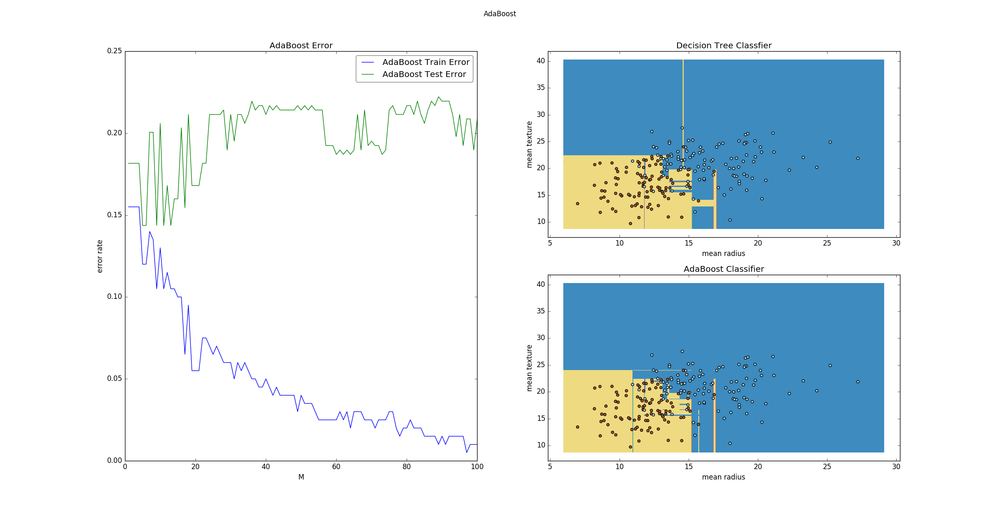
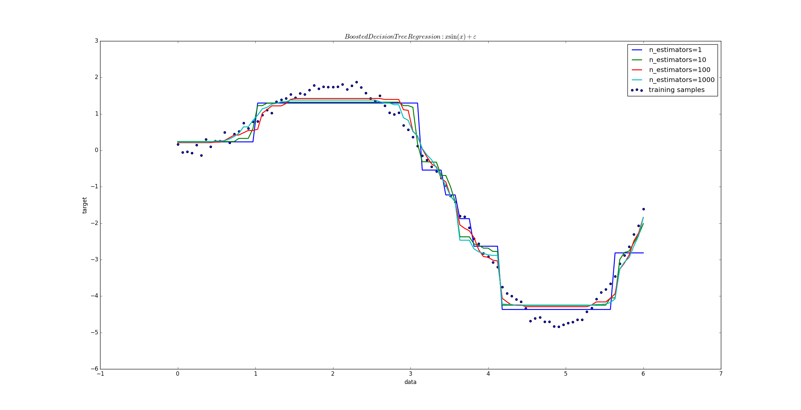
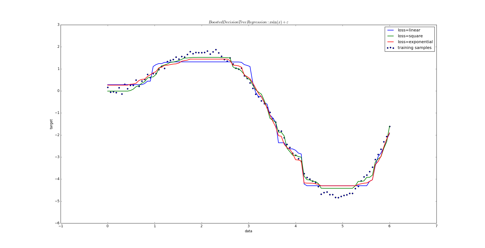
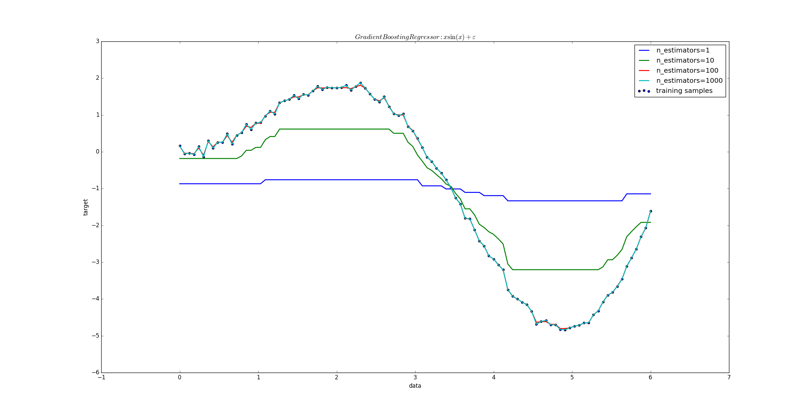
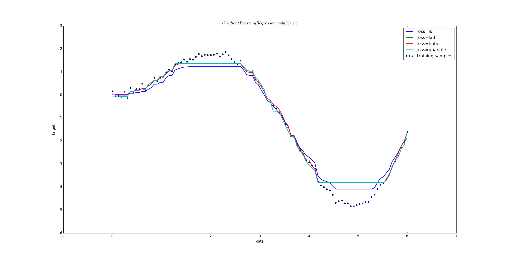

# AdaBoost 提升方法

## AdaBoost 算法

1.提升方法(`boosting`) 是一种常用的统计学习方法。在分类问题中，它通过改变训练样本的权重，学习多个分类器，并将这些分类器进行线性组合，提高分类的能力。

2.提升方法的基本思想：对于一个复杂任务来说，将多个专家的判断进行适当的综合所得出的判断，要比其中任何一个专家单独的判断要好。
> 类似于”三个臭皮匠顶一个诸葛亮“

3.在概率近似正确（`probably approximately correct,PCA`）学习的框架下：

- 强可学习：一个概念（或一个类别），若存在一个多项式的学习算法能够学习它，并且正确率很高，那么称这个概念是强可学习的
- 弱可学习：一个概念（或一个类别），若存在一个多项式的学习算法能够学习它，学习的正确率仅比随机猜测略好，那么称这个概念是弱可学习的

可以证明：强可学习与弱可学习是等价的。
> 即若在学习中发现了 ”弱学习算法“ ，则可以通过某些办法将它提升为 ”强学习算法“

4.对于分类问题而言，给定一个训练集，求一个比较粗糙的分类规则（弱分类器）要比求精确的分类规则（强分类器）要容易得多。

- 提升方法就是从弱学习算法出发，反复学习，得到一系列弱分类器（又称为基本分类器），然后组合这些弱分类器，构成一个强分类器
- 大多数提升方法都是改变训练数据的概率分布（也即训练数据的权值分布），针对不同的训练数据分布调用弱学习算法学习一系列弱分类器

那么：

- 每一轮中如何改变训练数据的权值或者说概率分布？

	`AdaBoost` 的做法是：提高那些被前一轮弱分类器错误分类样本的权值，而降低那些被正确分类样本的权值。
	> 这样一来，那些没有得到正确分类的数据由于权值的加大而受到后一轮的弱分类器的更大关注，于是分类问题被一系列的弱分类器”分而治之“

- 如何将一系列弱分类器组合成一个强分类器？

	`AdaBoost` 采用加权多数表决的方法。加大分类误差率较小的弱分类器的权值，使得它在表决中起较大作用；减小分类误差率较大的弱分类器的权值，使得它在表决中起较小的作用

5.AdaBoost 算法：

- 输入：训练数据集 \\(T=\\{(\mathbf x_1,y_1),(\mathbf x_2,y_2),\cdots,(\mathbf x_N,y_N)\\},\quad \mathbf x_i \in \mathcal X \subset \mathbb R^{n},y_i \in \mathcal Y=\\{-1,+1\\}\\)；弱学习算法
- 输出：最终分类器 \\(G(\mathbf x)\\)
- 算法步骤：
	- 初始化训练数据的权值分布 \\(D_1=(w\_{11},w\_{12},\cdots,w\_{1N}),w\_{1i}=\frac 1N,\quad i=1,2,\cdots,N\\)
	- 对  \\(m=1,2,\cdots,M\\)
		- 使用具有权值分布 \\(D_m\\) 的训练数据集学习，得到基本分类器（根据输入的弱学习算法）
			$$G_m(\mathbf x):\mathcal X \rightarrow \\{-1,+1\\}$$
		- 计算 \\(G_m(\mathbf x)\\) 在训练数据集上的分类误差率：
			$$e_m=P(G_m(\mathbf x_i) \neq y_i)=\sum\_{i=1}^{N}w\_{mi}I(G_m(\mathbf x_i) \neq y_i)$$
		> 即：所有误分类点的权重之和。权重越大的误差分类点，其在误差率中占比越大
		- 计算 \\(G_m(\mathbf x)\\) 的系数（这里对数是自然对数）：
			$$\alpha_m=\frac 12 \log \frac{1-e_m}{e_m}$$
			> 该系数表示\\(G_m(\mathbf x)\\) 在最终分类器中的重要性。它是 \\(e_m\\) 的单调减函数（说明误差越小的基本分类器，其重要性越高）
		- 更新训练数据集的权值分布： \\(D\_{m+1}=(w\_{m+1,1},w\_{m+1,2},\cdots,w\_{m+1,N}),\quad i=1,2,\cdots,N\\)，其中：$$w\_{m+1,i}=\frac{w\_{mi}}{Z_m}\exp(-\alpha_my_iG_m(\mathbf x_i)),i=1,2,\cdots,N$$
			其中 \\(Z_m=\sum\_{i=1}^{N}w\_{mi}\exp(-\alpha_my_iG_m(\mathbf x_i))\\) 为规范化因子。它使得 \\(D\_{m+1}\\) 成为一个概率分布
		> 对于正确分类样本，\\(G_m(\mathbf x_i)=y_i\\) 下一轮权重为：\\(w\_{m+1,i}=\frac{w\_{mi}}{Z_m}\exp^{-\alpha_m}\\)；对于错误分类样本，\\(G_m(\mathbf x_i)\neq y_i\\) 下一轮权重为：\\(w\_{m+1,i}=\frac{w\_{mi}}{Z_m}\exp^{\alpha_m}\\) 。两者比较，误分类样本的权重是正确分类样本的权重的 \\(\exp^{2\alpha_m}=\frac{e_m}{1-e_m}\\) 倍。于是误分类样本在下一轮学习中权重更大。
	- 构建基本分类器的线性组合： \\(f(\mathbf x)=\sum\_{m=1}^{M}\alpha_mG_m(\mathbf x)\\)，于是得到最终分类器：
	$$G(\mathbf x)=\text{sign}(f(\mathbf x))=\text{sign}(\sum\_{m=1}^{M}\alpha_mG_m(\mathbf x))$$
	> 这里实现了 M 个基本分类器的加权表决。系数 \\(\alpha_m\\) 表示了基本分类器\\(G_m(\mathbf x)\\) 的重要性。所有的  \\(\alpha_m\\)  之和并不为 1.

6.`AdaBoost` 算法解释：

- `AdaBoost` 提高那些被前一轮弱分类器错误分类样本的权值，而降低那些被正确分类样本的权值。这是通过更新训练数据集的权值分布： \\(D\_{m+1}=(w\_{m+1,1},w\_{m+1,2},\cdots,w\_{m+1,N}),\quad i=1,2,\cdots,N\\)，其中：$$w\_{m+1,i}=\frac{w\_{mi}}{Z_m}\exp(-\alpha_my_iG_m(\mathbf x_i)),i=1,2,\cdots,N$$ 来体现的

- `AdaBoost` 采用加权多数表决的方法。加大分类误差率较小的弱分类器的权值，使得它在表决中起较大作用；减小分类误差率较大的弱分类器的权值，使得它在表决中起较小的作用。这是通过\\(G_m(\mathbf x)\\) 的系数（这里对数是自然对数）：
			$$\alpha_m=\frac 12 \log \frac{1-e_m}{e_m}$$ 来体现的。其中$$e_m=P(G_m(\mathbf x_i) \neq y_i)=\sum\_{i=1}^{N}w\_{mi}I(G_m(\mathbf x_i) \neq y_i)$$

7.`AdaBoost`两个特点：

- 不改变所给的训练数据，而不断改变训练数据权值的分布，使得训练数据在基本分类器的学习中起不同作用
- 利用基本分类器的线性组合构成最终分类器。 \\(f(\mathbf x)=\sum\_{m=1}^{M}\alpha_mG_m(\mathbf x)\\)，得到最终分类器：
	$$G(\mathbf x)=\text{sign}(f(\mathbf x))=\text{sign}(\sum\_{m=1}^{M}\alpha_mG_m(\mathbf x))$$ 
	其中 \\(f(\mathbf x)\\) 的符号决定实例 \\(\mathbf x\\) 的分类，  \\(f(\mathbf x)\\)  的绝对值表示分类的确信度。

8.AdaBoost 算法训练误差分析：

- 定理一：AdaBoost的训练误差界： AdaBoost算法最终分类器的训练误差上界为：
	$$\frac 1N \sum\_{i=1}^{N}I(G(\mathbf x_i) \neq y_i) \le \frac 1N \sum\_{i=1}^{N}\exp(-y_if(\mathbf x_i))=\prod\_{m=1}^{M}Z_m$$ 其中 \\(Z_m=\sum\_{i=1}^{N}w\_{mi}\exp(-\alpha_my_iG_m(\mathbf x_i))\\)
	> 这一定理说明，可以在每一轮选取适当的 \\(G_m\\) 使得 \\(Z_m\\) 最小，从而使得训练误差下降最快

- 定理二：二类分类 AdaBoost 的训练误差界： $$\prod\_{m=1}^{M}Z_m=\prod\_{m=1}^{M}[2\sqrt{e_m(1-e_m)}]=\prod\_{m=1}^{M}\sqrt{(1-4\gamma_m^{2})} \le \exp(-2\sum\_{m=1}^{M}\gamma_m^{2})$$ 其中 \\(\gamma_m=\frac 12-e_m\\)
	- 推论：若存在 \\(\gamma \gt 0\\)，对所有 m 有 \\(\gamma_m \ge \gamma\\) ，则有：
		$$\frac 1N \sum\_{i=1}^{N}I(G(\mathbf x_i)\neq y_i) \le \exp(-2M\gamma^{2})$$
		> 这表明在此条件下， AdaBoost 的训练误差是以指数速率下降的

9.AdaBoost 算法具有自适应性，即它能够适应弱分类器各自的训练误差率。这也是它的名字（适应的提升）的由来

## AdaBoost 与加法模型

1.AdaBoost 算法可以认为是：模型为加法模型、损失函数为指数函数、学习算法为前向分步算法时的二类分类学习方法。

2.考虑加法模型： \\(f(\mathbf x)=\sum\_{m=1}^{M}\beta_mb(\mathbf x;\gamma_m)\\) 其中 \\(b(\mathbf x;\gamma_m)\\) 为基函数， \\(\gamma_m\\) 为基函数的参数， \\(\beta_m\\) 为基函数的系数。

- 给定训练数据以及损失函数 \\(L(y,f(\mathbf x))\\) 的条件下，学习加法模型 \\(f(\mathbf x)\\) 成为经验风险极小化即损失函数极小化问题：
$$\min_{\beta_m,\gamma_m}\sum\_{i=1}^{N}L(y_i,\sum\_{m=1}^{M}\beta_mb(\mathbf x;\gamma_m))$$
- 通常这是个复杂的哦优化问题。前向分步算法求解这一优化问题的思想是：
	- 因为学习的是加法模型，如果 能够从前向后，每一步只学习一个基函数及其系数，逐步逼近优化目标函数，则可以简化优化的复杂度
	- 具体地，每一步只需要优化如下的损失函数：
	$$\min_{\beta,\gamma}\sum\_{i=1}^{N}L(y_i,\beta b(\mathbf x;\gamma))$$

3.前向分步算法：

- 输入：训练数据集 \\(T=\\{(\mathbf x_1,y_1),(\mathbf x_2,y_2),\cdots,(\mathbf x_N,y_N)\\},\quad \mathbf x_i \in \mathcal X \subset \mathbb R^{n},y_i \in \mathcal Y=\\{-1,+1\\}\\)；损失函数 \\(L(y,f(\mathbf x))\\)； 基函数集 \\(\\{b(\mathbf x;\gamma)\\}\\)
- 输出：加法模型 \\(f(\mathbf x)\\)
- 算法步骤：
	- 初始化 \\(f_0(\mathbf x)=0\\)
	- 对 \\(m=1,2,\cdots,M\\)
		- 极小化损失函数：$$(\beta_m,\gamma_m)=\arg\min\_{\beta,\gamma}\sum\_{i=1}^{N}L(y_i,f\_{m-1}(\mathbf x_i)+\beta b(\mathbf x_i;\gamma))$$ 得到参数 \\(\beta_m,\gamma_m\\)
		- 更新 \\(f_m(\mathbf x)=f\_{m-1}(\mathbf x)+\beta_m b(\mathbf x;\gamma_m)\\)
	- 得到加法模型：\\(f(\mathbf x)=f_M(\mathbf x)=\sum\_{i=1}^{M}\beta_mb(\mathbf x;\gamma_m)\\)

4.定理： AdaBoost 算法是前向分步加法算法的特例。此时模型是由基本分类器组成的加法模型，损失函数是指数函数。

- 其中指数损失函数为： \\(L(y,f(\mathbf x))=\exp[-yf(\mathbf x)]\\)

## 提升树

1.提升树：它是以分类树或者回归树为基本分类器的提升方法。提升树被认为是统计学习中，性能最好的方法之一

- 以决策树为基函数的提升方法称为提升树。
	- 对分类问题决策树是二叉分类树
	- 对回归问题决策树是二叉回归树

	提升树模型可以表示为决策树的加法模型： $$f(\mathbf x)=f_M(\mathbf x)=\sum\_{m=1}^{M}T(\mathbf x;\Theta_m)$$ 其中 \\(T(\mathbf x;\Theta_m)\\) 表示决策树； \\(\Theta_m\\) 为决策树的参数； M 为决策树的数量

2.提升树算法：提升树算法采用前向分步算法。首先确定初始提升树 \\(f_0(\mathbf x)=0\\)， 第 m 步模型为：
$$f_m(\mathbf x)=f\_{m-1}(\mathbf x)+T(\mathbf x;\Theta_m)$$
其中 \\(f\_{m-1}(\mathbf x)\\) 为当前模型。

通过经验风险极小化确定下一棵决策树的参数 \\(\Theta_m\\)：$$\hat\Theta_m=\arg\min\_{\Theta_m}\sum\_{i=1}^{N}L(y_i,f\_{m-1}(\mathbf x_i)+T(\mathbf x_i;\Theta_m))$$

3.不同问题的提升树学习算法主要区别在于使用的损失函数不同。

- 回归问题：损失函数用平方误差损失函数
- 分类问题：损失函数用指数损失函数
- 一般决策问题：一般损失函数
> 对于二类分类问题，只需要将第一节中的 AdaBoost 算法中的基本分类器限制为二类分类树即可。

4.已知一个训练数据集 \\(T=\\{(\mathbf x_1,y_1),(\mathbf x_2,y_2),\cdots,(\mathbf x_N,y_N)\\},\quad \mathbf x_i \in \mathcal X \subseteq \mathbb R^{n},y_i \in \mathcal Y \subseteq \mathbb R\\)，其中 \\(\mathcal X\\) 为输入空间， \\(\mathcal Y\\) 为输出空间

如果将输入空间 \\(\mathcal X\\) 划分为 J 个互不相交的区域 \\(\mathbf R_1,\mathbf R_2,\cdots,\mathbf R_J\\)，并且在每个区域上确定输出的常量 \\(c_j\\)， 则树可以表示为： \\(T(\mathbf x;\Theta)=\sum\_{j=1}^{J}c_jI(\mathbf x \in \mathbf R_j)\\)

其中参数 \\(\Theta=\\{(\mathbf R_1,c_1),(\mathbf R_2,c_2),\cdots,(\mathbf R_J,c_J)\\}\\) 表示树的划分区域和各区域上的尝试。 J 是回归树的复杂度即叶结点个数。

- 回归问题提升树使用以下前向分步算法：
	$$
	f_0(\mathbf x)=0\\\
	f_m(\mathbf x)=f\_{m-1}(\mathbf x)+T(\mathbf x;\Theta_m),m=1,2,\cdots,M\\\
	f_M(\mathbf x)=\sum\_{m=1}^{M}T(\mathbf x;\Theta_m)
	$$
	在前向分步算法的第 m 步，给定当前模型 \\(f\_{m-1}(\mathbf x)\\)，求解：
	$$\hat\Theta_m=\arg\min\_{\Theta_m}\sum\_{i=1}^{N}L(y_i,f\_{m-1}(\mathbf x_i)+T(\mathbf x_i;\Theta_m))$$得到 \\(\hat\Theta_m\\) ，即第 m 棵树的参数
- 当采用平方误差损失函数时： \\(L(y,f(\mathbf x))=(y-f(\mathbf x))^{2}\\)，其损失变为：
	$$L(y,f\_{m-1}(\mathbf x)+T(\mathbf x;\Theta_m))=[y-f\_{m-1}(\mathbf x)-T(\mathbf x;\Theta_m)]^{2}=[r-T(\mathbf x;\Theta_m)]^{2}$$其中 \\(r=y-f\_{m-1}(\mathbf x)\\) 为当前模型拟合数据的残差。所以对回归问题的提升树算法，只需要简单拟合当前模型的残差

5.回归问题的提升树算法：

- 输入：训练数据集 \\(T=\\{(\mathbf x_1,y_1),(\mathbf x_2,y_2),\cdots,(\mathbf x_N,y_N)\\},\quad \mathbf x_i \in \mathcal X \subseteq \mathbb R^{n},y_i \in \mathcal Y \subseteq \mathbb R\\)
- 输出：提升树 \\(f_M(\mathbf x)\\)
- 算法步骤：
	- 初始化 \\(f_0(\mathbf x)=0\\)
	- 对于 \\(m=1,2,\cdots,M\\)
		- 计算残差： \\(r\_{mi}=y_i-f\_{m-1}(\mathbf x_i),i=1,2,\cdots,N\\)
		- 拟合残差  \\(r\_{mi}\\) 学习一个回归树，得到 \\(T(\mathbf x;\Theta_m)\\)
			> 拟合残差：生成一个回归树，使得它的损失函数最小
		- 更新 \\(f_m(\mathbf x)=f\_{m-1}(\mathbf x)+T(\mathbf x;\Theta_m)\\)
	- 得到回归问题提升树:\\(f_M(\mathbf x)=\sum\_{m=1}^{M}T(\mathbf x;\Theta_m)\\)

6.提升树利用加法模型与前向分步算法实现学习的优化过程。

- 当损失函数是平方损失函数和指数损失函数时，每一步优化都很简单
- 当损失函数是一般函数时，往往每一步优化不是很容易

针对这个问题，`Freidman`提出了梯度提升算法。它是利用最速下降法的近似方法，其关键是利用损失函数的负梯度在当前模型的值作为回归问题提升树算法中残差的近似值，拟合一个回归树

7.梯度提升算法：

- 输入：训练数据集 \\(T=\\{(\mathbf x_1,y_1),(\mathbf x_2,y_2),\cdots,(\mathbf x_N,y_N)\\},\quad \mathbf x_i \in \mathcal X \subseteq \mathbb R^{n},y_i \in \mathcal Y \subseteq \mathbb R\\)；损失函数 \\(L(y,f(\mathbf x)\\)
- 输出：回归树 \\(\hat f(\mathbf x)\\)
- 算法步骤：
	- 初始化： \\(f_0(\mathbf x)=\arg\min\_c\sum\_{i=1}^{N}L(y_i,c)\\)
		> 它是一颗只有根节点的树，根节点的类别为使得损失函数最小的类别
	- 对于 \\(m=1,2,\cdots,M\\)
		- 对于\\(i=1,2,\cdots,N\\), 计算： 
		$$r\_{mi}=-[\frac{\partial L(y_i,f(\mathbf x_i))}{\partial f(\mathbf x_i)}]\_{f(\mathbf x)=f\_{m-1}(\mathbf x)}$$
			> 计算损失函数的负梯度在当前模型的值，将它作为残差估计。对于平方损失函数，他就是通常意义上的残差；对于一般损失函数，他就是残差的近似 
		- 对 \\(r\_{mi}\\) 拟合一棵回归树，得到第 m 棵树的叶结点区域 \\(R\_{mj},j=1,2,\cdots,J\\)
		- 对  \\(j=1,2,\cdots,J\\) 计算：$$c\_{mj}=\arg\min\_c\sum\_{\mathbf x_i \in \mathbf R\_{mj}}L(y_i,f\_{m-1}(\mathbf x_i)+c)$$
		- 更新 \\(f_m(\mathbf x)=f\_{m-1}(\mathbf x)+\sum\_{j=1}^{J}c\_{mj}I(\mathbf x \in \mathbf R\_{mj})\\)
	- 得到回归树： $$\hat f(\mathbf x)=f_M(\mathbf x)=\sum\_{m=1}^{M}\sum\_{j=1}^{J}c\_{mj}I(\mathbf x \in \mathbf R\_{mj})$$

## 实践

1.`AdaBoostClassifier`是`scikit-learn`提供的`AdaBoost`分类器：

```
sklearn.ensemble.AdaBoostClassifier(base_estimator=None, n_estimators=50, \
learning_rate=1.0, algorithm='SAMME.R', random_state=None)
```
参数

- `base_estimator`：一个基础分类器对象。默认为`DecisionTreeClassfier`。该基础分类器必须支持采样本权重
- `n_estimators`：一个整数，指定基础分类器的数量（默认为50）。当然如果训练集已经完美的训练好了，可能算法会提前停止。此时基础分类器数量少于该值
- `learning_rate`：浮点数。默认为1.Learning rate shrinks the contribution of each classifier by learning_rate。在`learning_rate`和`n_estimators`之间会有所折中
- `algorithm`：一个字符串，指定算法。默认为`'SAMME.R'`
	- `'SAMME.R'`:使用`SAMME.R real boosting algorithm` 算法。基础分类器对象必须指出计算类别的概率
		> `SAMME.R real boosting algorithm` 算法会根据概率来计算样本的类别
	- `'SAMME'`：使用`SAMME discrete boosting algorithm`算法。
	> 通常`'SAMME.R'` 收敛更快，且误差更小，迭代数量更少
- `random_state`：一个整数（作为随机数种子）或者`RandomState`实例或者`None`。用于指定一个随机数生成器来混洗样本集

属性：

- `estimators_`：分类器的实例。它存放的是所有训练过的子分类器
- `classes_`：一个数组，形状为` [n_classes]`，类别标签
- `n_classes_`：一个整数，类别数量
- `estimator_weights_`：一个浮点数的数组，给出了每个子分类器的权重
- `estimator_errors_`：一个浮点数的数组，给出了每个子分类器的分类误差
- `feature_importances_`：一个数组，形状为`[n_features]`。如果`base_estimator`支持，则它给出了每个特征的重要性。

```
import numpy as np
import matplotlib.pyplot as plt
from matplotlib import  gridspec

from sklearn import datasets
from sklearn.tree import DecisionTreeClassifier
from sklearn.metrics import zero_one_loss
from sklearn.ensemble import AdaBoostClassifier


######### 加载数据############
data=datasets.load_breast_cancer()
X=data.data[:, 0:2] # 取前两个特征
Y=data.target
X_train,X_test=X[:200],X[200:]
Y_train,Y_test=Y[:200],Y[200:]
############## 训练 ###########

#### AdaBoost
n_estimators = 100
ada=AdaBoostClassifier(n_estimators=n_estimators).fit(X_train,Y_train)
### 决策树
dct = DecisionTreeClassifier().fit(X_train, Y_train)

###########绘制图形#############
fig=plt.figure()
fig.suptitle("AdaBoost")

gs=gridspec.GridSpec(2,2)
ax_err=plt.subplot(gs[:,0]) # 放置误差曲线
ax_err.set_title("AdaBoost Error")
ax_dt=plt.subplot(gs[0,1]) # 决策树
ax_dt.set_title("Decision Tree Classfier")
ax_ada=plt.subplot(gs[1,1]) # AdaBoost
ax_ada.set_title("AdaBoost Classifier")

###############  绘制误差曲线 ############
ada_err_train = np.zeros((n_estimators,))
ada_err_test = np.zeros((n_estimators,))
##训练误差
for i, y_pred in enumerate(ada.staged_predict(X_train)):
   ada_err_train[i] = zero_one_loss(y_pred, Y_train)
ax_err.plot(np.arange(n_estimators) + 1, ada_err_train, label='AdaBoost Train Error')
##测试误差
for i, y_pred in enumerate(ada.staged_predict(X_test)):
   ada_err_test[i] = zero_one_loss(y_pred,Y_test)
ax_err.plot(np.arange(n_estimators) + 1, ada_err_test, label='AdaBoost Test Error')
### 设置图形
ax_err.set_xlabel('M')
ax_err.set_ylabel('error rate')
ax_err.legend(loc='upper right', fancybox=True,framealpha=0.5)
########### 绘制网格  #############
plot_step=0.02
x_min, x_max = X[:, 0].min() - 1, X[:, 0].max() + 1
y_min, y_max = X[:, 1].min() - 1, X[:, 1].max() + 1
xx,yy = np.meshgrid(np.arange(x_min, x_max, plot_step),np.arange(y_min,y_max,plot_step))

clfs=[dct,ada]
axes=[ax_dt,ax_ada]
for i,clf in enumerate(clfs):
    Z = clf.predict(np.c_[xx.ravel(), yy.ravel()])
    Z = Z.reshape(xx.shape)
    axes[i].contourf(xx, yy, Z, cmap=plt.cm.Paired)
    axes[i].set_xlabel(data.feature_names[0])
    axes[i].set_ylabel(data.feature_names[1])
    axes[i].scatter(X_train[:, 0], X_train[:, 1], c=Y_train, cmap=plt.cm.Paired)
plt.show()
```

  

2.`AdaBoostRegressor`是 `scikit-learn`提供的`AdaBoost`回归器

```
sklearn.ensemble.AdaBoostRegressor(base_estimator=None, n_estimators=50, \
learning_rate=1.0, loss='linear', random_state=None)
```

该类通过`AdaBoost.R2`算法实现的

参数：

- `base_estimator`：一个基础回归器对象。默认为`DecisionTreeRegressor`。该基础回归器必须支持采样本权重
- `n_estimators`：一个整数，指定基础回归器的数量（默认为50）。当然如果训练集已经完美的训练好了，可能算法会提前停止。此时基础回归器数量少于该值
- `learning_rate`：浮点数。默认为1.Learning rate shrinks the contribution of each classifier by learning_rate。在`learning_rate`和`n_estimators`之间会有所折中
- `loss`：一个字符串。指定了损失函数。可以为：
	- `'linear'`:线性损失函数（默认）
	- `'square'`：平方损失函数
	- `'exponential'`：指数损失函数
- `random_state`：一个整数（作为随机数种子）或者`RandomState`实例或者`None`。用于指定一个随机数生成器来混洗样本集

属性：

- `estimators_`：回归器的实例。它存放的是所有训练过的子回归器
- `estimator_weights_`：一个浮点数的数组，给出了每个子回归器的权重
- `estimator_errors_`：一个浮点数的数组，给出了每个子回归器的分类误差
- `feature_importances_`：一个数组，形状为`[n_features]`。如果`base_estimator`支持，则它给出了每个特征的重要性。

```
import numpy as np
import matplotlib.pyplot as plt
from sklearn.ensemble import AdaBoostRegressor

######## 创建数据 #############
rng = np.random.RandomState(1)
X = np.linspace(0, 6, 100)[:, None]
Y = (X*np.sin(X)).ravel()  + rng.normal(0, 0.1, X.shape[0])

fig=plt.figure()
ax=fig.add_subplot(111)
ax.set_xlabel("data")
ax.set_ylabel("target")
ax.set_title(r"$Boosted Decision Tree Regression:x\sin(x)+\varepsilon$")
# 绘图
ax.scatter(X,Y,label="training samples")

ns=[1,10,100,1000]
### 训练和绘图：
for n in ns:
    regr = AdaBoostRegressor(n_estimators=n, random_state=rng)
    regr.fit(X, Y)
    pred_Y=regr.predict(X)
    ax.plot(X, pred_Y,label="n_estimators=%d"%n, linewidth=2)

ax.legend()
plt.show()
```

  
  

3.`GradientBoostingRegressor`是`scikit-learn`提供的`AdaBoost`梯度提升回归器

```
sklearn.ensemble.GradientBoostingRegressor(loss='ls', learning_rate=0.1,\
 n_estimators=100, subsample=1.0, min_samples_split=2, min_samples_leaf=1,\
 min_weight_fraction_leaf=0.0,\ max_depth=3, init=None, random_state=None, \
max_features=None, alpha=0.9, verbose=0,\
 max_leaf_nodes=None, warm_start=False, presort='auto')
```

它是`AdaBoost`算法的提升树模型。它通过前向分步算法实现学习的优化过程。

参数为：

- `loss`：一个字符串。指定损失函数：
	- `'ls'`：最小平方回归
	- `'lad'`：最小绝对偏差。
	- `'huber'`：是前两者的结合.通过`alpha`参数指定比例
	- `'quantile'`：分位数回归（分位数值得百分之几），通过`alpha`参数指定分位数
- `n_estimators`：一个整数，指定基础回归器的数量（默认为100）。梯度提升算法能够防止过拟合，因此该值越大，效果越好
- `learning_rate`：浮点数。默认为 0.1 .Learning rate shrinks the contribution of each classifier by learning_rate。在`learning_rate`和`n_estimators`之间会有所折中
- `max_depth`：一个整数。指定每个回归树的最大深度。该值会限制树的结点数量。通常调整该参数会得到比较好的模型。
	> 如果`max_leaf_nodes`参数不是`None`，则忽略本参数
- `min_samples_split`：整数。指定树的每个内部节点所包含的最少的样本数量
- `min_samples_leaf `:整数。指定树的每个叶子节点所包含的最少的样本数量、
- `min_weight_fraction_leaf`：浮点数。如果一个样本是叶子节点中，则它最少具有该值的权重系数
- `subsample`：一个浮点数。该值指定有多少倍的样本用于每个子回归器的学习。
	- 若该值小于1.0，则是随机梯度提升树。此时会导致变量减少，同时偏差会增大
- `max_features`：一个浮点数，字符串，整数，或者`None`，指定当划分特征时，考虑的最大特征数量
	- 整数：考虑`max_features`个特征来划分
	- 浮点数：考虑 `int(max_features * n_features)`个特征
	- 如果是`'auto'`：则考虑 `n_features`个特征
	- 如果是`'sqrt'`：则考虑`sqrt(n_features)`个特征
	- 如果是`'log2'`：则考虑`log2(n_features)`个特征
	- 如果是`None`：则考虑`n_features`个特征
	> 如果`max_features<n_features` 则会导致变量减少同时偏差增大
	>
	> 如果未找到一个有效的划分，则会突破`max_features`限制继续寻找特征来划分
- `max_leaf_nodes `：整数或者`None`。指定最大叶结点数量。该限制是最优先考虑的限制。如果为`None`，则没有限制
- `alpha`:一个浮点数。只有当`loss='huber'`或者`loss='quantile'`时才有效。指定了`alpha-quantile`
- `init`：一个`BaseEstimator`或者`None`。该初始的`estimator`用于计算初始的预测。
	- 如果为`None`,则使用`loss.init_estimator`
- `verbose`：一个整数。如果为0则不输出信息；如果为1则每隔一段时间打印一次信息；如果大于1，则每棵树都打印信息
- `warm_start`:布尔值。当是`True`时，则继续使用上一次训练的结果。否则重新开始训练
- `random_state`：一个整数（作为随机数种子）或者`RandomState`实例或者`None`。用于指定一个随机数生成器来混洗样本集
- `presort`：一个布尔值或者`'auto'`。如果为`True`，则会先对数据排序以加速回归树的划分过程。如果是`'auto'`，则会对稠密数据进行提前排序。如果对稀疏数据，你设置了`presort`则会报错

属性：

- `feature_importances_` : 一个数组，形状为`[n_features]`。它给出了每个特征的重要性。
- `oob_improvement_` :  一个数组，形状为[n_estimators]`。The improvement in loss (= deviance) on the out-of-bag samples relative to the previous iteration. oob_improvement_[0] is the improvement in loss of the first stage over the init estimator.

- `train_score_` :一个数组，形状为`[n_estimators]`：The i-th score train_score_[i] is the deviance (= loss) of the model at iteration i on the in-bag sample. If subsample == 1 this is the deviance on the training data.
- `loss_` : 损失函数。具体的损失函数对象
- `init` : `BaseEstimator`：The estimator that provides the initial predictions. Set via the init argument or loss.init_estimator.

- `estimators_` :`DecisionTreeRegressor`的数组，形状为`[n_estimators, 1]`。训练到的子回归器

```
import numpy as np
import matplotlib.pyplot as plt
from sklearn.ensemble import AdaBoostRegressor,GradientBoostingRegressor

######## 创建数据 #############
rng = np.random.RandomState(1)
X = np.linspace(0, 6, 100)[:, None]
Y = (X*np.sin(X)).ravel()  + rng.normal(0, 0.1, X.shape[0])

fig=plt.figure()
ax=fig.add_subplot(111)
ax.set_xlabel("data")
ax.set_ylabel("target")
ax.set_title(r"$GradientBoostingRegressor:x\sin(x)+\varepsilon$")
# 绘图
ax.scatter(X,Y,label="training samples")

ns=[1,10,100,1000]
### 训练和绘图：
for n in ns:
    regr = GradientBoostingRegressor(n_estimators=n, random_state=rng)
    regr.fit(X, Y)
    pred_Y=regr.predict(X)
    ax.plot(X, pred_Y,label="n_estimators=%d"%n, linewidth=2)

ax.legend()
plt.show()
```

  
  
