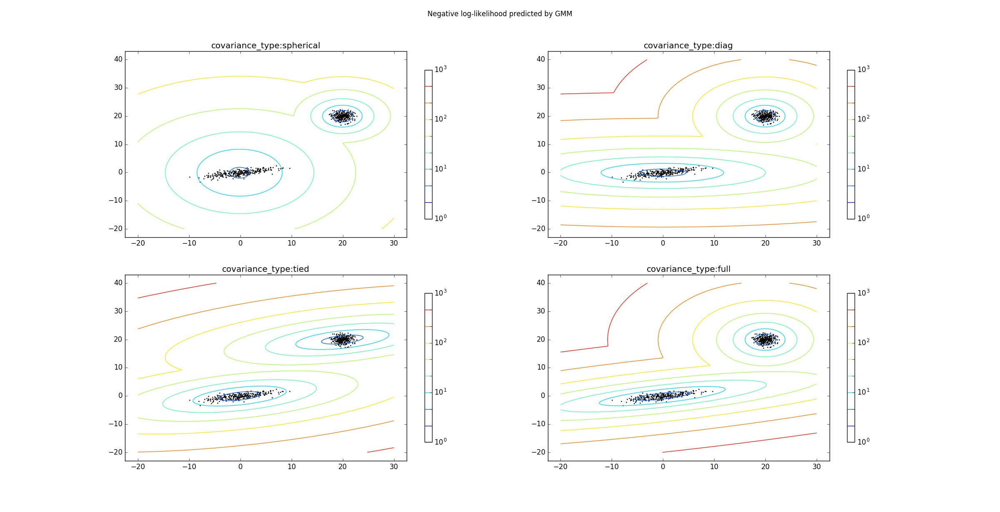

# EM算法

## EM算法

1.EM算法是一种迭代算法，用于含有隐变量的概率模型参数的极大似然估计，或者极大后验概率估计。

- EM算法的每次迭代由两步组成：
	- E步求期望
	- M步求极大

所以EM算法也称为期望极大算法

2.如果概率模型的变量都是观测变量，那么给定数据可以直接用极大似然估计法或者贝叶斯估计法来估计模型参数。但是当模型含有隐变量时，就不能简单的使用这些估计方法了。如下面的三硬币模型：

- 三硬币模型：已知三枚硬币 A，B，C。这些硬币正面出现的概率分别为 \\(\pi,p,q\\)。进行如下试验：
	- 先投掷硬币 A，若是正面则选硬币 B；若是反面则选硬币 C 。 
	- 然后投掷被选出来的硬币，投掷的结果如果是正面则记作 1；投掷的结果如果是反面则记作 0
	- 独立重复地 n 次试验，观测结果为： 1,1,0,1,0,...0,1 。

	现在只能观测到投掷硬币的结果，无法观测投掷硬币的过程，求估计三硬币正面出现的概率。
- 设随机变量 y 是观测变量，表示一次试验观察到的结果是 1 或者0；随机变量 z 是隐变量，表示未观测到的投掷硬币 A 的结果； \\(\theta=(\pi,p,q)\\) 是模型参数。则：
	$$P(y;\theta)=\sum\_{z}P(y,z;\theta)=\sum\_{z}P(z;\theta)P(y/z;\theta)\\\
	=\pi p^{y}(1-p)^{1-y}+(1-\pi)q^{y}(1-q)^{1-y}
	$$
	> 注意：随机变量 y 的数据可以观测，随机变量 z 的数据不可观测

	将观测数据表示为 \\(Y=(Y_1,Y_2,\cdots,Y_n)\\)，未观测数据表示为 \\(Z=(Z_1,Z_2,\cdots,Z_n)\\)。则
	$$P(Y;\theta)=\prod\_{j=1}^{n}[\pi p^{y_j}(1-p)^{1-y_j}+(1-\pi)q^{y_j}(1-q)^{1-y_j}]$$
	> \\(P(Y;\theta)=\sum_Z P(Y,Z;\theta)=\sum_Z P(Z;\theta)P(Y/Z;\theta)\\)

	考虑求模型参数 \\(\theta=(\pi,p,q)\\) 的极大似然估计，即：
	$$\hat \theta=\arg\max\_{\theta}\log P(Y;\theta)$$
	这个问题没有解析解，只有通过迭代的方法求解。 EM算法就是可以用于求解该问题的一种迭代算法

- EM算法首先选取参数的初值，记作 \\(\theta^{(0)}=(\pi^{(0)},p^{(0)},q^{(0)})\\)，然后通过下面的步骤迭代计算参数的估计值，直到收敛为止：
	- 设第 i 次迭代参数的估计值为： \\(\theta^{(i)}=(\pi^{(i)},p^{(i)},q^{(i)})\\)， 则EM算法的第 i+1 次迭代如下：
		- E步：计算模型在参数 \\(\theta^{(i)}=(\pi^{(i)},p^{(i)},q^{(i)})\\) 下，观测数据 \\(y_j\\) 来自于投掷硬币 B 的概率：
			$$\mu^{(i+1)}=\frac{\pi^{(i)}(p^{(i)})^{y_j}(1-p^{(i)})^{1-y_j}}{\pi^{(i)}(p^{(i)})^{y_j}(1-p^{(i)})^{1-y_j}+(1-\pi^{(i)})(q^{(i)})^{y_j}(1-q^{(i)})^{1-y_j}}$$
		> 它其实就是 \\(P(Z=1/Y=y_j)\\)，即已知事件\\(Y=y_j\\)的条件下， 隐变量的概率。
		- M 步：计算模型参数的新估计值：
		$$
		\pi^{(i+1)}=\frac 1n\sum\_{j=1}^{n}\mu_j^{(i+1)}\\\
		p^{(i+1)}=\frac{\sum\_{j=1}^{n}\mu_j^{(i+1)}y_j}{\sum\_{j=1}^{n}\mu_j^{(i+1)}}\\\
		q^{(i+1)}=\frac{\sum\_{j=1}^{n}(1-\mu_j^{(i+1)})y_j}{\sum\_{j=1}^{n}(1-\mu_j^{(i+1)})}
		$$

- EM算法与初值的选择有关，选择不同的初始值可能得到不同的参数估计值

3.一般地，用 Y 表示观测随机变量的数据， Z 表示隐随机变量的数据。 Y 和 Z 连在一起称作完全数据，观测数据 Y 又称作不完全数据。

- 假设给定观测数据 Y ，其概率分布为 \\(P(Y;\theta)\\)，其中 \\(\theta\\) 是需要估计的模型参数，则不完全数据 Y 的似然函数是 \\(P(Y;\theta)\\)， 对数似然函数为 \\(L(\theta)=\log P(Y;\theta)\\)
- 假定 Y 和 Z 的联合概率分布是 \\(P(Y,Z;\theta)\\)，则完全数据的对数似然函数是 \\(\log P(Y,Z;\theta)\\)

4.EM 算法通过迭代求解的是 \\(L(\theta)=\log P(Y;\theta)=\log\sum_Z P(Y,Z;\theta)=\log[\sum_Z P(Y/Z;\theta)P(Z;\theta)]\\) 的极大值。

- 困难在于：该目标函数包含了未观测数据的的分布的积分和对数
- EM 算法通过迭代逐步近似极大化 \\(L(\theta)\\) 的。
	- 假设在第 i 次迭代后，\\(\theta\\) 的估计是为： \\(\theta^{(i)}\\)。我们希望新估计值 \\(\theta\\) 能够使得 \\(L(\theta)\\) 增加，即： \\(L(\theta) \gt L(\theta^{(i)})\\) 。为此考虑两者的差：
	$$L(\theta) - L(\theta^{(i)})=\log[\sum_Z P(Y/Z;\theta)P(Z;\theta)]-\log P(Y;\theta^{(i)})$$
	- 利用 `Jensen`不等式：\\(\log\sum_j\lambda_j y_j \ge \sum_j\lambda_j\log y_j,\quad \lambda_j \ge 0,\sum_j \lambda_j=1\\)，考虑到 \\(\sum_Z P(Z/Y;\theta^{(i)})=1\\) 则有：
	$$L(\theta) - L(\theta^{(i)})=\log[\sum_Z P(Y/Z;\theta^{(i)}) \frac{P(Y/Z;\theta)P(Z;\theta)}{P(Y/Z;\theta^{(i)})}]-\log P(Y;\theta^{(i)})\\\
	\ge \sum_Z P(Z/Y;\theta^{(i)}) \log \frac{P(Y/Z;\theta)P(Z;\theta)}{P(Z/Y;\theta^{(i)})} -\log P(Y;\theta^{(i)})\\\
	=\sum_Z P(Z/Y;\theta^{(i)}) \log \frac{P(Y/Z;\theta)P(Z;\theta)}{P(Z/Y;\theta^{(i)})} -\sum_Z P(Z/Y;\theta^{(i)}) \log P(Y;\theta^{(i)})\\\
	=\sum_Z P(Z/Y;\theta^{(i)}) \log \frac{P(Y/Z;\theta)P(Z;\theta)}{P(Z/Y;\theta^{(i)})P(Y;\theta^{(i)})}
	$$
	- 令 \\(B(\theta,\theta^{(i)})=L(\theta^{(i)})+\sum_Z P(Z/Y;\theta^{(i)}) \log \frac{P(Y/Z;\theta)P(Z;\theta)}{P(Z/Y;\theta^{(i)})P(Y;\theta^{(i)})}\\)，则有： \\(L(\theta) \ge B(\theta,\theta^{(i)}) \\)，因此 \\(B(\theta,\theta^{(i)}) \\) 是 \\(L(\theta^{(i)})\\) 的一个下界。
		- 根据定义有： \\(L(\theta^{(i)})=B(\theta^{(i)},\theta^{(i)})\\)
		- 任何可以使得 \\(B(\theta,\theta^{(i)}) \\) 增大的 \\(\theta\\) ，也可以使 \\(L(\theta)\\) 增大，为了使得 \\(L(\theta)\\)  尽可能增大，则选择使得 \\(B(\theta,\theta^{(i)}) \\) 取极大值的 \\(\theta\\) ：  \\(\theta^{(i+1)}=\arg\max_\theta B(\theta,\theta^{(i)})\\)
	- 求极大值：
	$$\theta^{(i+1)}=\arg\max\_\theta B(\theta,\theta^{(i)})\\\
	=\arg\max\_\theta[L(\theta^{(i)})+\sum_Z P(Z/Y;\theta^{(i)}) \log \frac{P(Y/Z;\theta)P(Z;\theta)}{P(Z/Y;\theta^{(i)})P(Y;\theta^{(i)})}]\\\
	=\arg\max\_\theta[\sum_Z P(Z/Y;\theta^{(i)})\log (P(Y/Z;\theta)P(Z;\theta))]\\\
	=\arg\max\_\theta[\sum_Z P(Z/Y;\theta^{(i)})\log P(Y,Z;\theta)]\\\
	$$
- EM 算法不能保证得到全局最优值。其优点在于：简单性、普适性


5.EM 算法：

- 输入：观测变量数据 Y，隐变量数据Z， 联合分布 \\(P(Y,Z;\theta)\\)，条件分布 \\(P(Z/Y;\theta)\\)
	> \\(P(Z/Y;\theta)\\) 是已知 Y 的条件下， Z 的一个分布。它是我们预给定的一个函数
- 输出：模型参数 \\(\theta\\)
- 算法步骤：
	- 选择参数的初值 \\(\theta^{(0)}\\) ，开始迭代
		> 参数的初始条件可以任意选择，但是 EM 算法对初值是敏感的
	- E步：记 \\(\theta^{(i)}\\) 为第 i 次迭代参数 \\(\theta\\) 的估计值，在第 i+1 步迭代的 E 步，计算： $$Q(\theta,\theta^{(i)})=E_Z[\log P(Y,Z;\theta)/Y;\theta^{(i)}]=\sum_Z\log P(Y,Z;\theta)P(Z/Y;\theta^{(i)})$$
	这里 \\(P(Z/Y;\theta^{(i)})\\) 表示给定观测数据 Y 和当前的参数估计 \\(\theta^{(i)}\\) 的条件下隐变量 Z 的条件概率分布。它是真实的 Z 的条件概率分布的一个估计
		> - \\(Q(\theta,\theta^{(i)})\\) 是算法的核心，称作 Q 函数。它的物理意义是：完全数据的对数似然函数 \\(\log P(Y,Z;\theta)\\) 关于在给定观测数据 Y 和当前参数 \\(\theta^{(i)}\\) 下，对未观测数据 Z 的条件概率分布 \\(P(Z/Y;\theta^{(i)})\\) 的期望
		>- \\(Q(\theta,\theta^{(i)})\\) 中，第一个变元表示要极大化的参数；第二个变元表示参数的当前估计值
	- M步：求使得 \\(Q(\theta,\theta^{(i)})\\) 最大化的 \\(\theta\\)，确定 i+1 次迭代的参数的估计值 \\(\theta^{(i+1)}\\)$$\theta^{(i+1)}=\arg\max_\theta Q(\theta,\theta^{(i)})$$
	- 重复上面两步，直到收敛
		> 通常收敛的条件是：给定较小的正数 \\(\varepsilon_1,\varepsilon_2\\)，满足：\\(||\theta^{(i+1)}-\theta^{(i)}|| \lt \varepsilon_1\\) 或者 \\(||Q(\theta^{(i+1)},\theta^{(i)})-Q(\theta^{(i)},\theta^{(i)})|| \lt \varepsilon_2\\)

6.EM算法的直观理解：EM算法的目标是最大化对数似然函数 \\(L(\theta)=\log P(Y)\\)。

- 但是直接求解这个目标是有问题的。因为要求解该目标，你首先要得到未观测数据的分布 \\(P(Z/Y;\theta)\\)；但是未观测数据的分布就是你待求目标参数  \\(\theta\\) 的解的函数。这是一个“鸡生蛋-蛋生鸡” 的问题
- EM算法试图多次猜测这个未观测数据的分布  \\(P(Z/Y;\theta)\\)（每一轮迭代都猜测一个参数值  \\(\theta^{(i)}\\)，而每一轮参数值都对应着一个未观测数据的分布 \\(P(Z/Y;\theta^{(i)})\\)，因为未观测数据的分布就是参数的函数），然后通过最大化某个变量来求解参数值。这个变量就是 \\(B(\theta,\theta^{(i)})\\) 变量，它是真实的似然函数的下界
	- 如果猜测正确，则 B 就是 真实的似然函数
	- 如果猜测不正确，则 B 就是真实似然函数的一个下界

	> 为什么用 \\(P(Z/Y;\theta)\\)而不用 \\(P(Y/Z;\theta)\\)?
	>
	> - 因为 \\(P(Z/Y;\theta)\\) 是已知Y的情况下，Z的分布。真实情况确实是 Y 已知，但是 Z 的分布未知
	> - \\(P(Y/Z;\theta)\\)是已知Z的情况下， Y的分布。真实情况是：Y已经知晓，但是 Z 未知，因此定义无法满足

7.EM可以用于非监督学习。有时训练数据只有输入没有对应的输出： \\(T+\\{(\mathbf x_1,\cdot),(\mathbf x_2,\cdot),\cdots,(\mathbf x_N,\cdot)\\}\\)。此时生成模型由联合概率分布 \\(P(X,Y)\\) 表示，可以认为非监督学习训练数据是联合概率分布产生的数据： X 为观测数据， Y 为未观测数据

8.EM算法收敛性定理：

- 定理一：设 \\(P(Y;\theta)\\) 为观测数据的似然函数， \\(\theta^{(i)},\quad i=1,2,\cdots\\) 为EM算法得到的参数估计序列， \\(P(Y;\theta^{(i)}),\quad i=1,2,\cdots\\) 为对应的似然函数序列，则  \\(P(Y;\theta^{(i)}),\quad i=1,2,\cdots\\) 是单调递增的，即
	$$P(Y;\theta^{(i+1)}) \ge P(Y;\theta^{(i)})$$
- 定理二：设 \\(L(\theta)=\log P(Y;\theta)\\) 为观测数据的对数似然函数，  \\(\theta^{(i)},\quad i=1,2,\cdots\\) 为EM算法得到的参数估计序列，\\(L(\theta^{(i)}),\quad i=1,2,\cdots\\) 为对应的对数似然函数序列
	- 如果 \\(P(Y;\theta)\\) 有上界，则 \\(L(\theta^{(i)}),\quad i=1,2,\cdots\\) 收敛到某一个值 \\(L^{\*}\\)
	- 在函数  \\(Q(\theta,\theta^{(i)})\\) 与 \\(L(\theta)\\) 满足一定条件下，由 EM 算法得到的参数估计序列 \\(\theta^{(i)},\quad i=1,2,\cdots\\) 的收敛值 \\(\theta^{\*}\\) 是  \\(L(\theta)\\)  的稳定点
	>- 关于定理二中，“满足一定条件”：大多数条件下其实都是满足的
	>- 定理二只能保证参数估计序列收敛到对数似然函数序列的稳定点 \\(L^{\*}\\) ，不能保证收敛到极大值点

>- EM算法的收敛性包含关于对数似然函数序列 \\(L(\theta^{(i)}),\quad i=1,2,\cdots\\) 的收敛和关于参数估计序列 \\(\theta^{(i)},\quad i=1,2,\cdots\\)  的收敛两次意思，前者并不蕴含后者
>- 应用中，初值的选择非常重要。常用的办法是从几个不同的初值中进行迭代，然后对得到的各个估计值加以比较，从中选择最好的（对数似然函数最大的那个）

## 高斯混合模型

1.EM算法的一个重要应用是高斯混合模型的参数估计。

2.高斯混合模型(`Gaussian mixture model,GMM`)：指的是具有下列形式的概率分布模型：
$$P(y;\theta)=\sum\_{k=1}^{K}\alpha_k\phi(y;\theta_k)$$
其中 \\(\alpha_k\\) 是系数，满足 \\(\alpha_k \ge 0,\sum\_{k=1}^K \alpha_k=1\\)； \\(\phi(y;\theta_k)\\) 是高斯分布密度函数， \\(\theta_k=(\mu_k,\sigma_k^{2})\\)：
	$$\phi(y;\theta_k)=\frac{1}{\sqrt{2\pi}\sigma_k}\exp(-\frac{(y-\mu_k)^{2}}{2\sigma_k^{2}})$$
\\(\phi(y;\theta_k)\\) 称作第 k 个分模型
	> 如果用其他的概率分布密度函数代替上式中的高斯分布密度函数，则称为一般混合模型

3.假设观察数据 \\(y_1,y_2,\cdots,y_N\\) 由高斯混合模型生成： \\(P(y;\theta)=\sum\_{k=1}^{K}\alpha_k\phi(y;\theta_k)\\) ，其中 \\(\theta=(\alpha_1,\alpha_2,\cdots,\alpha_K;\theta_1,\theta_2,\cdots,\theta_K)\\)。我们需要用EM算法估计高斯混合模型的参数 \\(\theta\\) 

- 可以设想观察数据 \\(y_j,j=1,2,\cdots,N\\) 是这样产生的：
	- 首先以来概率  \\(\alpha_k\\) 选择第 k 个高斯分布分模型 \\(\phi(y;\theta_k)\\) 
	- 然后依第 k 个分模型的概率分布 \\(\phi(y;\theta_k)\\)  生成观察数据 \\(y_j\\) 
	- 这样，观察数据 \\(y_j,j=1,2,\cdots,K\\) 是已知的；观测数据 \\(y_j\\) 来自哪个分模型是未知的
- 对观察数据 \\(y_j\\) 定义 K 个隐变量隐变量 \\(\gamma\_{jk}\\) 为：
	$$
	\gamma\_{jk}=\begin{cases}
	1,& \text{if $y_j$ comes from $\phi(y;\theta_k)$}\\\
	0,& \text{else}
	\end{cases}\\\
	j=1,2,\cdots,N;\quad k=1,2,\cdots,K
	$$则 \\(\gamma\_{jk}\\) 是 0-1 随机变量，其为 1 的概率为 \\(\alpha_k\\)
- 有了观测数据 \\(y_j\\) 以及未观测数据 \\(\gamma\_{jk}\\)， 则完全数据是： \\((y_j,\gamma\_{j1},\gamma\_{j2},\cdots,\gamma\_{jK}),\quad j=1,2,\cdots,N\\)

	于是完全数据的似然函数为：
	$$P(y,\gamma;\theta)=\prod\_{j=1}^{N}P(y_j,\gamma\_{j1},\gamma\_{j2},\cdots,\gamma\_{jK};\theta)\\\
	=\prod\_{k=1}^{K}\prod\_{j=1}^{N}[\alpha_k\phi(y_j;\theta_k)]^{\gamma\_{jk}}\\\
	=\prod\_{k=1}^{K}\alpha_k^{n_k}\prod\_{j=1}^{N}[\phi(y_j;\theta_k)]^{\gamma\_{jk}}\\\
	=\prod\_{k=1}^{K}\alpha_k^{n_k}\prod\_{j=1}^{N}[\frac{1}{\sqrt{2\pi}\sigma_k}\exp(-\frac{(y_j-\mu_k)^{2}}{2\sigma_k^{2}})]^{\gamma\_{jk}}$$
	其中 \\(n_k=\sum\_{j=1}^{N} \gamma\_{jk},\sum\_{k=1}^{K}n_k=N\\)
> 这里有个基本假设：即随机变量  \\(\gamma\_{jk}\\) 是相互独立的。

- 完全数据的对数似然函数为：
	$$\log P(y,\gamma;\theta)=\sum\_{k=1}^{K}\\{n_k\log \alpha_k+\sum\_{j=1}^{N}\gamma\_{jk}[\log(\frac{1}{\sqrt{2\pi}})-\log\sigma_k-\frac{1}{2\sigma_k^{2}}(y_j-\mu_k)^{2}]\\}$$
	- EM算法的E步：确定 Q 函数，考虑到 \\(E\gamma\_{jk}=E(\gamma\_{jk}/Y=y_j;\theta)=\sum\_\gamma \gamma\_{jk}P(\gamma\_{jk}/Y=y_j;\theta^{(i)})\\)：
	$$Q(\theta,\theta^{(i)})=E\_\gamma[\log P(y_j,\gamma;\theta)/Y=y_j;\theta^{(i)}]=\sum\_\gamma\log P(y_j,\gamma;\theta)P(\gamma/Y=y_j;\theta^{(i)})\\\
	= \sum\_{k=1}^{K}\\{n_k\log\alpha_k+\sum\_{j=1}^{N}(E\gamma\_{jk})[\log(\frac{1}{\sqrt{2\pi}})-\log\sigma_k-\frac{1}{2\sigma_k^{2}}(y_j-\mu_k)^{2}]\\}$$
		- 令  \\(\hat\gamma\_{jk}= E\gamma\_{jk}=E(\gamma\_{jk}/Y=y_j;\theta)\\)，则：
		$$\hat\gamma\_{jk}=P(\gamma\_{jk}=1/Y=y_j;\theta)\cdot 1+0\\\
		= \frac{P(\gamma\_{jk}=1,y_j;\theta)}{\sum\_{k=1}^{K}P(\gamma\_{jk}=1,y_j;\theta)}\\\
		=\frac{P(y_j/\gamma\_{jk}=1;\theta)P(\gamma\_{jk}=1;\theta)}{\sum\_{k=1}^{K}P(y_j/\gamma\_{jk}=1;\theta)P(\gamma\_{jk}=1;\theta)}\\\
		= \frac{\alpha_k\phi(y_j;\theta_k)}{\sum\_{k=1}^{K}\alpha_k\phi(y_j;\theta_k)	}\\\
j=1,2,\cdots,N;\quad k=1,2,\cdots,K
		$$
		\\(\hat\gamma\_{jk}\\) 是当前模型参数下第 j 个观测数据来自第 k 个分模型的概率，称为分模型 k 对观测数据 \\(y_j\\) 的响应度
	
		于是有：$$Q(\theta,\theta^{(i)})= \sum\_{k=1}^{K}\\{n_k\log\alpha_k+\sum\_{j=1}^{N}\hat\gamma\_{jk}[\log(\frac{1}{\sqrt{2\pi}})-\log\sigma_k-\frac{1}{2\sigma_k^{2}}(y_j-\mu_k)^{2}]\\}$$
	- EM算法的M步：求解 \\(Q(\theta,\theta^{(i)})\\) 对  \\(\theta\\) 的极大值:
	$$\theta^{(i+1)}=\arg\max\_{\theta}Q(\theta,\theta^{(i)})$$
	用 \\(\hat \mu_k,\hat \sigma_k^{2},\hat \alpha_k, \quad k=1,2,\cdots,K\\) 表示 \\(\theta^{(i)}\\) 的各个参数。根据偏导数为0，以及 \\(\sum\_{k=1}^{K}\alpha_k=1\\) 得到：
	$$
	\hat \mu_k=\frac{\sum\_{j=1}^{N}\hat\gamma\_{jk}y_j}{\sum\_{j=1}^{N}\hat\gamma\_{jk}},\quad k=1,2,\cdots,K\\\
	\hat \sigma_k^{2}=\frac{\sum\_{j=1}^{N}\hat\gamma\_{jk}(y_j-\mu_k)^{2}}{\sum\_{j=1}^{N}\hat\gamma\_{jk}},\quad k=1,2,\cdots,K\\\
	\hat \alpha_k=\frac{n_k}{N}=\frac{\sum\_{j=1}^{N}\hat\gamma\_{jk}}{N},\quad k=1,2,\cdots,K
	$$
	- 重复上述计算，直到对数似然函数值不再有明显的变化为止

4.高斯混合模型参数估计的EM算法：

- 输入：观察数据 \\(y_1,y_2,\cdots,y_N\\) ，高斯混合模型；
- 输出：高斯混合模型参数
- 算法步骤：
	- 取参数的初始值开始迭代
	- E步：根据当前模型参数，计算分模型 k对观测数据 \\(y_j\\) 的响应度
		$$\hat\gamma\_{jk}=\frac{\alpha_k\phi(y_j;\theta_k)}{\sum\_{k=1}^{K}\alpha_k\phi(y_j;\theta_k)},\quad j=1,2,\cdots,N;\quad k=1,2,\cdots,K$$
	- M步：计算新一轮迭代的模型参数：
	$$
	\hat \mu_k=\frac{\sum\_{j=1}^{N}\hat\gamma\_{jk}y_j}{\sum\_{j=1}^{N}\hat\gamma\_{jk}},\quad k=1,2,\cdots,K\\\
	\hat \sigma_k^{2}=\frac{\sum\_{j=1}^{N}\hat\gamma\_{jk}(y_j-\mu_k)^{2}}{\sum\_{j=1}^{N}\hat\gamma\_{jk}},\quad k=1,2,\cdots,K\\\
	\hat \alpha_k=\frac{n_k}{N}=\frac{\sum\_{j=1}^{N}\hat\gamma\_{jk}}{N},\quad k=1,2,\cdots,K
	$$
	- 重复上面两步直到对数似然函数值或者参数估计值收敛

## EM 算法的推广

1.F函数：假设隐变量数据 Z 的概率分布为 \\(\tilde P(Z)\\)，定义分布 \\(\tilde P(Z)\\) 与参数 \\(\theta\\) 的函数 \\(F(\tilde P,\theta)\\) 为：\\(F(\tilde P,\theta)=E\_{\tilde P}[\log P(Y,Z;\theta)]+H(\tilde P)\\)， 其中  \\(H(\tilde P)=-E\_{\tilde P}\log \tilde P(Z)\\) 是分布  \\(\tilde P(Z)\\) 的熵
> 通常假定 \\(P(Y,Z;\theta)\\) 是  \\(\theta\\) 的连续函数，因此 \\(F(\tilde P,\theta)\\) 为 \\(\tilde P(Z)\\) 和  \\(\theta\\) 的连续函数

2.函数  \\(F(\tilde P,\theta)\\) 有下列重要性质：

- 对固定的 \\(\theta\\) ，存在唯一的分布 \\(\tilde P\_{\theta}(Z)\\) 使得极大化  \\(F(\tilde P,\theta)\\)。此时  \\(\tilde P\_{\theta}(Z)=P(Z/Y;\theta)\\)，并且  \\(\tilde P\_{\theta}\\)  随着  \\(\theta\\)  连续变化
- 若  \\(\tilde P\_{\theta}(Z)=P(Z/Y;\theta)\\)， 则 \\(F(\tilde P,\theta)=\log P(Y;\theta)\\)

3.定理：设 \\(L(\theta)=\log P(Y;\theta)\\) 为观测数据的对数似然函数， \\(\theta^{(i)},i=1,2,\cdots,\\) 为 EM 算法得到的参数估计序列，函数 \\(F(\tilde P,\theta)=E\_{\tilde P}[\log P(Y,Z;\theta)]+H(\tilde P)\\)，则：

- 如果 \\(F(\tilde P,\theta)\\) 在 \\(\tilde P^{\*}(Z)\\) 和 \\(\theta^{\*}\\) 有局部极大值，那么 \\(L(\theta)\\) 也在 \\(\theta^{\*}\\) 有局部极大值
- 如果 \\(F(\tilde P,\theta)\\) 在 \\(\tilde P^{\*}(Z)\\) 和 \\(\theta^{\*}\\) 有全局极大值，那么 \\(L(\theta)\\) 也在 \\(\theta^{\*}\\) 有全局极大值

4.定理：EM算法的一次迭代可由 F 函数的极大-极大算法实现：设 \\(\theta^{(i)}\\) 为第 i 次迭代参数 \\(\theta\\) 的估计， \\(\tilde P^{(i)}\\) 为第 i 次迭代函数 \\(\tilde P(Z)\\) 的估计。在第 i+1 次迭代的两步为：

- 对固定的  \\(\theta^{(i)}\\) ，求 \\(\tilde P^{(i+1)}\\) 使得 \\(F(\tilde P,\theta^{(i)})\\) 极大化
- 对固定的 \\(\tilde P^{(i+1)}\\) ，求  \\(\theta^{(i+1)}\\) 使得 \\(F(\tilde P^{(i+1)},\theta)\\) 极大化

5.GEM算法（EM算法的推广形式）：

- GEM算法1：
	- 输入： 观测数据， F 函数
	- 输出：模型参数
	- 算法步骤：
		- 初始化参数  \\(\theta^{(0)}\\) ，开始迭代
		- 第 \\(i+1\\) 次迭代：
			- 记 \\(\theta^{(i)}\\)  为参数  \\(\theta\\)  的估计值， \\(\tilde P^{(i)}\\) 为函数 \\(\tilde P\\) 的估计值。求 \\(\tilde P^{(i+1)}\\) 使得 \\(F(\tilde P,\theta^{(i)})\\) 极大化 
			- 求  \\(\theta^{(i+1)}\\) 使得 \\(F(\tilde P^{(i+1)},\theta)\\) 极大化
			- 重复上面两步直到收敛

	> 该算法的问题是，有时候求 \\(F(\tilde P^{(i+1)},\theta)\\) 极大化很困难。

- GEM算法2：
	- 输入： 观测数据， Q 函数
	- 输出：模型参数
	- 算法步骤：
		- 初始化参数  \\(\theta^{(0)}\\) ，开始迭代
		- 第 \\(i+1\\) 次迭代：
			- 记 \\(\theta^{(i)}\\)  为参数  \\(\theta\\)  的估计值， 计算
			$$Q(\theta,\theta^{(i)})=E\_{Z}[\log P(Y,Z;\theta);Y;\theta^{(i)}]=\sum\_Z P(Z/Y;\theta^{(i)})\log P(Y,Z;\theta)$$
			> Q 的物理意义是：完全数据的对数似然函数 \\(\log P(Y,Z;\theta)\\) 关于在给定观测数据 Y 和当前参数 \\(\theta^{(i)}\\) 下，对未观测数据 Z 的条件概率分布 \\(P(Z/Y;\theta^{(i)})\\) 的期望
			- 求 \\(\theta^{(i+1)}\\) 使得 \\(Q(\theta^{(i+1)},\theta^{(i)}) \gt Q(\theta^{(i)},\theta^{(i)})\\)
			- 重复上面两步，直到收敛

	> 此算法不需要求 \\(Q(\theta,\theta^{(i)})\\) 的极大值，只需要求解使它增加的 \\(\theta^{(i+1)}\\) 即可
- GEM算法3：
	- 输入： 观测数据， Q 函数
	- 输出：模型参数
	- 算法步骤：
		- 初始化参数  \\(\theta^{(0)}=(\theta_1^{(0)},\theta_2^{(0)},\cdots,\theta_d^{(0)})\\) ，开始迭代
		- 第 \\(i+1\\) 次迭代：
			- 记 \\(\theta^{(i)}=(\theta_1^{(i)},\theta_2^{(i)},\cdots,\theta_d^{(i)})\\)  为参数  \\(\theta=(\theta_1,\theta_2,\cdots,\theta_d)\\)  的估计值， 计算
			$$Q(\theta,\theta^{(i)})=E\_{Z}[\log P(Y,Z;\theta);Y;\theta^{(i)}]=\sum\_Z P(Z/Y;\theta^{(i)})\log P(Y,Z;\theta)$$
			- 进行 d 次条件极大化：
				- 首先在 \\(\theta_2^{(i)},\cdots,\theta_d^{(i)}\\) 保持不变的条件下求使得 \\(Q(\theta,\theta^{(i)})\\) 达到极大的  \\(\theta_1^{(i+1)}\\)
				- 然后在 \\(\theta_1=\theta_1^{(i+1)},\theta_j=\theta_j^{(i)},j=3,\cdots,d\\) 的条件下求使得 \\(Q(\theta,\theta^{(i)})\\) 达到极大的  \\(\theta_2^{(i+1)}\\)
				- 如此继续，经过 d 次条件极大化，得到 \\(\theta^{(i+1)}=(\theta_1^{(i+1)},\theta_2^{(i+1)},\cdots,\theta_d^{(i+1)})\\) ，使得 \\(Q(\theta^{(i+1)},\theta^{(i)}) \gt Q(\theta^{(i)},\theta^{(i)})\\)
			- 重复上面两步，直到收敛

	>该算法将 EM 算法的 M步分解为 d 次条件极大化，每次只需要改变参数向量的一个分量，其余分类不改变

## 实践


1.`GMM`是`sikit-learn`实现的混合高斯模型

```
sklearn.mixture.GMM(n_components=1, covariance_type='diag', random_state=None,\
 thresh=None, tol=0.001, min_covar=0.001, n_iter=100, n_init=1, params='wmc',\
 init_params='wmc', verbose=0
```
参数为：

- `n_components`：一个整数，指定分模型的数量，默认为1
- `covariance_type`：一个字符串，指定协方差的类型。必须为下列值之一：
	- `'spherical'`	:球型
	- `'tied'`:结点型
	- `'diag'`：对角型
	- `'full'全型
-  `random_state`：一个整数（作为随机数种子）或者`RandomState`实例或者`None`，指定一个随机数生成器来混洗输入数据
- `min_covar`：一个浮点数，协方差矩阵对角线上元素的最小值（用于防治过拟合）
- `tol`：一个浮点数，用于指定收敛的阈值。 EM迭代算法中，当对数似然函数平均增益低于此阈值时，迭代停止
- `n_iter`：一个整数，指定EM算法迭代的次数
- `n_init`：一个整数，用于指定初始化次数（只有表现最好的那次初始化会被留下）
- `params `：一个字符串，指定在训练过程中那些参数会被更新。可以是下列字符串的组合或者单独的形式：
	- `'w'`：表示权重
	- `'m'`：表示均值
	- `'c'`：表示协方差
- `init_params`:一个字符串，指定在初始化过程中，哪些参数会被更新。可以是下列字符串的组合或者单独的形式：
	- `'w'`：表示权重
	- `'m'`：表示均值
	- `'c'`：表示协方差
- `verbose`：一个整数，指定训练过程中需不需要输出中间过程。如果是 1 则总是输出当前的初始化和迭代过程。如果大于1 ，则只是某些必要的时候输出中间状态。如果是0 则不输出

属性：

- `weights_` :一个数组，形状为`(n_components,)`。该属性存储了每个分模型的权重
- `means_` : 一个数组，形状为`(n_components, n_features)`。该属性存储了每个分模型的均值 \\(\mu_k\\)
- `covars_` : 一个数组，存放了每个分模型的方差 \\(\sigma_k^{2}\\)。数组的形状根据方差类型有所不同：
	- 如果是 `'spherical'`，则方差数组形状为 `(n_components, n_features)`
	- 如果是 `'tied'`，则方差数组形状为 `(n_features, n_features)`
	- 如果是 `'diag'`，则方差数组形状为 `(n_components, n_features)`
	- 如果是 `'full'`，则方差数组形状为 `(n_components, n_features, n_features)`
- `converged_` : 一个布尔值。当训练过程收敛时，该值为`True`;不收敛时，为`False`


```
import numpy as np
import matplotlib.pyplot as plt
from matplotlib.colors import LogNorm
from sklearn import mixture


############  生成数据 ##############
n_samples = 300
np.random.seed(0)
## 第一组二维高斯分布
shifted_gaussian = np.random.randn(n_samples, 2) + np.array([20, 20])
## 第二组二维高斯分布
C = np.array([[0., -0.7], [3.5, .7]])
stretched_gaussian = np.dot(np.random.randn(n_samples, 2), C)
X_train = np.vstack([shifted_gaussian, stretched_gaussian])

#########  训练GMM ###########

clf = mixture.GMM(n_components=2, covariance_type='full')
clf.fit(X_train)
x = np.linspace(-20.0, 30.0,200)
y = np.linspace(-20.0, 40.0,200)
X, Y = np.meshgrid(x, y)
XX = np.array([X.ravel(), Y.ravel()]).T
Z = -clf.score_samples(XX)[0] ## 返回的是样本点的对数似然函数
Z = Z.reshape(X.shape)
########## 绘图 ############
fig=plt.figure()
ax=fig.add_subplot(1,1,1)
CS=ax.contour(X, Y, Z, norm=LogNorm(vmin=1.0, vmax=1000.0),levels=np.logspace(0, 3, 10))
CB = plt.colorbar(CS, shrink=0.8, extend='both')
ax.scatter(X_train[:, 0], X_train[:, 1], .8)

ax.set_title('Negative log-likelihood predicted by GMM')
plt.show()
```

  

- 不同方差类型：

  

- 不同分模型数量：

  
